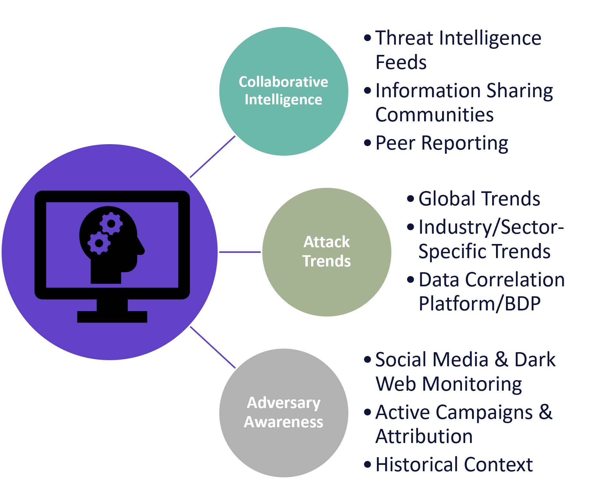
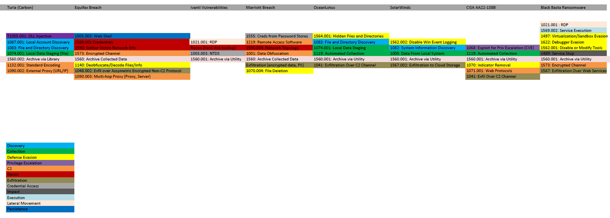
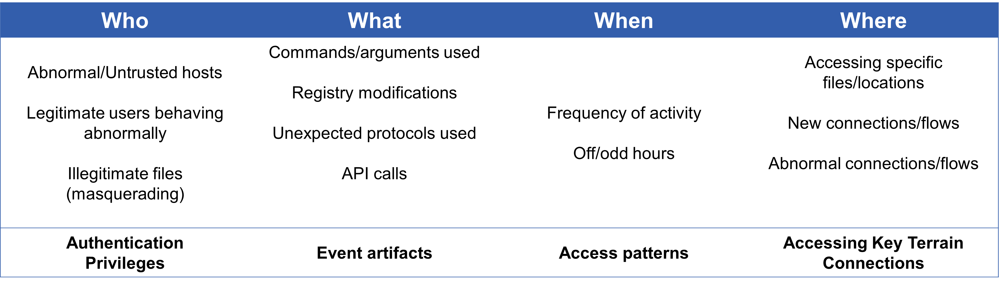
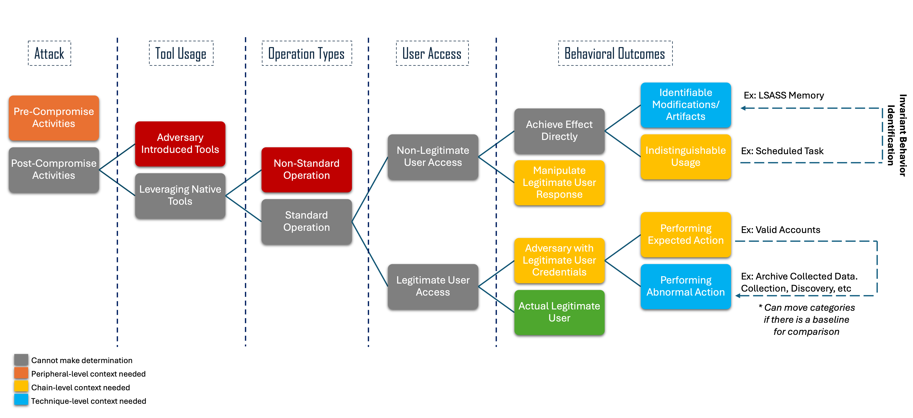

.. _Context:

==============================================================
Context to Determine Intent
==============================================================

Our research on ambiguous techniques led us to classify three different types of
context that a defender may need in order to distill an actor's intent:
peripheral-level, chain-level, and technique-level. These contexts provide
needed information surround the usage of a technique, which is critical for
determining intent. 

-----------------------------------------------------
Peripheral-Level Context
-----------------------------------------------------

Peripheral-Level Context can be understood as an "outside-looking-in"
perspective. This category focuses on external information that is most valuable
for defending against potential attacks targeting your network.

Many of the techniques within this category are associated with pre-compromise
activities, such as those in the Reconnaissance tactic. As a result, the
detections generated in this category are primarily proactive in nature, rather
than traditional queries that can be directly implemented in a Security
Information and Event Management (SIEM) system. Instead, these detections
emphasize cyber threat intelligence on emerging threats to your network,
industry, or sector. This approach supports the development of both
behavior-based and signature-based defenses, enabling organizations to better
anticipate and mitigate risks before they materialize.

------------------------------------------------------
Chain-Level Context
------------------------------------------------------

   Click to enlarge

Chain-level context focuses on observing co-occurring techniques—those that
occur before, after, or concurrently with a specific technique of interest—in
order to establish intent. We examined chain-level context techniques by
leveraging data from our repository of Attack Flows and our Adversary Emulation
Library. 

Using Archiving Collected Data as an example, we examined infamous breaches and
mapped out the activities occurring immediately before, after, or concurrent to
the technique to identify patterns and trends. We used a color-coded system
based on tactics, which helped highlight trends more effectively. For example,
one notable trend we observed was the frequent occurrence of Exfiltration (seen
above in brown) immediately following the archiving of collected data. This
trend informed our understanding of the attack chains and what activity we could
anticipate seeing around Archiving Collected Data that would point to it being
employed with malicious intent.

The determination of malicious intent in this context relied on analyzing
historical attack chains and recurring patterns. One consideration during this
process was the length of the attack chain. In most cases, the analytics we
developed focused on chaining together two techniques. While it is possible to
chain together more techniques, there is a trade-off between chain length and
the accuracy and precision of the analysis. Longer chains may exclude relevant
activity that would otherwise be captured, so finding an optimal balance between
chain length, the number of techniques linked, and the desired level of accuracy
and precision is critical.

------------------------------------------------------
Technique-Level Context
------------------------------------------------------

   Click to enlarge

Technique-level context focuses on artifacts related to the detection of a
single technique. To determine technique-level context, we distill the detection
criteria into four general categories: **Who, What, When, & Where**. 

------------------------------

**Who:** Authentication and privileges, examining who is operating within the
network, the privileges they are using, and how they are attempting to access
resources. It provides insight into user behavior and access patterns.

**What:** Traditional event artifacts, such as flags, commands, specific
registry keys, API calls, and other concrete artifacts that can be extracted
from event codes or event IDs. 

**When:** Analyzes access patterns, including the frequency of activity and
whether operations are occurring outside of typical or expected hours. It helps
identify anomalies in the timing of activity that may indicate malicious intent.

**Where:** Examines the key terrain within a network. This includes monitoring
critical files, locations, or systems, as well as examining network connections.
By establishing a baseline, organizations can detect abnormal connections or
flows, such as new connections being initiated or unexpected destinations being
accessed.

------------------------------

By organizing detection criteria into these categories, we provide a structured
approach to developing detection analytics and identifying technique-level
differentiators. This framework enables defenders to focus on key aspects of
network activity - authentication, artifacts, timing, and terrain - while
leveraging baseline data and behavioral analysis to detect anomalies and
differentiate between benign and malicious behavior.

--------------------------------------
How to Use Context to Determine Intent
--------------------------------------

   Click to enlarge

The flowchart represents the progression of activities during an incident, and
which type of context to use as a defender. The flow starts from the onset of
the attack behavior and moves toward behavioral specifics. The legend at the
bottom-left highlights the different contexts, with gray representing not enough
information to make a determination. We have broken the flowchart into 5 stages: 

1. Attack:
    * Pre-Compromise Activities: Actions that occur before the adversary has
      breached the network, e.g. Reconnaissance.
    * Post-Compromise Activities: Actions that occur after an adversary has
      gained access into the network, e.g. Inital Access
2. Tool Usage:
    * Adversary-brought Tools: software brought in by an adversary to accomplish
      an attack, and used in a way that clearly indicates malicious intent, e.g.
      Mimikatz
    * Pre-existing Tools: software or functionality that existed on the system
      pre-compromise, and used in a way that does not indicate malicious intent,
      e.g. PowerShell
3. Operation Types:
    * Non-Standard Operation: Involves actions that deviate from intended usage
      of a tool in an identifiable manner, which would be presumed to be
      malicious.
    * Standard Operation: Includes intended user activities, either by
      legitimate users or adversaries
4. User Access:
    * Non-Legitimate User Access: Includes actions by adversaries meant to
      directly manipulate systems or deceive legitimate users.
    * Legitimate User Access: Includes actions by legitimate users or
      adversaries using stolen credentials or tokens.
5. Behavioral Outcomes:
    * Identifiable Modifications/Artifacts: Detectable changes in systems or
      behaviors that could indicate malicious activity, e.g. Scheduled Task
    * Indistinguishable Usage: Actions that mimic normal user behavior without
      identifiable modifications, e.g. LSASS Memory Access
    * Performing Expected Actions: Legitimate activity aligned with normal
      behavior expectations, e.g. Valid Accounts.
    * Performing Abnormal Actions: Deviations from expected behavior, which may
      indicate malicious activity, e.g. Archive Collected Data.
