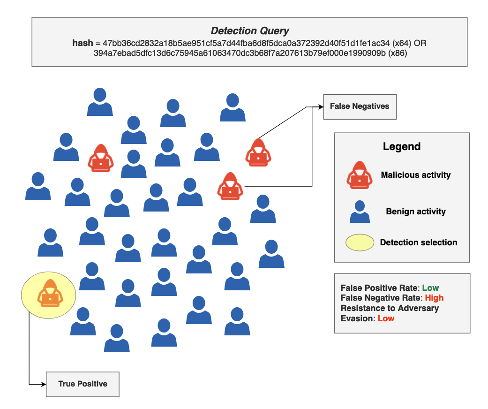
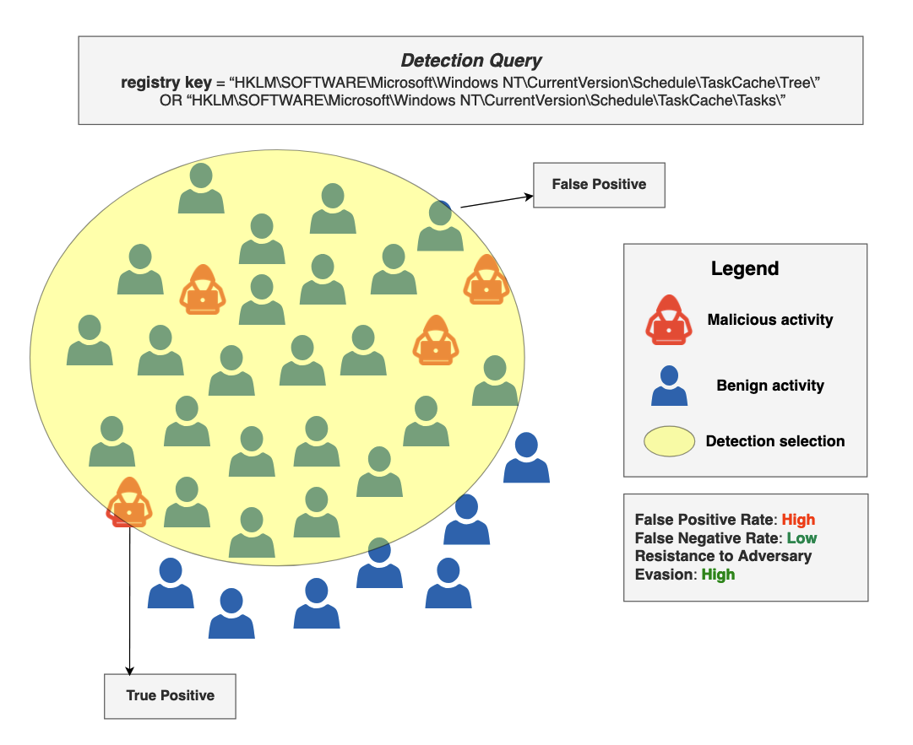
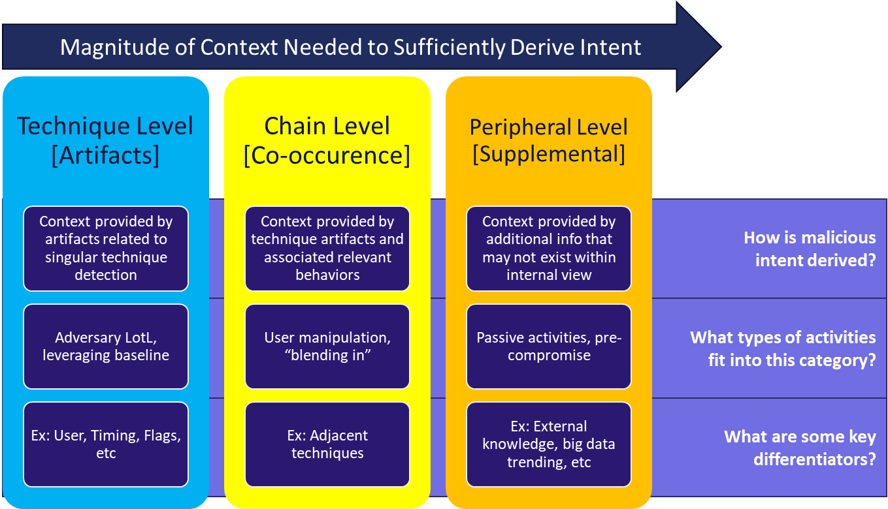

.. _Components:

Components of a Robust Detection
================================

A :ref:`robust detection<Robust Detection>` is one that is accurate and
resistant to adversary evasion over time.  But what does that look like when we
are building out a detection?

Let's first establish some key terms that will help us distinguish the types of
alerts a defender will see within their environment:

* True positive: An alert for a malicious event
* False positive: An alert for a benign event
* True negative: Benign event that does not alert
* False negative: Malicious event that does not alert

Malicious activity or benign activity will be categorized as one of these four
alert categories and will help defenders analyze the quality and effectiveness
of their alerts.

Accurate Detection
------------------

An :ref:`accurate detection<Accuracy>` combines the traditional detection
metrics of precision and recall. When we are building an accurate detection, we
want to build a detection which has low false positives and low false negatives.
Therefore, defenders must find the balance.

A detection with low false positives does not alert on much benign activity,
making it great for detecting on specific, malicious activity.

Let's think of detecting malicious Scheduled Task activity. Many actors use
their own tools to schedule tasks and maintain persistence within their
environment. One of those tools is Shamoon. If we wanted to build a detection
analytic against Shamoon that has a low false positive rate, we could use a hash
value to detect on the specific use of this malicious activity within our
environment. The use of this hash value creates a low false positive rate
because it is highly unlikely that we will capture benign activity within this
detection.

   A hash value creates a low false positive rate, but it does not provide good
   false negative rate or resistance to adversary evasion over time.

A detection which has a low false negative rate is one that has a high
probabilty of detecting malicious events. Visualizing this in terms of a
technique or a specific topic of coverage in a detection, an analytic would
catch all malicious activity. So, the selection area of an analytic could be
very large.

The ATT&CK page identifies many malicious technique implementations of Scheduled
Task activities. A Scheduled Task analytic that has low false negative rate will
capture many of those documented malicious implementations. For example, when a
task is scheduled, it creates a new registry key. Because this would occur
across all implementations of scheduled tasks, an analytic that detects the
creation of a registry key within the task scheduler would be considered an
accurate detection. This detection could also be resistant to adversary evasion
over time, since this activity occurs across all implementations of a technique
and cannot be avoided.

   A registry key detection for scheduled tasks provides a low false negative
   rate and is resistant to adversary evasion over time. However, it raises the
   false positive rate.

When building an accurate detection, defenders must find the balance between
false positive and false negative rates.

Accurate vs. Resistance
-----------------------

There is usually a trade-off between the false positive and false negative rate
that occurs when creating an accurate detection. When an analyst creates a
detection that has a low false positive rate, it might be too specific to
account for other malicious implementations of a technique, making the detection
more susceptible to missing other malicious activity. On the other hand, an
analytic that captures all malicious activity is more susceptible to capturing
benign activity as well, raising the false positive rate. This puts more work on
the analyst to triage alerts. Let's refer to our detection of scheduled tasks.
Since registry key creation occurs across all implementations, it will also
alert on benign activity. For example, if a Windows application schedules an
update to run, our detection analytic will alert, generating a false positive.
It is possible to create detections that have a low false positive and low false
negative rate, but it is not possible for all techniques. When building
detections, an analyst must weigh what is most important for them and the risks
associated with favoring false positive or false negative rates.

There is also a second component to a robust detection: resistance to adversary
evasion over time. This ensures that detections created, regardless of current
or future implementations, can remain effective. Resistance to adversary evasion
over time more closely aligns with having a low false negative rate. As a
defender builds a detection that uses observables associated with techniques
(Levels 4 and 5), it covers multiple or all implementations and is more
difficult for the adversary to evade. Once a defender's detection is at the top
of the pyramid, the most likely way an adversary will evade detection is through
changing their technique entirely. Because of this, false negative rate and
resistance to adversary evasion over time are closely aligned. However,
exclusions which are built to lower the false positive rate can also be built to
be resistant to adversary evasion. The observables chosen to filter out benign
activity can be built in a way that is difficult for adversaries to manipulate,
making it more difficult for adversaries to hide in exclusions.

The Summiting the Pyramid robustness matrix can help a defender map an analytic
to their resistance to adversary evasion over time. Want to know how to score
your detection analytics for accuracy and resistance to adversary evasion?
:ref:`Read our guidance  on scoring detection analytics<scoring analytic>`.

Determining Sufficient Context
-------------------------------

Context plays a critical role in developing robust analytics for ambiguous
techniques, as it helps differentiate between malicious and benign behaviors
that share overlapping observables. Without sufficient context, analytics risk
generating excessive false positives, which can render them ineffective and
burdensome for defenders. The Ambiguous Techniques framework emphasizes the need
to incorporate situational awareness via :ref:`context<Context>` to accurately
infer intent and distinguish malicious activity, while maintaining robustness to
ensure operational feasibility.

By integrating context into analytic development, defenders can improve
detection accuracy, reduce false positives, and make informed decisions.
Maintaining robustness involves balancing precision with operational
feasibility, ensuring analytics remain effective in diverse environments.

Bringing It All Together Through Robust Detection
-------------------------------------------------

A robust detection is what we look to achieve in our detection environment.
While this might not be possible for all detections, it is important to know how
to measure the accuracy and resistance to adversary evasion over time for the
detection, find balance between them, and fill the gaps within your detection
environment with additional logging or detections.

Want to know how to bring this all together? :ref:`Read our guidance  that
outlines the steps needed to create a robust detection<Build Robust Detection>`.
