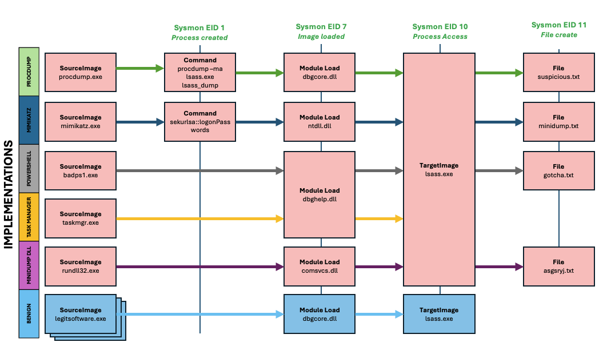
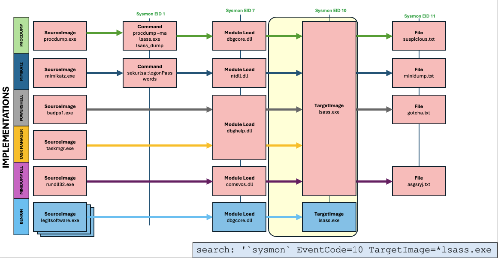
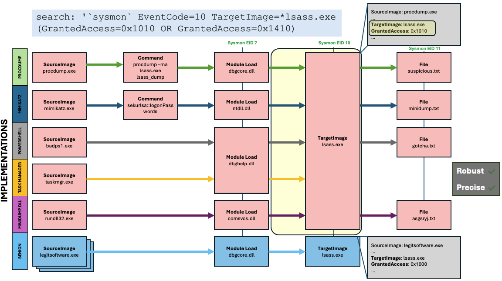
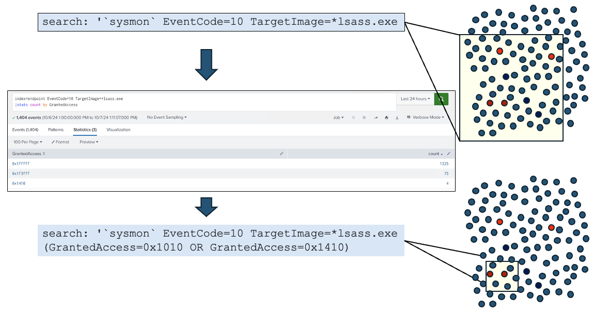
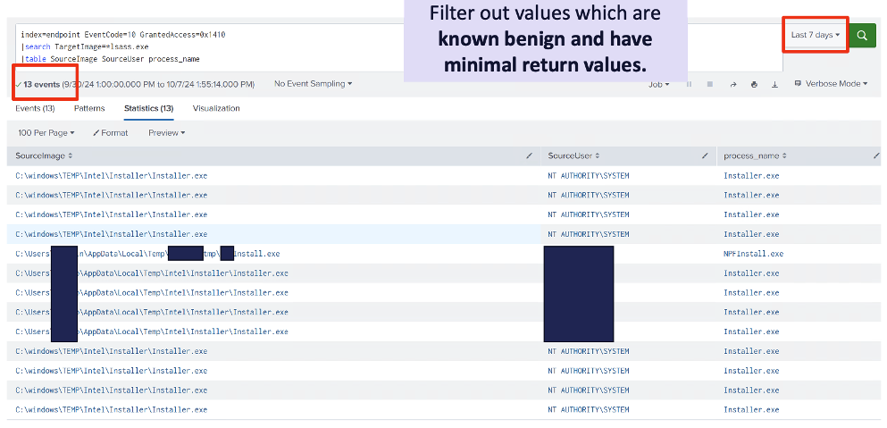
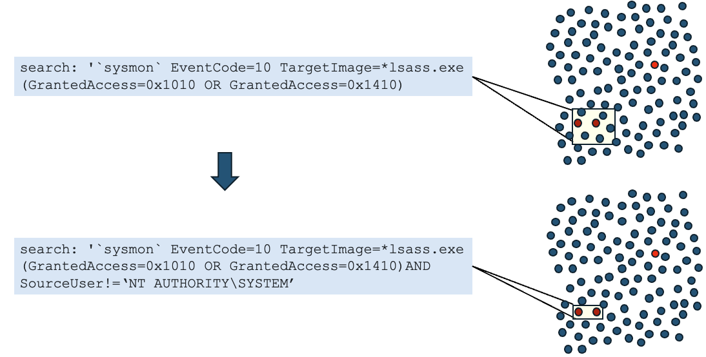
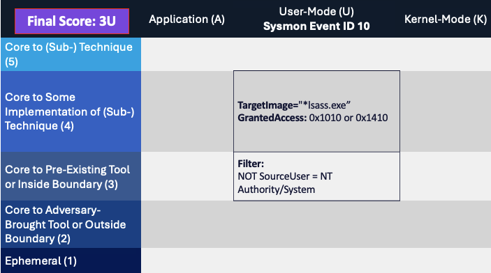
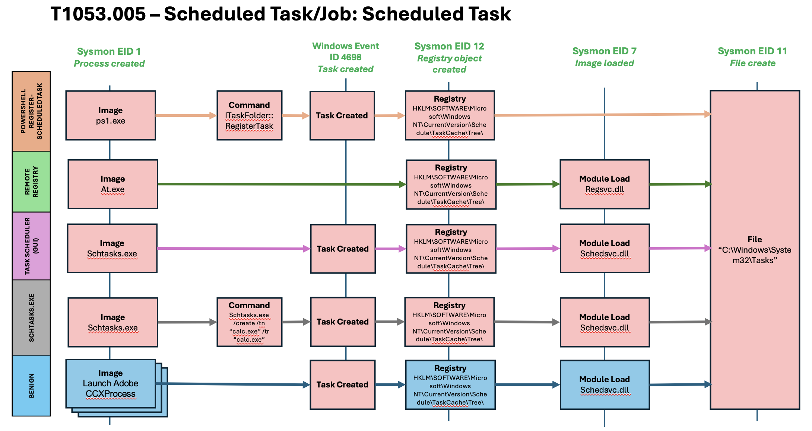
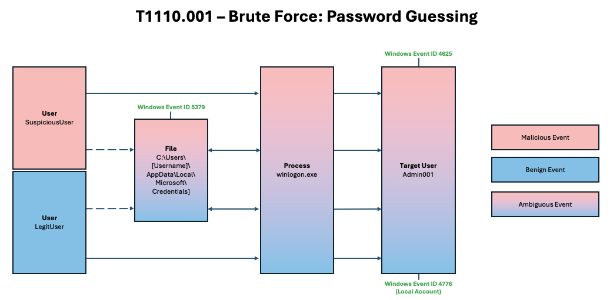
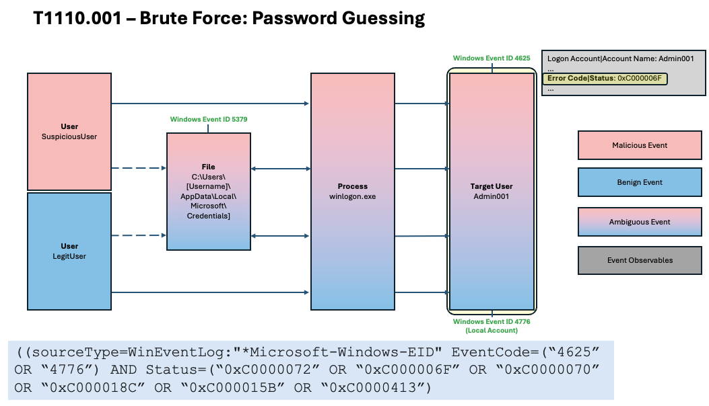

Detection Decomposition Diagram (D3)
====================================

What Is D3?
-----------

The Detection Decomposition Diagram (D3) is a visual aid designed to showcase
significant observables that exist across various implementations of a
technique.  The focus of a D3 for a given technique is on the known malicious
implementations to identify the most useful observables for use in a robust
detection.  While the primary focus is on observables that can be used for
resistance to adversary evasion and a low false negative rate, the D3 will also
include the most significant benign implementations to keep the false positive
rate in mind and help guide development toward as robust a detection as
possible.

The D3 tool is most helpful in the first step of the robust detection
development process, :ref:`identifying all spanning sets of observables for
malicious behavior<Spanning Sets>` as a way to illuminate key observables and
where those spanning sets may exist. The D3 can also be leveraged during
continual refinement of developed detections, however, as well as during later
sets.  Finally, the D3 can be a useful tool in visually depicting how accuracy
and robustness come together when evaluating a detection across various
implementations of a technique.  

One caveat is that a D3 is not necessarily comprehensive of all variations of
specific technique procedures. The goal of a D3 is not to capture every single
value possible for an observable in each implementation, as that could overwhelm
the visual and make it too difficult to understand. Rather, the D3 should
highlight the most significant implementations and observables in a way that
highlights all implementations at a higher, more abstracted level in a way that
is helpful for defenders and detection engineers, with the ultimate focus being
on shaping robust detections.

Our Inspiration: Capability Abstraction 
---------------------------------------

Capability abstractions document the actions taken by the system, and their
associated observables, once a technique is executed. Capability abstractions
also help identify commonalities between implementations. Those commonalities
are excellent candidates for low-variance or invariant behaviors and, therefore,
robust observables.

.. figure:: ../_static/capability_abstraction_specterops.png
   :alt: Kerberoasting - Specter Ops
   :align: center
   :scale: 100%

   Kerberoasting Capability Abstraction Taken From SpecterOps. [#f1]_ (Click to enlarge)

Capability abstraction, a concept developed by `SpecterOps <https://posts.specterops.io/capability-abstraction-fbeaeeb26384>`_, seeks to understand activities that occur on a system when an attacker is accomplishing their goals. It also introduced a visual graphic, known as an “abstraction map,” which conveys the relationships between operating system (OS) abstraction layers and begins to highlight how an adversary can evade a specific detection or sensor entirely and still accomplish their goals. The art of capability abstraction showcases how each tool or behavior can be uncovered into different layers that can be acted upon by defenders. As seen in the capability abstraction above, tools used for kerberoasting can map to similar managed code, Windows API functions, RPC calls, and the same network protocol. Through reverse engineering, defenders can utilize this information to detect behaviors that might be more difficult for adversaries to evade. For example, if defenders wanted to detect the tool implementations of kerberoasting shown here, they could create an analytic surrounding the network protocol Kerberos TGS-REQ/REP, a behavior that adversaries would not be able to evade based on the research conducted.

The capability abstraction map below for `T1543 - Create or Modify System Process:
Windows Service <https://attack.mitre.org/techniques/T1543/003/>`_ illustrates how
multiple tools can create a new service.

.. figure:: ../_static/new_service_capability_abstraction.png
   :alt: New Service Capability Abstraction - Created by SpecterOps
   :align: center
   :scale: 100%

   New Service Capability Abstraction created by SpecterOps. The relevant MITRE ATTACK
   Technique ID was changed to T1543.003 after this capability abstraction was published.
   [#f2]_ (Click to enlarge)

These tools and implementations include standard Windows or commonly abused
binaries, OS API calls or functions, and open-source or custom code that an
adversary might copy or develop. These different implementations may call the
Windows API differently, which in turn might call different RPC interfaces and
methods. However, they all ultimately utilize the same registry key within the
Registry Service Database. If an adversary wanted to evade detection at the tool
level, they could create a new service by directly interacting with the Windows
API, RPC, or Registry. This is not a hypothetical but has actually been seen in
the wild. Threat group APT41 has utilized Windows service creation within their
attacks not only through the utilization of the service creation tool (sc.exe),
but also by directly modifying the registry itself. [#f3]_

The Summiting the Pyramid team is utilizing capability abstraction mappings to
map certain observables to the :doc:`../levels/index` outlined by our methodology. As
observables are assigned, further research can be conducted to identify
detections based off those observables, especially for observables that might
cover part or all of a technique. For example, if a kernel call is detected, is
a specific Windows Event ID fired? Are any registry keys updated? Does a
registry key change over all implementations of a technique? These details give
the defender a broader perspective of not only the tools that use similar
behaviors toward the lower levels of the operating system, but also how to think
of detecting behaviors the closer an adversary gets to the kernel.

T1003.001: OS Credential Dumping LSASS Memory
---------------------------------------------

We will demonstrate how you can build your own D3 diagram with the example below
of T1003.001: OS Credential Dumping: LSASS Memory. [#f4]_

**Step 1: Identifying All Spanning Sets of Observables for Malicious Behavior** 

To begin, the Technique T1003.001: OS Credential Dumping: LSASS Memory was
researched to identify all potential implementations for how it could be
conducted, as well as one of the most prominent benign implementations.

   D3 for OS Credential Dumping: LSASS Memory. (Click to enlarge)

From there, we can see a spanning set of the ``TargetImage: “lsass.exe”`` is
easily identified. Like a capability abstraction, this observable occurs across
multiple implementations of this technique and could be used for building out a
robust detection.

   TargetImage: "lsass.exe" is an observable which is accurate and resistant to
   adversary evasion over time. (Click to enlarge)

**Step 2: Select the Spanning Set(s) Most Specific to the Malicious Behavior**

While an analytic focused on the ``TargetImage`` value has a low false negative,
it would also capture all of the benign activity involving LSASS.  We want to
keep the analytic focused on the malicious behavior while also maintaining a
manageable false positive rate, so next we will look at the associated events
triggered when LSASS is accessed and try to identify a more specific spanning
set.  From our investigation, Sysmon EID 10, which produces the ``TargetImage``
field, also has a field called ``GrantedAccess``. ``GrantedAccess`` is a 32-bit
mask that defines the access rights to a certain object. [#f5]_  The
``GrantedAccess`` mask values could help differentiate typical benign LSASS
access from potentially malicious access.

   The highlighted observables (TargetImage, GrantedAccess) are fields that can
   be used to increase the accuracy of the LSASS detection. (Click to enlarge)

This re-focus helps us get closer to a more useful, robust detection. If we
place the ``GrantedAccess`` masks defined on the ATT&CK page that are associated
with malicious implementations of OS Credential Dumping, specifically 0x1010 and
0x1410, [#f6]_  we see more targeted results produced by our detection analytic.
Our detection is accurate and scores at a :ref:`Some Implementations` on the
Summiting model, making it reasonably resistant to adversary evasion over time.

   The result of adding in GrantedAccess to the OS Credential Dumping query.
   (Click to enlarge)

The ``GrantedAccess`` mask field also allows us to highlight the most likely
malicious events, making it highly accurate. A large majority of the benign uses
of ``lsass.exe`` are made using the 0x1fffff access mask, while the 0x1010 and
0x1410 are far less common. These masks allow us to dramatically lower our false
positives while retaining visibility for multiple implementations of LSASS
memory access. Additional malicious GrantedAccess masks could be added to make
the detection more accurate in capturing more implementations based on what is
expected within the environment. Since this is not a :ref:`Technique`, it will
not capture all malicious events.

**Step 3: Add Exclusions for False Positive Reduction.**

While this analytic was much better in terms of accuracy and resistance to
adversary evasion over time, there is still potential for false positives that
we can try to address.  From the notes on an associated Splunk analytic and
analysis in our own testing environment, we were able to discern that certain
users accessing LSASS is probably more indicative of malicious behavior than
other system-associated accounts, and thus could be a way to reduce some false
positives.  The ``SourceUser`` field is managed by the organization and specific
to the environment, making it a :ref:`Pre-Existing Tools`. Additionally, the
value ``NT AUTHORITY\SYSTEM`` is a specific value that is known to run mostly
benign activities throughout the system.

   Our detection environment identifies a few distinct users which demonstrate
   the OS Credential Dumping LSASS behavior. (Click to enlarge)

While this introduces another means for the adversary to potentially hide (by
acting as one of those “trusted” users), we made the determination that
filtering on user was more beneficial in terms of reducing false positives than
it would be harmful to robustness.  Thus, we arrived at our final analytic in
its most robust form.

   Increasing the accuracy of our analytic by looking at certain users that can
   call LSASS. (Click to enlarge)

Therefore, our final analytics scoring comes out to a **3U** with the use of a filter:

   Our final score for OS Credential Dumping: LSASS Memory is 3U. (Click to enlarge)

T1053.005: Scheduled Tasks
--------------------------

For a more detailed process of the Scheduled Task D3 visual, :ref:`please refer to the Building a Robust Detection walkthrough<Build Robust Detection>`. 

   D3 for scheduled tasks. (Click to enlarge)

T1110.001: Brute Force: Password Guessing
-----------------------------------------

This example D3 depicts the Password Guessing technique, [#f7]_ and in doing so
shows the significant overlap in malicious and benign execution.  Due to this
overlap, it is very difficult to differentiate adversarial failed login attempts
from benign, typical attempts.

   D3 for Brute Force: Password Guessing. [#f7]_ (Click to enlarge)

Because of the difficulty with differentiation, understanding benign behavior
and fields and values associated with it is a key factor to making a useful
detection so that analysts are not overwhelmed with false positives they need to
investigate.  One robust field that can be used to assist with narrowing down
results is the Status code for Windows Event ID 4625, or the Error Code value
for Windows Event ID 4776 (which conveniently have equivalent values).  One
`Sigma analytic
<https://github.com/SigmaHQ/sigma/blob/master/rules/windows/builtin/security/win_security_susp_failed_logon_reasons.yml>`_
that leverages these values is represented on the D3 below.

   The Error Code provided in Windows EID 4776 can help reduce the false
   positive rate of this detection, but not eliminate completely. (Click to enlarge)

While this analytic still does not completely eliminate the chances of returning
false positives, it does assist with narrowing down results for analysts to
investigate while also being resistant to much adversary evasion over time.
This example highlights how some techniques do not cleanly differentiate between
malicious and benign behavior, and while we can use the robust detection
guidance to narrow down alerts to more specifically focus on potentially
malicious behavior, it may not be possible to do so effectively in all
scenarios.

.. rubric:: References

.. [#f1] https://posts.specterops.io/capability-abstraction-fbeaeeb26384
.. [#f2] https://abstractionmaps.com/maps/t1050/
.. [#f3] https://www.mandiant.com/resources/blog/apt41-initiates-global-intrusion-campaign-using-multiple-exploits
.. [#f4] https://attack.mitre.org/techniques/T1003/001/
.. [#f5] https://learn.microsoft.com/en-us/windows/win32/secauthz/access-rights-and-access-masks
.. [#f6] https://www.splunk.com/en_us/blog/security/you-bet-your-lsass-hunting-lsass-access.html
.. [#f7] https://attack.mitre.org/techniques/T1110/001/
