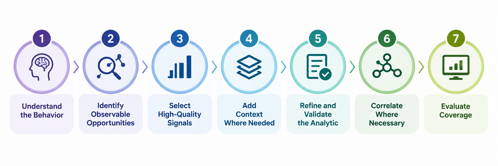

.. _detection-engineering-workflow:

Detection Engineering Workflow
==============================

Building effective detection analytics requires more than writing a query
against available telemetry. Detection engineers must understand the behavior
they want to detect, identify where that behavior can be observed, select
useful signals, add context where necessary, and evaluate what the resulting
analytic actually covers.

The Summiting the Pyramid methodology brings these activities together into a
repeatable detection engineering workflow:

These steps are not strictly linear. Detection engineering is an iterative
process, and findings at one stage may identify gaps that require revisiting an
earlier decision.

1. Understand the Behavior
--------------------------

Start with the adversary behavior you want to detect rather than a particular
tool, indicator, or analytic. Identify the ATT&CK technique or sub-technique of interest and understand the
different ways the behavior can be performed. A technique may have multiple
behaviorally distinct implementations, each involving different execution
paths and system interactions.

At this stage, ask:

* What behavior am I trying to detect?
* How can an adversary accomplish it?
* Which system interactions are required to perform it?
* Which differences between implementations matter for detection?

Starting with behavior establishes the scope of the detection before telemetry
or analytic logic constrains the problem. See :ref:`Implementation Coverage <implementation-coverage>` and the
:ref:`Implementation Catalog <implementation-catalog>` for guidance on
understanding behaviorally distinct implementations of ATT&CK techniques.

2. Identify Observable Opportunities
-------------------------------------

Once the behavior is understood, determine where evidence of that behavior can
be observed. Malicious activity can produce observables at multiple layers, ranging from
tool-specific artifacts to system interactions shared across several
implementations. Understanding these relationships can reveal detection
opportunities that are more durable than indicators associated with a single
tool or execution path. The :ref:`Detection Decomposition Diagram (D3)
<d3>` can be used to visualize significant
observables across implementations and identify common detection
opportunities.

Next, determine whether the necessary telemetry is available. Trace relevant
system interactions to the sensors, events, and fields capable of observing
them. See :ref:`Field-Level Telemetry Mappings & Scoring
<field-level-telemetry-mappings>` for guidance on connecting system
interactions to observable telemetry.

3. Select High-Quality Signals
------------------------------

From the available observables, select signals that provide meaningful
evidence of the behavior and are difficult for an adversary to avoid. Do not assume that the most specific observable is necessarily the strongest
one. A filename, hash, tool name, or command string may precisely identify
known activity while remaining inexpensive for an adversary to change.
Conversely, an observable tied to a required system interaction may provide
more durable visibility but require additional context to distinguish
malicious from legitimate activity.

The objective is to select and combine signals that provide useful
:ref:`Detection Quality <detection-quality>` while maintaining visibility
across the behavior you intend to detect. See :ref:`High-Quality Detection Design Principles
<high-quality-detection-design-principles>` for guidance on selecting signals
and designing detection logic around behavior rather than disposable
artifacts.

4. Add Context Where Needed
---------------------------

Some adversary behaviors cannot be reliably distinguished from legitimate
activity using a single observable. When the behavior is ambiguous, determine what additional information is
needed to establish intent. Useful context may come from the user performing
the activity, the affected system, timing, environmental baselines, other
observable fields, or surrounding activity in the attack chain.

The objective is to add enough context to distinguish the behavior of interest
without unnecessarily narrowing the analytic and creating avoidable blind
spots. See :ref:`Using Context to Determine Intent
<Context>` for guidance on technique-level,
chain-level, and peripheral-level context.

5. Refine and Validate
----------------------

Test the analytic against representative data from the environment in which it
will operate. Evaluate whether the analytic captures the intended behavior, identify
legitimate activity that produces alerts, and determine whether expected
malicious or emulated activity is missed.

Environmental baselines can help identify recurring benign behavior and
determine where exclusions may be appropriate. When adding an exclusion,
consider both its operational benefit and the blind spot it creates. Broad or
easily manipulated exclusions may give an adversary an opportunity to hide
otherwise detectable activity.

Prefer exclusions that:

* are grounded in known benign behavior;
* are as specific as practical;
* rely on conditions that are difficult for an adversary to manipulate; and
* have clearly understood detection trade-offs.

Validation should continue after deployment. Environments change, benign
activity changes, telemetry changes, and adversaries adapt. Analytics and
their exclusions should therefore be reviewed and adjusted over time. See :ref:`High-Quality Detection Design Principles
<high-quality-detection-design-principles>` for additional guidance on
designing detections for the environment in which they operate.

6. Correlate Where Necessary
----------------------------

A single analytic may not always provide enough evidence to reliably identify
malicious behavior. When multiple observations collectively provide stronger evidence than any
one observation alone, correlation can add the context necessary to make a
more useful detection. This may involve directly correlating dependent
activities associated with a known adversary or campaign, or more loosely
combining behaviors that collectively increase confidence.

Correlation should be used when the relationship between observations adds
meaningful information, rather than simply to increase analytic complexity. See :ref:`Chaining Analytics <Chaining Analytics>` for guidance on direct and
loose correlation approaches.

7. Evaluate Coverage
--------------------

Once an analytic has been developed and validated, evaluate what defensive
coverage it actually provides.

Consider:

* Which implementations of the mapped ATT&CK technique can the analytic
  detect?
* How robust are the signals it relies upon?
* How well do those signals distinguish the behavior of interest?
* What behavior or implementations remain outside the analytic's visibility?
* Is a remaining gap caused by detection logic, telemetry, or both?

Coverage evaluation can identify opportunities to improve the analytic,
collect different telemetry, develop complementary detections, or revisit the
ATT&CK mapping. See :ref:`Measuring Detection Coverage <measuring-detection-coverage>` for
guidance on Detection Quality and Implementation Coverage. The
:ref:`Detection Coverage Calculator <detection-coverage-calculator>` can
automate portions of this analysis across larger sets of detection content.

An Iterative Process
--------------------

Detection engineering rarely ends after the first analytic is deployed. Coverage analysis may identify an implementation that is not observed.
Validation may expose a false-positive problem. A new telemetry source may
provide a stronger observable, or changes in the environment may make an existing
exclusion unsafe or unnecessary; these findings should feed back into the workflow. The goal is not to create a perfect analytic in one pass, but to establish a
repeatable process for refining and improving your detections.
