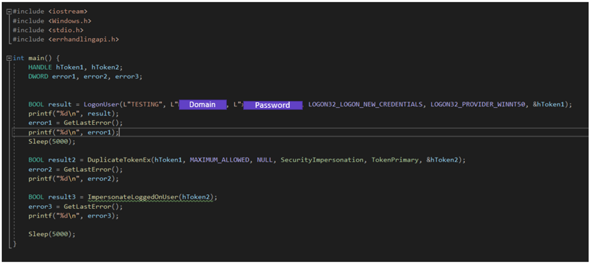
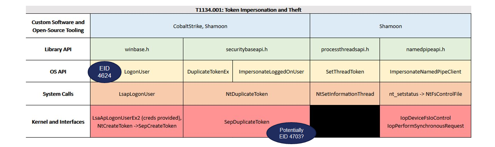

----------------------------
Potential Access Token Abuse
----------------------------

- https://github.com/SigmaHQ/sigma/blob/master/rules/windows/process_creation/proc_creation_win_hktl_cobaltstrike_bloopers_cmd.yml 

.. code-block:: yaml
  
  title: Operator Bloopers Cobalt Strike Commands
  id: 647c7b9e-d784-4fda-b9a0-45c565a7b729
  related:
      - id: 4f154fb6-27d1-4813-a759-78b93e0b9c48
        type: similar
  status: experimental
  description: Detects use of Cobalt Strike commands accidentally entered in the CMD shell
  references:
      - https://hstechdocs.helpsystems.com/manuals/cobaltstrike/current/userguide/content/cobalt-4-5-user-guide.pdf
      - https://thedfirreport.com/2021/10/04/bazarloader-and-the-conti-leaks/
      - https://thedfirreport.com/2022/06/16/sans-ransomware-summit-2022-can-you-detect-this/
  author: _pete_0, TheDFIRReport
  date: 2022/05/06
  modified: 2023/01/30
  tags:
      - attack.execution
      - attack.t1059.003
  logsource:
      category: process_creation
      product: windows
  detection:
      selection_img:
          - OriginalFileName: 'Cmd.Exe'
          - Image|endswith: '\cmd.exe'
      selection_cli:
          CommandLine|startswith:
              - 'cmd '
              - 'cmd.exe'
              - 'c:\windows\system32\cmd.exe'
          CommandLine|contains:
              - 'psinject'
              - 'spawnas'
              - 'make_token'
              - 'remote-exec'
              - 'rev2self'
              - 'dcsync'
              - 'logonpasswords'
              - 'execute-assembly'
              - 'getsystem'
      condition: all of selection_*
  falsepositives:
      - Unknown
  level: high

Original Analytic Scoring
^^^^^^^^^^^^^^^^^^^^^^^^^
.. list-table::
    :widths: 20 20 30 20
    :header-rows: 1

    * - 
      - Library (L)
      - User-mode (U)
      - Kernel-mode (K)
    * - Core to (Sub-) Technique (5)
      - 
      - 
      - 
    * - Core to Part of (Sub-) Technique (4)
      - 
      -
      -
    * - Core to Pre-Existing Tool (3)
      - 
      - 
      -
    * - Core to Adversary-brought Tool (2)
      - 
      - | EventID: 1
        | CommandLine|contains:
        |    - 'psinject'
        |    - 'spawnas'
        |    - 'make_token'
        |    - 'remote-exec'
        |    - 'rev2self'
        |    - 'dcsync'
        |    - 'logonpasswords'
        |    - 'execute-assembly'
        |    - 'getsystem'
      - 
    * - Ephemeral (1)
      - 
      - | selection_img:
        |     - OriginalFileName: 'Cmd.Exe'
        |     - Image|endswith: '\\cmd.exe'
        |     CommandLine|startswith:
        |         - 'cmd '
        |         - 'cmd.exe'
        |         - 'c:\\\\windows\\\\system32\\\\cmd.exe'
      - 

This analytic's robustness score is **1U** because it relies on commands being run from ``cmd.exe``. While some observables of the analytic score at level 2, they are ORed with level 1 
making the overall analytic score at 1U. This analytic also relies on an adversary accidentally entering these commands on the victim machine since the specified 
arguments are typically executed on a beacon within CobaltStrike. 

We can generate an analytic that scores scores higher according to the Summiting methodoogy by researching what happens on a system when a token is impersonated.
The original analytic spans several different behaviors, tactics, and techniques including process injection, privilege escalation, 
lateral movement, access token manipulation, and credential access, so we also need to re-scope our analytic and focus on a single ATT&CK technique. We’ll continue 
with **T1134.001 Access Token Manipulation: Token Impersonation/Theft**. We will further scope down our research, focusing on access token theft implementations that 
leverage Windows API calls versus command line implementations like the ``runas`` command.

Test scripts were executed to call Windows APIs commonly used by adversaries and/or tools when performing access token manipulation, as seen on the ATT&CK page [#f1]_:

  - LogonUser
  - DuplicateTokenEx
  - ImpersonateLogonUser

  Test script used to call Windows APIs associated with Access Token Manipulation

Testing confirmed that calling these APIs generated Event ID 4624 (An account has been logged on).

.. note::
  ``Audit Logon`` events must be configured in Local System or Group Policy to capture Event ID 4624

With knowledge that event ID 4624 [#f2]_ is fired anytime an adversary performs access token manipulation, we can now begin to develop a new analytic. Simply searching for 
Event ID 4624 would be incredibly noisy on a production environment, therefore defenders must leverage other fields in the event to filter out false positives. 
Fortunately, the Summiting team has gone through this process already, submitted the improved analytic to Sigma through previous research [#f3]_, and started developing a capability abstraction map. The team is continuing the research to find better event IDs or other observables which can be correlated to access tokens specifically.

.. code-block:: yaml

  title: Potential Access Token Abuse
  id: 02f7c9c1-1ae8-4c6a-8add-04693807f92f
  status: experimental
  description: Detects potential token impersonation and theft. Example, when using "DuplicateToken(Ex)" and "ImpersonateLoggedOnUser" with the "LOGON32_LOGON_NEW_CREDENTIALS flag".
  references:
      - https://www.elastic.co/fr/blog/how-attackers-abuse-access-token-manipulation
      - https://www.manageengine.com/log-management/cyber-security/access-token-manipulation.html
  author: Michaela Adams, Zach Mathis
  date: 2022/11/06
  modified: 2023/04/26
  tags:
      - attack.defense_evasion
      - attack.privilege_escalation
      - attack.t1134.001
  logsource:
      product: windows
      service: security
  detection:
      selection:
          EventID: 4624
          LogonType: 9
          LogonProcessName: 'Advapi'
          AuthenticationPackageName: 'Negotiate'
          ImpersonationLevel: '%%1833' # Impersonation
      condition: selection
  falsepositives:
      - Anti-Virus
  level: medium

  Capability abstraction map for API-based implementations of Access Token Manipulation: Token Impersonation and Theft

Improved Analytic Scoring
^^^^^^^^^^^^^^^^^^^^^^^^^

.. list-table::
    :widths: 20 20 30 20
    :header-rows: 1

    * - 
      - Library (L)
      - User-mode (U)
      - Kernel-mode (K)
    * - Core to (Sub-) Technique (5)
      - 
      - 
      - 
    * - Core to Part of (Sub-) Technique (4)
      - 
      - | EventID: 4624
        | LogonType: 9
        | LogonProcessName: 'Advapi'
        | AuthenticationPackageName: 'Negotiate'
        | ImpersonationLevel: '%%1833'
      -
    * - Core to Pre-Existing Tool (3)
      - 
      - 
      -
    * - Core to Adversary-brought Tool (2)
      - 
      - 
      - 
    * - Ephemeral (1)
      - 
      - 
      - 

.. note::
   The behavioral analytic research for Access Token Manipulation is covered in MITRE ATT&CK Defender's (MAD) Technique Detection Course on Access Token Manipulation. Learn more about the underlying research and process of discovering the behavioral analytics by subscribing and watching the MAD Access Token Manipulation `Technique Detection course <https://mad.mitre-engenuity.org/CourseDetail/22>`_ and `Adversary Emulation course <https://mad.mitre-engenuity.org/CourseDetail/21>`_.

.. rubric:: References

.. [#f1] https://attack.mitre.org/techniques/T1134/001/
.. [#f2] https://www.ultimatewindowssecurity.com/securitylog/encyclopedia/event.aspx?eventid=4624
.. [#f3] https://github.com/SigmaHQ/sigma/blob/a08e1b9d45e61570d26377e8f6811d37c6a01166/rules/windows/builtin/security/account_management/win_security_access_token_abuse.yml
.. [#f4] https://mitre-engenuity.org/cybersecurity/mad/