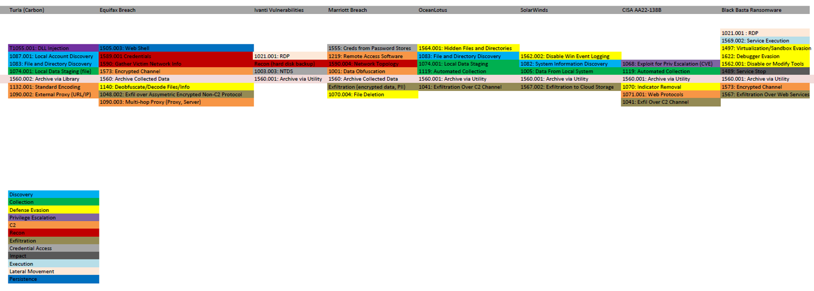

-------------------------
Archive Collected Data
-------------------------

Technique Investigation
^^^^^^^^^^^^^^^^^^^^^^^^^

This technique focuses on the repeated creation of compressed archive files,
such as Zip files or WinRar files, in a short amount of time. While the creation
of file archives may be a routine part of office work, it can also be indicative
of staging files for exfiltration or can be paired with encryption to become the
impact step of a ransomware attack. The behavior which identifies the
distinction between benign usage and potential malicious usage is multiple
archive events occurring in a short time frame. This indicates the use of a
script or other automated process for creating archives, which is rare enough
for normal user activity that it should minimize false positive detections. 

Context Flowchart Walkthrough
^^^^^^^^^^^^^^^^^^^^^^^^^^^^^^

.. figure:: ../_static/archive-collected-data-flow.png
   :alt: Context Flowchart Walkthrough for Archive Collected Data Technique
   :align: center
   :scale: 100%

   Click to enlarge

This technique, which is indistinguishable from routine workflows except for
volume, falls into the chained technique category of "Performing Abnormal
Action.” The only differentiator we identified from legitimate usage was the
volume and number of these actions in a short amount of time. This means that
effective detection needs to rely on the chaining together of several individual
events into a chain for proper detection.

Technique-Level Analysis
^^^^^^^^^^^^^^^^^^^^^^^^^^^^^^

   Click to enlarge

   Click to enlarge

We researched a way in which we could pair the archive creation with
exfiltration methods directly. However, we found that there is too much
variation between specific exfiltration methods used in the attack chains that
the resulting analytics would not have been very robust. Additionally, the
environments in which we we tested these analytics had an accelerated timeline
of known adversary activity because our “known bad” event logs came from
adversary emulation exercises. Actual APT activity or ransomware campaigns may
have compression and exfiltration occur out-of-order or on time-tables that we
could not accurately predict. 

The focus on the volume of archive creation is one behavior we identified that
was most likely to filter out the routine usage and highlight potentially
malicious behavior.

Original Analytic
^^^^^^^^^^^^^^^^^^^^^^^^^
.. code-block:: yaml

    powershell EventCode=4104 ScriptBlockText = "*Compress-Archive*"  ScriptBlockText = "*\\Temp\\*" 
     | stats count min(_time) as firstTime max(_time) as lastTime by EventCode ScriptBlockText Computer UserID 
     | rename Computer as dest 
     | rename UserID as user 
     | `security_content_ctime(firstTime)` 
     | `security_content_ctime(lastTime)` 
     | `windows_archive_collected_data_via_powershell_filter`

The `original Splunk analytic
<https://research.splunk.com/endpoint/74c5a3b0-27a7-463c-9d00-1a5bb12cb7b5/>`_
we used for comparison focuses solely on the PowerShell usage of the
“Compress-Archive” commandlet. Additionally, it only alerted on compression
operations which occurred in a “Temp” directory. This analytic does filter out
much of the benign usage with the inclusion of this directory filter. However,
this is a brittle analytic. All an adversary need do to avoid triggering this is
to compress files outside of folders named “Temp.” Also, this focus on
PowerShell compression also leaves out scenarios where an adversary uses a
standard archiving tool like WinZip or 7zip for their compression. 

.. list-table::
    :widths: 20 20 20 20
    :header-rows: 1

    * - 
      - Application (A)
      - User-mode (U)
      - Kernel-mode (K)
    * - Core to (Sub-) Technique (5)
      - 
      - 
      - 
    * - Core to Part of (Sub-) Technique (4)
      - 
      - 
      -
    * - Core to Pre-Existing Tool (3) 
      -
      -
      - | EventCode=4104
        | \'powershell\'
    * - Core to Adversary-brought Tool (2)
      - 
      - 
      - 
    * - Ephemeral (1)
      - 
      - 
      - | ScriptBlockText = "\*\\Temp\\\*

This analytic focuses only on Process Creation of a Pre-Existing Tool commonly
used on the compression technique. The event code is generated from a Kernel
level operation, so for the EventCode=4104 portion of the analytic scoring, we
can place that in 3K.

However, the inclusion of the "Temp" directory as a way of filtering out noise
is completely Ephemeral. If an adversary were to simply avoid working out of a
folder titled "Temp," the malicious behavior would be filtered out as benign.

Following the Boolean logic of how these components are being combined via
“AND”, the overall analytic is thus scored as a 1K.

Improved Analytic
^^^^^^^^^^^^^^^^^^^^^^^^^

.. code-block:: yaml

   ### CORRELATION
   title: Multiple Archived Files
   description: Detects multiple uses of archiving utilities indicative of staging activity
   status: test
   correlation: 
      type: event_count
      rules:
         - archiving_utils
      group-by:
         - TargetObject
      timespan: 10m
      condition:
         gte: 5
   ---
   ### BASE RULE
   title: Archiving Data Using Common Utilties
   status: test
   description: An adversary may compress data that is collected prior to exfiltration using 3rd party utilities
   name: archiving_utils
   author: MITRE
   date: 2025-03-25 
   tags:
       - attack.collection
       - attack.t1560.001
   logsource:
       product: windows
       category: process_creation
   detection:
       selection:
           - OriginalFileName:
               - '7z.exe'
               - '7z*.exe'
               - 'winzip.exe'
               - 'winzip64.exe'
               - 'rar.exe'
           - CommandLine|contains:
               - 'Compress-Archive'
       condition: 1 of selection
   falsepositives:
       - Legitimate user activity

.. list-table::
    :widths: 20 20 30 20
    :header-rows: 1

    * - 
      - Application (A)
      - User-mode (U)
      - Kernel-mode (K)
    * - Core to (Sub-) Technique (5)
      - 
      - 
      - 
    * - Core to Part of (Sub-) Technique (4)
      - 
      - 
      -
    * - Core to Pre-Existing Tool (3)
      - 
      -
      - | EventCode=4104
        | \`powershell\`
        | ScriptBlockText = "\*Compress-Archive\*“
        | OriginalFileName=(7z\*.exe OR \*rar.exe)

    * - Core to Adversary-brought Tool (2)
      - 
      - 
      - 
    * - Ephemeral (1)
      - 
      - 
      - 

The change in our analytic focused on substituting the Ephemeral string search
of "Temp" with the timespan and count of Archiving Data Using Common Utilities.
This elimination of the 1K analytic scoring immediately improved the analytic to
a 3K, but it also introduced a far greater chance for false positives to be
generated. To reduce this false positive opportunity, we focused on a number of
events that would occur within a short timeframe. This eliminated the benign use
case of a user who might be using archive tools on their workstation for
approved business purposes. Scripting is the only common way to reach the
volumes our analytic checks, and we find this to be an acceptable level of
potential false positive alerts. Please note that the number of archive events
and the time span may need to be adjusted for your organization.
