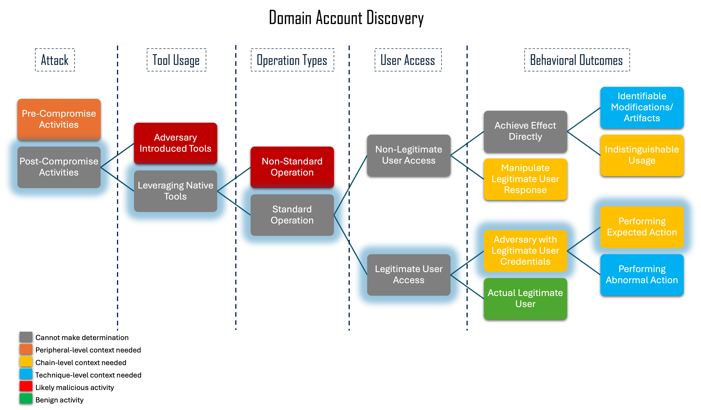
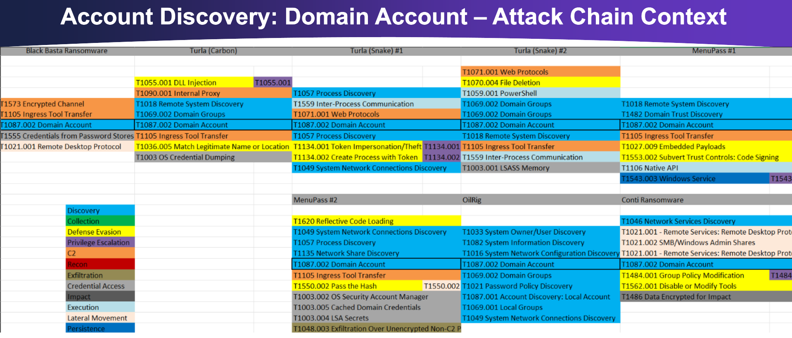

-------------------------
Domain Account Discovery
-------------------------

Account Discovery: Domain Account lists existing accounts on a domain. This
technique is considered ambiguous because a system administrator would have
legitimate reasons to perform these actions and would use some of the same
commands to do so.

While determining whether these actions are being used for malicious purposes or
not solely from looking at a command may be extremely difficult, we were able to
identify differentiating factors that add additional context and can help
determine intent. For example, which account is performing these actions, which
host are these actions being performed on, and when are these actions being
performed? Is the account expected to do so, have these commands been run on
this host before, and are the commands being run during normal working hours?
Was this action seen alongside other discovery techniques? Since the action
alone is not enough to determine intent, we need to add additional context to
help generate a larger picture of what is occurring.

Context Flowchart Walkthrough
^^^^^^^^^^^^^^^^^^^^^^^^^^^^^^



   Click to enlarge

When we look at the ambiguous nature of this technique, specifically when an
adversary uses built-in tools to perform it, and walk through the flowchart, we
can categorize this technique as “Performing Expected Action”. As discussed
previously, the best way to determine intent for this technique is to analyze
the context in which it is performed. Therefore, we see that this technique can
utilize Chain-Level Context Analysis in our resulting improved analytic.


Chain-Level Analysis
^^^^^^^^^^^^^^^^^^^^^^^^^^^^^^



   Click to enlarge

Existing `Attack Flows
<https://center-for-threat-informed-defense.github.io/attack-flow/>`_
that contained Account Discovery: Domain Account were investigated and other
techniques that were performed alongside it were extracted, as seen above. Based
on the Attack Flows, we selected T1069.002 Permission Group Discovery: Domain
Group, T1057 Process Discovery, T1049 System Network Connections Discovery,
T1049 System Information Discovery and T1018 Remote System Discovery as
techniques that will most likely be performed alongside Account Discovery:
Domain Account. We determined that if three or more out of the six techniques
are seen in short succession, especially when executed by the same user and on
the same host, it is highly likely that malicious activity is occurring.
Additional discovery techniques would also be valid for a chain analytic and
could be added to the total number of discovery techniques to watch, though the
threshold for the number of different techniques seen before triggering an alert
may need to be modified.

Original Analytic
^^^^^^^^^^^^^^^^^^^^^^^^^
.. code-block:: yaml

   tstats `security_content_summariesonly` count min(_time) as firstTime max(_time) as lastTime from datamodel=Endpoint.Processes where (Processes.process_name="cmd.exe" OR Processes.process_name="powershell*") AND Processes.process = "*Get-ADUser*" AND   Processes.process = "*-filter*" by Processes.dest Processes.user Processes.parent_process Processes.process_name Processes.process Processes.process_id Processes.parent_process_id Processes.parent_process_name 
    | `drop_dm_object_name(Processes)` 
    | `security_content_ctime(firstTime)` 
    | `security_content_ctime(lastTime)` 
    | `get_aduser_with_powershell_filter`


This `Splunk analytic
<https://research.splunk.com/endpoint/0b6ee3f4-04e3-11ec-a87d-acde48001122/>`_
was one of multiple chosen as a starting point for the larger chain analytic we
developed. It looks for the cmdlet ```Get-ADUser``` being run in either
PowerShell or the command prompt, which is one way an adversary may perform
Account Discovery: Domain Account.

.. list-table::
    :widths: 20 20 20 20
    :header-rows: 1

    * - 
      - Application (A)
      - User-mode (U)
      - Kernel-mode (K)
    * - Core to (Sub-) Technique (5)
      - 
      - 
      - 
    * - Core to Part of (Sub-) Technique (4)
      - 
      - 
      -
    * - Core to Pre-Existing Tool (3)
      - 
      - 
      - | Processes.process_name="cmd.exe"
        | Processes.process_name="powershell*"
        | Processes.process = "*Get-ADUser*"

    * - Core to Adversary-brought Tool (2)
      - 
      - 
      - 
    * - Ephemeral (1)
      - 
      - 
      - 

Since process creation is detected in kernel-mode, and this analytic is looking
for PowerShell and command prompt, which are existing tools, the analytic is a
3K.

Improved Analytic
^^^^^^^^^^^^^^^^^^^^^^^^^

.. code-block:: yaml

   ###CORRELATION
   title: Ambiguous Discovery
   status: test
   correlation: 
       type: event_count
       rules:
           - ambg_domain_account
           - ambg_domain_group
           - ambg_process
           - ambg_sys_net_conn
           - ambg_sys_info
           - ambg_remote_system
       group-by:
           - CommandLine
           - User
           - Computer
       timespan: 15m
       condition:
           gte: 3
   tags:
       - attack.discovery
       - attack.t1087.002
       - attack.t1069.002
       - attack.t1057
       - attack.t1049
       - attack.t1082
       - attack.t1018
   ---
   ### BASE RULEs
   title: Ambiguous Discovery - Domain Account
   name: ambg_domain_account
   description: powershell and command prompt domain account discovery
   logsource: 
     product: windows
     service: sysmon
   detection:
     selection:
       EventID: 1
       filter1087pwsh:
           CommandLine|contains:
             - "*powershell*"
             - "*Get-ADUser*"
       filter1087cmd:
           CommandLine|contains:
             - "*net*"
             - "*user*"
             - "*/do*"
     condition: selection and (filter1087pwsh or filter1087cmd)
   tags:
       - attack.discovery
       - attack.t1087.002
   ---
   title: Ambiguous Discovery - Domain Group
   name: ambg_domain_group
   description: powershell and command prompt domain group discovery
   logsource: 
     product: windows
     service: sysmon
   detection:
     selection:
       EventID: 1
       filter1069pwshgadg:
           CommandLine|contains:
             - "*powershell*"
             - "*Get-ADGroup*"
       filter1069pwshgdg:
           CommandLine|contains:
             - "*powershell*"
             - "*Get-DomainGroup*"
       filter1069cmd:
           CommandLine|contains:
             - "*net*"
             - "*group*"
             - "*/do*"
     condition: selection and (filter1069pwshgadg or filter1069pwshgdg or filter1069cmd)
   tags:
       - attack.discovery
       - attack.t1069.002
   ---
   title: Ambiguous Discovery - Process
   name: ambg_process
   description: powershell and command prompt process discovery
   logsource: 
     product: windows
     service: sysmon
   detection:
     selection:
       EventID: 1
       filter1057pwsh:
           CommandLine|contains:
             - "*powershell*"
             - "*Get-Process*"
       filter1057cmd:
           CommandLine|contains:
             - "*tasklist*"
     condition: selection and (filter1057pwsh or filter1057cmd)
   tags:
       - attack.discovery
       - attack.t1057
   ---
   title: Ambiguous Discovery - System Network Connections
   name: ambg_sys_net_conn
   description: powershell and command prompt system network connection discovery
   logsource: 
     product: windows
     service: sysmon
   detection:
     selection:
       EventID: 1
       filter1049pwsh:
           CommandLine|contains:
             - "*powershell*"
             - "*Get-NetTcpConnection*"
       filter1049cmd:
           CommandLine|contains:
             - "*net*"
             - "*use*"
       filter1049cmdnot:
         CommandLine|contains:
           - "*user*"
     condition: selection and (filter1049pwsh or (filter1049cmd and not filter1049cmdnot))
   tags:
       - attack.discovery
       - attack.t1049
   ---
   title: Ambiguous Discovery - System Information
   name: ambg_sys_info
   description: wmic and command prompt system information discovery
   logsource: 
     product: windows
     service: sysmon
   detection:
     selection:
       EventID: 1
       filter1082wmic:
           CommandLine|contains:
             - "*wmic*"
             - "*qfe*"
       filter1082cmd:
           CommandLine|contains:
             - "*systeminfo*"
             - "*hostname*"
     condition: selection and (filter1082wmic or filter1082cmd)
   tags:
       - attack.discovery
       - attack.t1082
   ---
   title: Ambiguous Discovery - Remote System
   name: ambg_remote_system
   description: powershell and command prompt remote system discovery
   logsource: 
     product: windows
     service: sysmon
   detection:
     selection:
       EventID: 1
       filter1018pwshgdcm:
           CommandLine|contains:
             - "*powershell*"
             - "*Get-DomainComputer*"
       filter1018pwshgadc:
           CommandLine|contains:
             - "*powershell*"
             - "*Get-AdComputer*"
       filter1018pwshgdc:
           CommandLine|contains:
             - "*powershell*"
             - "*Get-DomainController*"
       filter1018cmddomain:
           CommandLine|contains:
             - "*net*"
             - "*domain*"
             - "*computers*"
             - "*/do*"
       filter1018cmdview:
         CommandLine|contains:
           - "*net*"
           - "*view*"
           - "*/do*"
     condition: selection and (filter1018pwshgdcm or filter1018pwshgadc or filter1018pwshgdc or filter1018cmddomain or filter1018cmdview)
   tags:
       - attack.discovery
       - attack.t1018


.. list-table::
    :widths: 20 20 30 20
    :header-rows: 1

    * - 
      - Application (A)
      - User-mode (U)
      - Kernel-mode (K)
    * - Core to (Sub-) Technique (5)
      - 
      - 
      - 
    * - Core to Part of (Sub-) Technique (4)
      - 
      - 
      -
    * - Core to Pre-Existing Tool (3)
      - 
      -
      - | CommandLine|contains:
        | "*powershell*"
        | "*net*"
        | (...)

    * - Core to Adversary-brought Tool (2)
      - 
      - 
      - 
    * - Ephemeral (1)
      - 
      - 
      - 

Each base rule of the analytic is using Sysmon Event ID 1, process creation,
which is detected in kernel-mode. The base rules are also using PowerShell
cmdlets or command prompt commands for their detections, which are pre-existing.
Therefore, the whole analytic is scored as a 3K.

While the improved analytic does not do a better job of detecting domain account
discovery than the original, it does provide vital information about the context
in which the account discovery was performed. By filtering out discovery
techniques that are executed on their own, we can reduce the false positive rate
of detections on discovery techniques and reduce the workload on defenders.

We encourage defenders to use this analytic as a starting point, and to expand
on the number of base rules and the depth of the existing base rules. Additional
discovery techniques can be added to this analytic in the form of additional
base rules to broaden the scope of the analytic. Further ways to perform
different discovery techniques can be added to the existing base rules to
increase their effectiveness.
