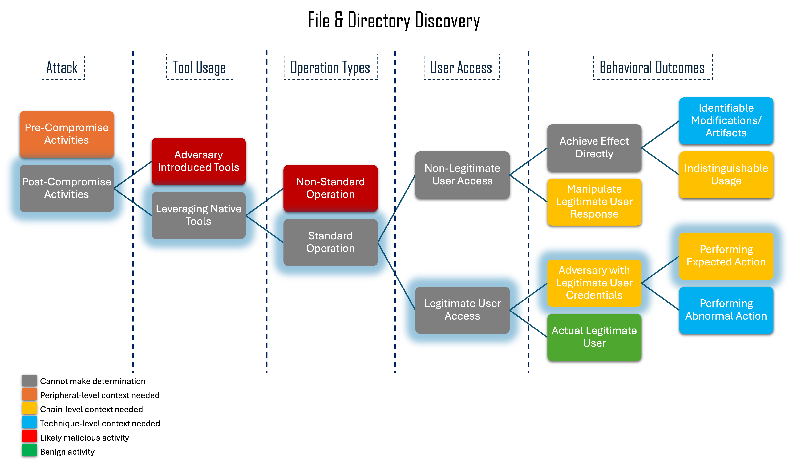
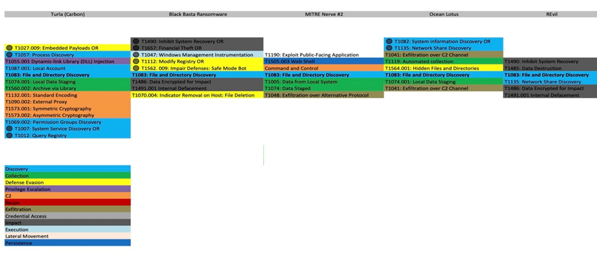

---------------------------
File & Directory Discovery
---------------------------

File and Directory Discovery (T1083) is the enumeration of files and
directories. Legitimate users commonly enumerate files and directories
throughout routine use. However, an adversary can perform the same actions with
malicious intent. 

Deep dive research of this technique highlighted key differences between benign
and malicious File and Directory Discovery. First, if the files and directories
are sensitive, it is more likely that the intent is malicious. Discovery during
times of day that are not routine or by users or groups that do not normally
perform this type of action should also be flagged. If the action occurs in
proximity with other malicious behaviors, it is more likely to be part of an
adversarial campaign. Finally, a high frequency of commands in a short amount of
time indicates scripted behavior, which is likely malicious. 

PowerShell and Windows Command Prompt often have aliases for discovery commands.
For example, gci is often used as an alias for ``Get-ChildItem``. Therefore, an
analytic that looks for only a command and not its aliases can be considered
brittle.

Context Flowchart Walkthrough
^^^^^^^^^^^^^^^^^^^^^^^^^^^^^^

   Click to enlarge

The context flowchart above shows that File and Directory discovery appears as a
standard operation and appears as legitimate user access, but is in reality an
adversary with legitimate user credentials performing the activity. When File
and Directory Discovery is performed as part of an attack, it may appear benign
when viewed in isolation. Consequently, as depicted by the flowchart, it is
important to perform a chain-level contextual analysis to determine whether a
specific occurrence of file and directory discovery behaviors are displaying
malicious intent. 

Chain-Level Analysis
^^^^^^^^^^^^^^^^^^^^^^^^^^^^^^

   Click to enlarge

The image above shows a chain level analysis of adversary campaigns that include
File and Directory Discovery. An examination of the chain level analysis
concludes that File and Directory Discovery is generally followed by Data
Encrypted for Impact (T1486) or Data Staged (T1074).

The team chose to focus on the ransomware scenario, zeroing in on the connection
between File and Directory Discovery and Data Encrypted for Impact.

Original Analytic
^^^^^^^^^^^^^^^^^^^^^^^^^

The team did not start with an existing File and Directory discovery-focused
analytic as many we found were brittle in nature.  Instead, our resulting
analytic was based upon the investigative research conducted as a part of this
project.

The following analytic was found for Data Encrypted for Impact:

.. code-block:: yaml
  
    title: Suspicious Reg Add BitLocker
    id: 0e0255bf-2548-47b8-9582-c0955c9283f5
    status: test
    description: Detects suspicious addition to BitLocker related registry keys via the reg.exe utility
    references:
      - https://thedfirreport.com/2021/11/15/exchange-exploit-leads-to-domain-wide-ransomware/
    author: frack113
    date: 2021-11-15
    modified: 2022-09-09
    tags:
      - attack.impact
      - attack.t1486
    logsource:
      category: process_creation
      product: windows
    detection:
      selection:
        CommandLine|contains|all:
          - REG
          - ADD
          - \SOFTWARE\Policies\Microsoft\FVE
          - /v
          - /f
        CommandLine|contains:
          - EnableBDEWithNoTPM
          - UseAdvancedStartup
          - UseTPM
          - UseTPMKey
          - UseTPMKeyPIN
          - RecoveryKeyMessageSource
          - UseTPMPIN
          - RecoveryKeyMessage
      condition: selection
    falsepositives:
      - Unlikely
    level: high

The above analytic looks for process creation events where regedit is being used
via the command line to add values to registry keys that are specific to
BitLocker, setting conditions for the utility to be used for ransomware.

.. list-table::
    :widths: 20 20 20 20
    :header-rows: 1

    * - 
      - Application (A)
      - User-mode (U)
      - Kernel-mode (K)
    * - Core to (Sub-) Technique (5)
      - 
      - 
      - 
    * - Core to Part of (Sub-) Technique (4)
      - 
      - 
      -
    * - Core to Pre-Existing Tool (3)
      - 
      - 
      - | CommandLine|contains|all:
        |    -REG
        |    -ADD
        |    -\SOFTWARE\Policies\Microsoft\FVE
        |    -/v
        |    -/f
        | CommandLine|contains:
        |    -EnableBDEWithNoTPM
        |    -UseAdvancedStartup
        |    -UseTPM
        |    -UseTPMKey
        |    -UseTPMKeyPIN
        |    -RecoveryKeyMessageSource
        |    -UseTPMPIN
        |    -RecoveryKeyMessage
    * - Core to Adversary-brought Tool (2)
      - 
      - 
      - 
    * - Ephemeral (1)
      - 
      - 
      - 

Because the original “Suspicious Reg Add Bitlocker” analytic uses a process
creation event (which we are assuming could be Sysmon Event ID 1), we can
conclude it is triggered at the kernel level, and so it is scored as a K.
Because it is looking for command line utilization to modify registry keys, it
is scored at the “Core to Pre-Existing Tool or Inside Boundary (3)” level. This
results in an overall score of 3K.

Improved Analytic
^^^^^^^^^^^^^^^^^^^^^^^^^

.. code-block:: yaml

   ### CORRELATION RULE
   title: Correlation - File and Directory Discovery Followed by Suspicious Reg Add BitLocker
   status: test
   description: Detects file and directory discovery followed by suspicious addition to BitLocker related registry keys via the reg.exe utility
   references: https://github.com/SigmaHQ/sigma-specification/blob/main/specification/sigma-correlation-rules-specification.md
   author: Kayla Kraines (MITRE CTID)
   date: 2025-03-25
   correlation:
       type: temporal_ordered
       rules:
           - file_directory_discovery
           - suspicious-bitlocker-reg-event
   timespan: 60m
   falsepositives:
       - Unlikely
   level: high
   ---
   ### BASE RULES
   title: Suspicious Reg Event BitLocker
   status: test
   description: Detects suspicious modification to BitLocker related registry keys
   name: suspicious-bitlocker-reg-event
   references: https://thedfirreport.com/2021/11/15/exchange-exploit-leads-to-domain-wide-ransomware/
   author: MITRE
   date: 2025-03-21
   modified: 2025-03-21
   tags:
       - attack.impact
       - attack.t1486
   logsource:
       category: registry_event
       product: windows
   detection:
       selection:
           TargetObject|contains:
               - 'EnableBDEWithNoTPM'
               - 'UseAdvancedStartup'
               - 'UseTPM'
               - 'UseTPMKey'
               - 'UseTPMKeyPIN'
               - 'RecoveryKeyMessageSource'
               - 'UseTPMPIN'
               - 'RecoveryKeyMessage'
       condition: selection
   falsepositives:
       - Unlikely
   level: high
   ---
   title: File & Directory Discovery
   status: test
   description: Detects commands that enumerate or display files or directories.
   name: file_directory_discovery
   author: Kayla Kraines (MITRE CTID)
   date: 2025-03-25 
   tags:
       - attack.discovery
       - attack.t1083
   logsource:
       product: windows
       category: process_creation
   detection:
       selection:
           - OriginalFileName:
               - 'ls.exe'
               - 'dir.exe'
               - 'tree.exe'
               - 'cat.exe'
               - 'find.exe'
               - 'locate.exe'
           - CommandLine|contains:
               - 'Get-ChildItem'
       condition: 1 of selection
   falsepositives:
       - Legitimate user activity

The improved analytic is a direct correlation between the improved “Suspicious
Reg Add Bitlocker” analytic and a new “File and Directory Discovery” analytic. 

The Suspicious Reg Add Bitlocker analytic was improved to trigger on the
registry key being changed, not only via command line. This enables the analytic
to cover many more implementations of this activity. This analytic is still
scored at 3K. 

The File and Directory Discovery analytic is triggering on process creation at
the Kernel-Mode at the “Core to Pre-Existing Tool or Inside Boundary” level and
is therefore scored at 3K. 

Overall, the final analytic is scored at 3K, which is the same scoring as the
original analytic. This analytic will trigger when File & Directory Discovery
co-occurs with the SOFTWARE\Policies\Microsoft\FVE\EnableBDEWithNoTPM Bitlocker
reigstry key being editing.

Chaining these two analytics drastically improves the impact that these
analytics may have. The “File and Directory Discovery” analytic alone would
trigger frequently on regular user activity, but correlating it with the
“Suspiciuos Reg Add Bitlocker” analytic makes it more useful in alerting on
suspicious enumeration of files and directories.

.. list-table::
    :widths: 20 20 30 20
    :header-rows: 1

    * - *Data Encrypted for Impact*
      - Application (A)
      - User-mode (U)
      - Kernel-mode (K)
    * - Core to (Sub-) Technique (5)
      - 
      - 
      - 
    * - Core to Part of (Sub-) Technique (4)
      - 
      - 
      -
    * - Core to Pre-Existing Tool (3)
      - 
      - 
      - | TargetObject|contains:
        |    -EnableBDEWithNoTPM
        |    -UseAdvancedStartup
        |    -UseTPM
        |    -UseTPMKey
        |    -UseTPMKeyPIN
        |    -RecoveryKeyMessageSource
        |    -UseTPMPIN
        |    -RecoveryKeyMessage
    * - Core to Adversary-brought Tool (2)
      - 
      - 
      - 
    * - Ephemeral (1)
      - 
      - 
      - 

.. list-table::
    :widths: 20 20 30 20
    :header-rows: 1

    * - *File & Directory Discovery*
      - Application (A)
      - User-mode (U)
      - Kernel-mode (K)
    * - Core to (Sub-) Technique (5)
      - 
      - 
      - 
    * - Core to Part of (Sub-) Technique (4)
      - 
      - 
      -
    * - Core to Pre-Existing Tool (3)
      - 
      - 
      - | OriginalFileName:
        |    - 'ls.exe'
        |    - 'dir.exe'
        |    - 'tree.exe'
        |    - 'cat.exe'
        |    - 'find.exe'
        |    - 'locate.exe'
        | CommandLine|contains:
        |    - 'Get-ChildItem'
    * - Core to Adversary-brought Tool (2)
      - 
      - 
      - 
    * - Ephemeral (1)
      - 
      - 
      - 
