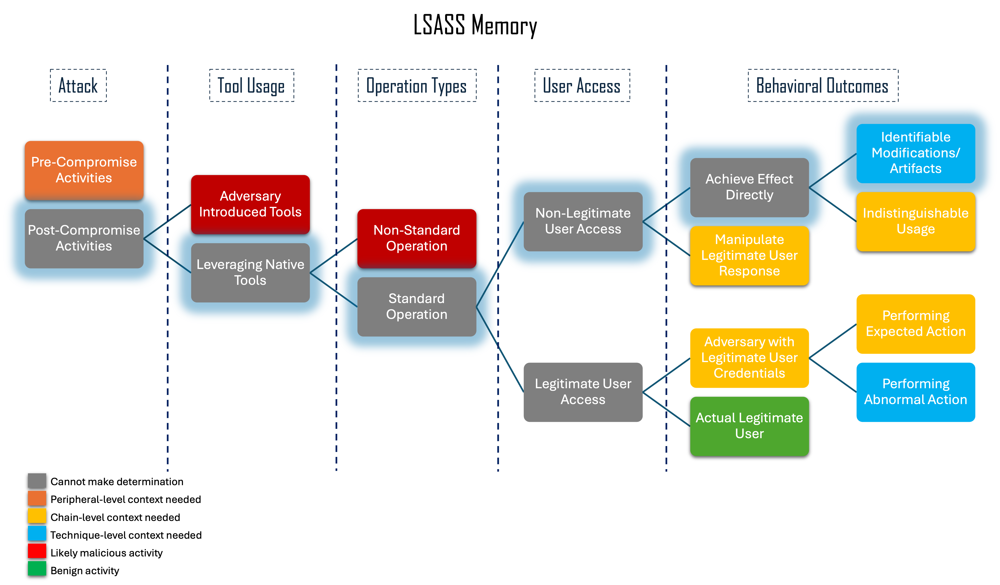
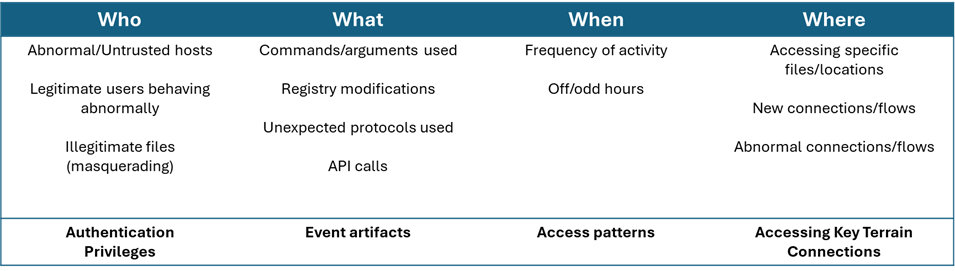

-------------------------
LSASS Memory
-------------------------

This technique focuses on the malicious use of dumping credential materials
stored in the Local Security Authority Subsystem Service (LSASS). While this
technique focuses on how an adversary can use LSASS process memory to access
credentials, there are also valid use cases where a legitimate user, such as an
admin, may need to access LSASS memory in an identical manner.

Through our investigation of the technique and its various implementations, we
found that there are a few robust mechanisms in which we can potentially
differentiate benign use cases from malicious ones. One method is to focus on
the 'GrantedAccess' mask field value found in Sysmon Event ID 10 (Process
Access), which can differ based on the implementation method and other
parameters present when LSASS is accessed.  Other potential methods include
monitoring access or modifications to associated Registry keys.

Context Flowchart Walkthrough
^^^^^^^^^^^^^^^^^^^^^^^^^^^^^^

   Click to enlarge

Focusing on the ambiguous nature of this technique (ex: implementations
utilizing native tools and not known adversary tooling) and walking through the
flowchart, we can categorize this technique as having “Identifiable
Modifications and Artifacts”, as we saw through the identification of the
'GrantedAccess” mask value as a differentiator during our technique
investigation.  Consequently, we see that this technique can utilize
Technique-Level Context in our resulting improved analytic.

Technique-Level Analysis
^^^^^^^^^^^^^^^^^^^^^^^^^^^^^^

   Click to enlarge

Based on the investigative research we did on the LSASS memory sub-technique, we
identified a key event artifact within Sysmon Event ID 10 that we can use to
identify probably malicious intent. The GrantedAccess mask value is a
low-variance behavior that serves as an effective differentiator between
malicious and benign behavior, and given the value which corresponds to certain
requested permissions, we can incorporate it into an analytic in order to
maintain robustness while also helping to reduce false positives.

Original Analytic
^^^^^^^^^^^^^^^^^^^^^^^^^

CAR-2019-04-004: Credential Dumping via Mimikatz:
https://car.mitre.org/analytics/CAR-2019-04-004/

.. code-block:: yaml
  
  index=__your_sysmon_data__ EventCode=10
  TargetImage="C:\\WINDOWS\\system32\\lsass.exe"
  (GrantedAccess=0x1410 OR GrantedAccess=0x1010 OR GrantedAccess=0x1438 OR GrantedAccess=0x143a OR GrantedAccess=0x1418)
  CallTrace="C:\\windows\\SYSTEM32\\ntdll.dll+*|C:\\windows\\System32\\KERNELBASE.dll+20edd|UNKNOWN(*)"
  | table _time hostname user SourceImage GrantedAccess

The above analytic looks for instances where processes are requesting certain
permissions to read parts of LSASS in order to detect potential credential
dumping. The components of this analytic are tuned to implementations utilizing
Mimikatz, which while effective, may weed out other potential malicious
activity.  

.. list-table::
    :widths: 20 20 20 20
    :header-rows: 1

    * - 
      - Application (A)
      - User-mode (U)
      - Kernel-mode (K)
    * - Core to (Sub-) Technique (5)
      - 
      - 
      - 
    * - Core to Part of (Sub-) Technique (4)
      - 
      - | TargetImage="\*lsass.exe"
        | GrantedAccess=0x1410 or 0x1010 or 0x143a or 0x1418

      -
    * - Core to Pre-Existing Tool (3)
      - 
      - 
      -
    * - Core to Adversary-brought Tool (2)
      - 
      - | CallTrace="C:\\windows\\SYSTEM32\\ntdll.dll+\* 
        | | C:\\windows\\System32\\KERNELBASE.dll+20edd
        | | UNKNOWN(*)"
      - 
    * - Ephemeral (1)
      - 
      - 
      - 

Sysmon Event ID is triggered via a user-mode API, and so is scored at the 'U'
level.  From our research, we know that the GrantedAccess mask value can be used
as a good differentiator for identifying probable malicious intent, and so that
component is scored as a 4U. Utilizing the CallTrace value is a viable method to
reduce false positives by honing in on the function residing at the specified
virtual address. 

Because this function is specific to a default configuration of a version of
Mimikatz, we score it at a 2U.

Following the Boolean logic of how these components are being combined via
“AND”, the overall analytic is thus scored as a 2U.

Improved Analytic
^^^^^^^^^^^^^^^^^^^^^^^^^

.. list-table::
    :widths: 20 20 30 20
    :header-rows: 1

    * - 
      - Application (A)
      - User-mode (U)
      - Kernel-mode (K)
    * - Core to (Sub-) Technique (5)
      - 
      - 
      - 
    * - Core to Part of (Sub-) Technique (4)
      - 
      - | TargetImage="\*lsass.exe"
        | GrantedAccess=0x1410 or 0x1010

      -
    * - Core to Pre-Existing Tool (3)
      - 
      - | **Filter:** NOT SourceUser=NT Authority/System
      -
    * - Core to Adversary-brought Tool (2)
      - 
      - 
      - 
    * - Ephemeral (1)
      - 
      - 
      - 

Starting from the original analytic, we removed the CallTrace value that focused
on more narrow implementations involving Mimikatz. After conducting some field
testing on the GrantedAccess mask values in our environment, we found that a
large majority of the benign uses of lsass.exe are made using the 0x1fffff
access mask, while the 0x1010 and 0x1410 are far less common. These masks allow
us to dramatically lower our false positives while retaining visibility for
multiple implementations of LSASS memory access. Additional malicious
GrantedAccess masks could be added to make the detection more accurate in
capturing more implementations based on what is expected within the environment.
Since this is not a Level 5: Core to Sub-Technique or Technique, it will not
capture all malicious events, and can be put in the Level 4 category.

While this analytic was much better in terms of accuracy and resistance to
adversary evasion over time, there is still potential for false positives that
we can try to address. From analysis in our own testing environment, we were
able to discern that an individual users accessing LSASS is probably more
indicative of malicious behavior than other system-associated accounts, and thus
could be a way to reduce some false positives. The SourceUser field is managed
by the organization and specific to the environment, making it a Level 3: Core
to Pre-Existing Tools or Inside Boundary. Additionally, the value ``NT
AUTHORITY\SYSTEM`` is a specific value that is known to run mostly benign
activities throughout the system. While this introduces another means for the
adversary to potentially hide (by acting as one of those “trusted” users), we
made the determination that filtering on user was more beneficial in terms of
reducing false positives than it would be harmful to robustness. 

With all this considered and combined, our final analytic scoring comes out to a
3U with the use of a filter.

