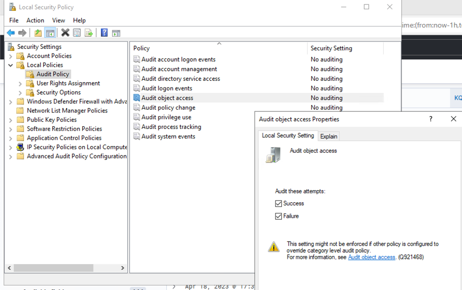

-------------------------
Execution with schtasks
-------------------------

..
    Insert link to analytic here (like a Sigma rule)

- https://car.mitre.org/analytics/CAR-2013-08-001/

.. list-table::
    :widths: 30 70

    * - Original Analytic
      -  | command_line IN ("\*/create\*", "\*/run\*", "\*/query\*", "\*/delete\*", "\*/change\*", "\*/end\*") AND
         | process_name = schtasks.exe
    * - Improved Analytic #1
      - | EventID = 11 AND TargetFileName = C:\\Windows\\System32\\Tasks\\*
    * - Improved Analytic #2
      - | index:Sysmon EventID:(12 | 13 | 14) AND
        | TargetObject:  (“HKEY_LOCAL_MACHINE\\SOFTWARE\\Microsoft\\Windows NT\\CurrentVersion\\Schedule\\TaskCache\\Tree\*” | “HKEY_LOCAL_MACHINE\\SOFTWARE\\Microsoft\\Windows NT\\CurrentVersion\\Schedule\\TaskCache\\Tasks\\*”)
    * - Improved Analytic #3
      - | EventID: (4656 | 4657 | 4663) AND
        | TargetObject:  (“HKEY_LOCAL_MACHINE\\SOFTWARE\\Microsoft\\Windows NT\\CurrentVersion\\Schedule\\TaskCache\\Tree\*” | “HKEY_LOCAL_MACHINE\\SOFTWARE\\Microsoft\\Windows NT\\CurrentVersion\\Schedule\\TaskCache\\Tasks\\*”)

Original Analytic Scoring
^^^^^^^^^^^^^^^^^^^^^^^^^
.. list-table::
    :widths: 15 30 60
    :header-rows: 1

    * - Level
      - Level Name
      - Observables
    * - 7
      - Kernel/Interfaces
      - 
    * - 6
      - System Calls
      - 
    * - 5
      - OS API
      - 
    * - 4
      - Library API
      - 
    * - 3
      - Tools Outside Adversary Control
      - command_line IN ("\*/create\*", "\*/run\*", "\*/query\*", "\*/delete\*", "\*/change\*", "\*/end\*")
    * - 2
      - Tools Within Adversary Control
      - 
    * - 1
      - Operational/Environmental Variables
      - process_name = schtasks.exe

The original analytic detects on the process name of a newly created process in combination with commandline arguments. Since the ``schtasks`` executable 
can be easily copied and renamed by an adversary, it gets scored at the Operational/Environmental level. The commandline arguments are more 
challenging for an adversary to change since that would require recompiling the source code. However, since `schtasks` is part of the OS and no source 
code is available, the additional commandline arguments are considered out of the adversary's control and scored at level 3. 

Existing research from Jonny Johnson and SpecterOps provides insight into what goes on behind the scenes when a task gets scheduled [#f1]_ . 
The resulting capability abstraction map shows how ``schtasks`` is one of several ways a task can be scheduled:

.. figure:: ../_static/scheduled_task_capability_abstraction_markedup.png
  :alt: Scheduled Task Capability Abstraction - Created by SpecterOps
  :align: center
  
  Scheduled Task Capability Abstraction - Created by SpecterOps [#f1]_

Immediately we can see a few different ways an adversary could schedule a task on a system without firing the original level 3 analytic. One of the simpler 
options would be using the Task Scheduler GUI, but several other alternatives exist. 

This capability abstraction map can be used to create many different analytics, the most robust of which might detect on the invariant registry or file 
creation activity. As a first attempt at an improved analytic, we can start with the file creation activity. If we create a scheduled task using the Task Scheduler 
GUI in a test environment with Sysmon installed, we might expect to generate an Event ID 11: FileCreate.

.. figure:: ../_static/sysmon_eventid11_schtasks.png
  :alt: Sysmon Event ID 11: FileCreate
  :align: center

  Sysmon Event ID 11: FileCreate

Looks like the hypothesis was correct! An Event ID 11 was generated under the expected ``C:\Windows\System32\Tasks`` directory. 

.. note::
  It is important to note all the false positives. Unfortunately this more robust analytic generates a large amount of false positives and should be combined with other observables or fields to provide 
  context, filter out false positives, and ensure the analytic is not completely ignored by an analyst. 

Let’s score this new analytic and see if it is more robust than the original. It’s tough to tell right now where to place Event ID 11, but fortunately 
open-source references exist that enumerate Windows APIs and the respective Event IDs that are generated:

  - Roberto Rodriguez’s `API - To - Event <https://docs.google.com/spreadsheets/d/1Y3MHsgDWj_xH4qrqIMs4kYJq1FSuqv4LqIrcX24L10A/edit#gid=0>`_
  - Jonny Johnson’s `TelemetrySource <https://docs.google.com/spreadsheets/d/1d7hPRktxzYWmYtfLFaU_vMBKX2z98bci0fssTYyofdo/edit#gid=0>`_

     

These two spreadsheets indicate which Event IDs are generated by user-mode or kernel-mode APIs. An excerpt of Roberto’s spreadsheet is below, showing the different 
APIs that generated a Sysmon Event ID 11: FileCreate.

+--------------+---------+------------+--------------------------+
|   API Call   | EventID | Event Name |       Log Provider       |
+==============+=========+============+==========================+
|   CopyFile   |   11    | FileCreate | Microsoft-Windows-Sysmon |
+--------------+---------+------------+--------------------------+
|  CopyFile2   |   11    | FileCreate | Microsoft-Windows-Sysmon |
+--------------+---------+------------+--------------------------+
|  CopyFileEx  |   11    | FileCreate | Microsoft-Windows-Sysmon |
+--------------+---------+------------+--------------------------+
| CreateFile2  |   11    | FileCreate | Microsoft-Windows-Sysmon |
+--------------+---------+------------+--------------------------+
| CreateFileA  |   11    | FileCreate | Microsoft-Windows-Sysmon |
+--------------+---------+------------+--------------------------+
| CreateFileW  |   11    | FileCreate | Microsoft-Windows-Sysmon |
+--------------+---------+------------+--------------------------+
|   MoveFile   |   11    | FileCreate | Microsoft-Windows-Sysmon |
+--------------+---------+------------+--------------------------+
| NtCreateFile |   11    | FileCreate | Microsoft-Windows-Sysmon |
+--------------+---------+------------+--------------------------+
| NtWriteFile  |   11    | FileCreate | Microsoft-Windows-Sysmon |
+--------------+---------+------------+--------------------------+

All the relevant APIs are in user-mode, therefore we can score this analytic at level 5.

Improved Analytic Scoring #1
^^^^^^^^^^^^^^^^^^^^^^^^^^^^

.. list-table::
    :widths: 15 30 60
    :header-rows: 1

    * - Level
      - Level Name
      - Observables
    * - 7
      - Kernel/Interfaces
      - 
    * - 6
      - System Calls
      - 
    * - 5
      - OS API
      - EventID = 11
    * - 4
      - Library API
      - 
    * - 3
      - Artifacts Outside Adversary Control
      - TargetFileName = C:\\Windows\\System32\\Tasks\\*
    * - 2
      - Artifacts Within Adversary Control
      - 
    * - 1
      - Operational/Environmental Variables
      - 

So far we have created an analytic using the FileCreate invariant behavior. What if we pivot and use the registry key? Might the registry key approach score 
at a higher level? Sysmon EventID 12: RegistryEvent (Object create and delete) should be generated when a registry key is created.

+-------------------------+---------+------------------------------------------+--------------------------+
|        API Call         | EventID |                Event Name                |       Log Provider       |
+=========================+=========+==========================================+==========================+
|      RegCreateKeyA      |   12    | RegistryEvent (Object create and delete) | Microsoft-Windows-Sysmon |
+-------------------------+---------+------------------------------------------+--------------------------+
|     RegCreateKeyExA     |   12    | RegistryEvent (Object create and delete) | Microsoft-Windows-Sysmon |
+-------------------------+---------+------------------------------------------+--------------------------+
|     RegCreateKeyExW     |   12    | RegistryEvent (Object create and delete) | Microsoft-Windows-Sysmon |
+-------------------------+---------+------------------------------------------+--------------------------+
|      RegCreateKeyW      |   12    | RegistryEvent (Object create and delete) | Microsoft-Windows-Sysmon |
+-------------------------+---------+------------------------------------------+--------------------------+
|       ZwCreateKey       |   12    | RegistryEvent (Object create and delete) | Microsoft-Windows-Sysmon |
+-------------------------+---------+------------------------------------------+--------------------------+

Looking back at Roberto’s Event ID to Windows API mapping, we see several user-mode APIs can generate Event ID 12. But we also see ``ZwCreateKey``, 
a kernel-mode API. This kernel-mode API is very difficult for an adversary to evade, therefore we score it at level 7. It is important to ensure an adversary 
can’t evade our analytic by editing an existing registry key value or an renaming an entire registry key/value pair, so we should also integrate Event 
IDs 13: (Value Set) and 14: (Key and Value Rename) into our analytic logic. 

.. note::
  To detect the relevant registry activity, Object Auditing must be enabled within Local or Group 
  Security Policy and a `SACL <https://learn.microsoft.com/en-us/windows/win32/secauthz/access-control-lists>`_ must be set on ``HKEY_LOCAL_MACHINE\SOFTWARE\Microsoft\Windows NT\CurrentVersion\Schedule\TaskCache\Tree\`` and 
  ``HKEY_LOCAL_MACHINE\SOFTWARE\Microsoft\Windows NT\CurrentVersion\Schedule\TaskCache\Tasks\``

Roberto’s excerpted API research again for the additional Event IDs:

+---------------+---------+--------------------------------------+--------------------------+
|   API Call    | EventID |              Event Name              |       Log Provider       |
+===============+=========+======================================+==========================+
| ZwSetValueKey |   13    |    A registry value was modified     | Microsoft-Windows-Sysmon |
+---------------+---------+--------------------------------------+--------------------------+
|  NtRenameKey  |   14    | RegistryEvent (Key and Value Rename) | Microsoft-Windows-Sysmon |
+---------------+---------+--------------------------------------+--------------------------+

Improved Analytic Scoring #2
^^^^^^^^^^^^^^^^^^^^^^^^^^^^

.. list-table::
    :widths: 15 30 60
    :header-rows: 1

    * - Level
      - Level Name
      - Observables
    * - 7
      - Kernel/Interfaces
      - | EventID: ( 12 | 13 | 14) AND
        | TargetObject:  (“HKEY_LOCAL_MACHINE\\SOFTWARE\\Microsoft\\Windows NT\\CurrentVersion\\Schedule\\TaskCache\\Tree\*” | “HKEY_LOCAL_MACHINE\\SOFTWARE\\Microsoft\\Windows NT\\CurrentVersion\\Schedule\\TaskCache\\Tasks\\*”)
    * - 6
      - System Calls
      - 
    * - 5
      - OS API
      - 
    * - 4
      - Library API
      - 
    * - 3
      - Tools Outside Adversary Control
      - 
    * - 2
      - Tools Within Adversary Control
      - 
    * - 1
      - Operational/Environmental Variables
      -

In some environments it might not be possible to deploy Sysmon. Or maybe an adversary disabled Sysmon and it’s data can no longer be 
referenced. We can implement a similar detection using Windows Event Logging instead.

  Enabling Audit Object Access

Once the SACL is applied on the respective registry keys, we might expect to find Event IDs 4656, 4657, and 4663 . These events, according to Roberto’s 
research, can be generated by kernel-mode APIs which makes the analytic score at level 7.

+---------------------+---------+-----------------------------------------+-------------------------------------+
|      API Call       | EventID |               Event Name                |            Log Provider             |
+=====================+=========+=========================================+=====================================+
|      ZwOpenKey      |  4656   |   A handle to an object was requested   | Microsoft-Windows-Security-Auditing |
+---------------------+---------+-----------------------------------------+-------------------------------------+
|    ZwSetValueKey    |  4657   |      A registry value was modified      | Microsoft-Windows-Security-Auditing |
+---------------------+---------+-----------------------------------------+-------------------------------------+
|   ZwEnumerateKey    |  4663   | An attempt was made to access an object | Microsoft-Windows-Security-Auditing |
+---------------------+---------+-----------------------------------------+-------------------------------------+
| ZwEnumerateValueKey |  4663   | An attempt was made to access an object | Microsoft-Windows-Security-Auditing |
+---------------------+---------+-----------------------------------------+-------------------------------------+
|      ZwOpenKey      |  4663   | An attempt was made to access an object | Microsoft-Windows-Security-Auditing |
+---------------------+---------+-----------------------------------------+-------------------------------------+
|    ZwSetValueKey    |  4663   | An attempt was made to access an object | Microsoft-Windows-Security-Auditing |
+---------------------+---------+-----------------------------------------+-------------------------------------+

Improved Analytic Scoring #3
^^^^^^^^^^^^^^^^^^^^^^^^^^^^

.. list-table::
    :widths: 15 30 60
    :header-rows: 1

    * - Level
      - Level Name
      - Observables
    * - 7
      - Kernel/Interfaces
      - | EventID: (4656 | 4657 | 4663) AND
        | TargetObject:  (“HKEY_LOCAL_MACHINE\\SOFTWARE\\Microsoft\\Windows NT\\CurrentVersion\\Schedule\\TaskCache\\Tree\*” | “HKEY_LOCAL_MACHINE\\SOFTWARE\\Microsoft\\Windows NT\\CurrentVersion\\Schedule\\TaskCache\\Tasks\\*”)
    * - 6
      - System Calls
      - 
    * - 5
      - OS API
      - 
    * - 4
      - Library API
      - 
    * - 3
      - Tools Outside Adversary Control
      - 
    * - 2
      - Tools Within Adversary Control
      - 
    * - 1
      - Operational/Environmental Variables
      -

.. rubric:: References

.. [#f1] https://posts.specterops.io/abstracting-scheduled-tasks-3b6451f6a1c5
