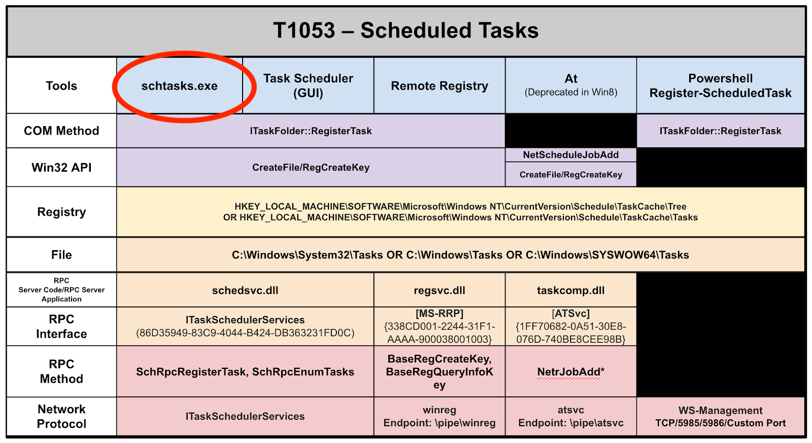
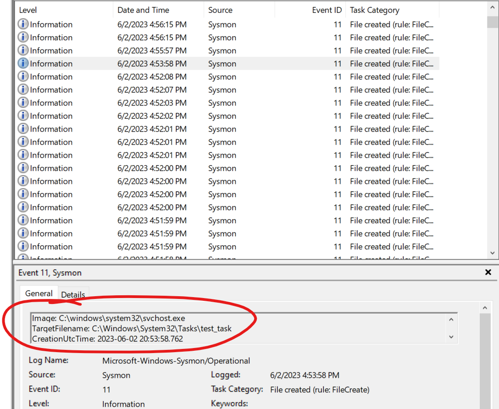
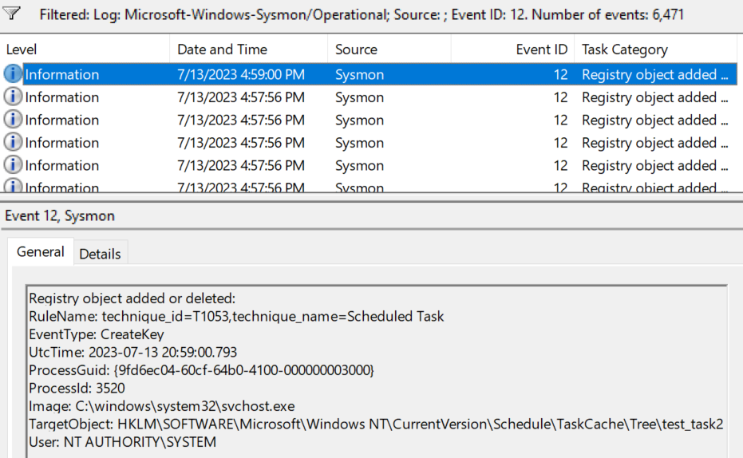

------------------
Scheduled Task/Job
------------------

..
    Insert link to analytic here (like a Sigma rule)

- https://github.com/SigmaHQ/sigma/blob/c0332a9d96f6c7804fcc85dd706caed889446a62/rules/windows/process_creation/proc_creation_win_schtasks_creation.yml 

.. code-block:: yaml

  title: Scheduled Task Creation
  id: 92626ddd-662c-49e3-ac59-f6535f12d189
  status: test
  description: Detects the creation of scheduled tasks in user session
  author: Florian Roth (Nextron Systems)
  date: 2019/01/16
  modified: 2022/10/09
  tags:
      - attack.execution
      - attack.persistence
      - attack.privilege_escalation
      - attack.t1053.005
      - attack.s0111
      - car.2013-08-001
  logsource:
      category: process_creation
      product: windows
  detection:
      selection:
          Image|endswith: '\schtasks.exe'
          CommandLine|contains: ' /create '
      filter:
          User|contains: # covers many language settings
              - 'AUTHORI'
              - 'AUTORI'
      condition: selection and not filter
  fields:
      - CommandLine
      - ParentCommandLine
  falsepositives:
      - Administrative activity
      - Software installation
  level: low

Original Analytic Scoring
^^^^^^^^^^^^^^^^^^^^^^^^^

.. list-table::
    :widths: 20 20 30 20
    :header-rows: 1

    * - 
      - Application (A)
      - User-mode (U)
      - Kernel-mode (K)
    * - Core to (Sub-) Technique (5)
      - 
      - 
      - 
    * - Core to Part of (Sub-) Technique (4)
      - 
      -
      -
    * - Core to Pre-Existing Tool (3)
      - 
      - | EventID: 1
        | CommandLine|contains: '/create'
      -
    * - Core to Adversary-brought Tool (2)
      - 
      - 
      - 
    * - Ephemeral (1)
      - 
      - Image|endswith: '\\schtasks.exe'
      - 

The original analytic detects on the name of a newly-created process in combination with the commandline argument 
``/create``. The fields references in this analytic exist in Sysmon EventID 1 and not Windows Event ID 4688 for 
process creation, therefore we know the intent was to use Sysmon data. We have previously scored Sysmon Event ID 
1 as operating in user-mode since it is fired when the Win32 API function CreateProcessA is called. 

The schtasks executable can be easily copied and renamed by an adversary, ``Image|endswith: '\\schtasks.exe'`` 
therefore it is placed at the Ephemeral level. The commandline argument is more challenging for an adversary to 
evade, since they would likely need the source code to change these arguments. However, since schtasks exists in 
the OS prior to system compromise and no source code is available, the commandline argument observable is placed 
at **Core to Pre-existing Tool**. Factoring in StP boolean logic, this analytic ultimately scores at a 1U because 
an adversary can simply change the Image name and avoid detection.

.. note:: 
  The filter in an analytic does not affect the overall robustness score since its purpose is to remove false positives.
  Studying how filters affect scoring is slated for future research.

We can use existing open source research from SpecterOps to make this analytic more robust. The following 
capability abstraction highlights several different ways adversaries could schedule a task on a system without 
firing the original analytic, and our original analytic would only detect the circled implementation.

  
  Scheduled Task Capability Abstraction - Created by SpecterOps [#f1]_

Conversely, defenders can use the capability abstraction to create several different analytics, the most 
robust of which might detect on the invariant registry or file creation activity. As a first attempt at a more robust 
analytic, we can start with the file creation activity. If we create a scheduled task via the Task 
Scheduler GUI in a test environment with Sysmon installed, we might expect to generate an Event ID 11: FileCreate.

  Sysmon Event ID 11: FileCreate

Looks like the hypothesis was correct! An Event ID 11 was generated under the expected ``C:\Windows\System32\Tasks`` 
directory. 

.. note::
  It is important to note all the false positives. Unfortunately this more robust analytic generates a large amount of false positives and should be combined with other observables or fields to provide 
  context, filter out false positives, and ensure the analytic is not completely ignored by an analyst. 

Let’s score this new analytic and see if it is more robust than the original. It’s tough to tell right now where to place Event ID 11, but fortunately 
open-source references exist that enumerate Windows APIs and the respective Event IDs that are generated:

  - Roberto Rodriguez’s `API - To - Event <https://docs.google.com/spreadsheets/d/1Y3MHsgDWj_xH4qrqIMs4kYJq1FSuqv4LqIrcX24L10A/edit#gid=0>`_
  - Jonny Johnson’s `TelemetrySource <https://docs.google.com/spreadsheets/d/1d7hPRktxzYWmYtfLFaU_vMBKX2z98bci0fssTYyofdo/edit#gid=0>`_

These two spreadsheets indicate which Event IDs are generated by user-mode or kernel-mode APIs. An excerpt of Roberto’s spreadsheet is below, showing the different 
APIs that generate a Sysmon Event ID 11: FileCreate.

+--------------+---------+------------+--------------------------+
|   API Call   | EventID | Event Name |       Log Provider       |
+==============+=========+============+==========================+
|   CopyFile   |   11    | FileCreate | Microsoft-Windows-Sysmon |
+--------------+---------+------------+--------------------------+
|  CopyFile2   |   11    | FileCreate | Microsoft-Windows-Sysmon |
+--------------+---------+------------+--------------------------+
|  CopyFileEx  |   11    | FileCreate | Microsoft-Windows-Sysmon |
+--------------+---------+------------+--------------------------+
| CreateFile2  |   11    | FileCreate | Microsoft-Windows-Sysmon |
+--------------+---------+------------+--------------------------+
| CreateFileA  |   11    | FileCreate | Microsoft-Windows-Sysmon |
+--------------+---------+------------+--------------------------+
| CreateFileW  |   11    | FileCreate | Microsoft-Windows-Sysmon |
+--------------+---------+------------+--------------------------+
|   MoveFile   |   11    | FileCreate | Microsoft-Windows-Sysmon |
+--------------+---------+------------+--------------------------+
| NtCreateFile |   11    | FileCreate | Microsoft-Windows-Sysmon |
+--------------+---------+------------+--------------------------+
| NtWriteFile  |   11    | FileCreate | Microsoft-Windows-Sysmon |
+--------------+---------+------------+--------------------------+

All the relevant APIs are in user-mode, and since the file activity is invariant behavior across all implementations of 
task scheduling we can score this analytic at 5U.

Improved Analytic Scoring #1
^^^^^^^^^^^^^^^^^^^^^^^^^^^^

.. list-table::
    :widths: 20 20 30 20
    :header-rows: 1

    * - 
      - Application (A)
      - User-mode (U)
      - Kernel-mode (K)
    * - Core to (Sub-) Technique (5)
      - 
      - | EventID: 11
        | TargetFileName|contains: 
        | - “C:\\Windows\\System32\\Tasks”
        | - “C:\\Windows\\SYSWOW64\\Tasks”
      -
    * - Core to Part of (Sub-) Technique (4)
      - 
      -
      -
    * - Core to Pre-Existing Tool (3)
      - 
      - 
      -
    * - Core to Adversary-brought Tool (2)
      - 
      - 
      - 
    * - Ephemeral
      - 
      - 
      - 

So far we have created an analytic using the FileCreate invariant behavior. What if we pivot and use the registry key? Might the registry key approach score 
at a higher level? Sysmon EventID 12: RegistryEvent (Object create and delete) should be generated when a registry key is created. Roberto’s Event ID to 
Windows API mapping shows us that Event ID 12 can be generated from kernel-mode APIs, so we can score this analytic as operating in kernel-mode. 

+-------------------------+---------+------------------------------------------+--------------------------+
|        API Call         | EventID |                Event Name                |       Log Provider       |
+=========================+=========+==========================================+==========================+
|      RegCreateKeyA      |   12    | RegistryEvent (Object create and delete) | Microsoft-Windows-Sysmon |
+-------------------------+---------+------------------------------------------+--------------------------+
|     RegCreateKeyExA     |   12    | RegistryEvent (Object create and delete) | Microsoft-Windows-Sysmon |
+-------------------------+---------+------------------------------------------+--------------------------+
|     RegCreateKeyExW     |   12    | RegistryEvent (Object create and delete) | Microsoft-Windows-Sysmon |
+-------------------------+---------+------------------------------------------+--------------------------+
|      RegCreateKeyW      |   12    | RegistryEvent (Object create and delete) | Microsoft-Windows-Sysmon |
+-------------------------+---------+------------------------------------------+--------------------------+
|       ZwCreateKey       |   12    | RegistryEvent (Object create and delete) | Microsoft-Windows-Sysmon |
+-------------------------+---------+------------------------------------------+--------------------------+

Since the registry key is invariant behavior, the analytic is placed at the Core to Subtechnique level and we 
can ultimately score it at 5K. It is important to ensure an adversary can’t evade our analytic by editing an 
existing registry key value or an renaming an entire registry key/value pair, so we should also integrate Event 
IDs 13: (Value Set) and 14: (Key and Value Rename) into our analytic logic.

Improved Analytic Scoring #2
^^^^^^^^^^^^^^^^^^^^^^^^^^^^

.. list-table::
    :widths: 20 20 20 30
    :header-rows: 1

    * - 
      - Application (A)
      - User-mode (U)
      - Kernel-mode (K)
    * - Core to (Sub-) Technique (5)
      -  
      - 
      - | EventID:
        | - 12
        | - 13
        | - 14 
        | TargetObject|contains: 
        | - "HKLM\\SOFTWARE\\Microsoft\\Windows NT\\CurrentVersion\\Schedule\\TaskCache\\Tree\\”
        | - “HKLM\\SOFTWARE\\Microsoft\\Windows NT\\CurrentVersion\\Schedule\\TaskCache\\Tasks\\”
    * - Core to Part of (Sub-) Technique (4)
      - 
      -
      -
    * - Core to Pre-Existing Tool (3)
      - 
      - 
      -
    * - Core to Adversary-brought Tool (2)
      - 
      - 
      - 
    * - Ephemeral (1)
      - 
      - 
      - 

.. note:: 
  It is also possible to implement a similar analytic by placing a SACL on the invariant registry keys and searching for Event IDs 4657 or 4663.

.. rubric:: References

.. [#f1] https://posts.specterops.io/abstracting-scheduled-tasks-3b6451f6a1c5
