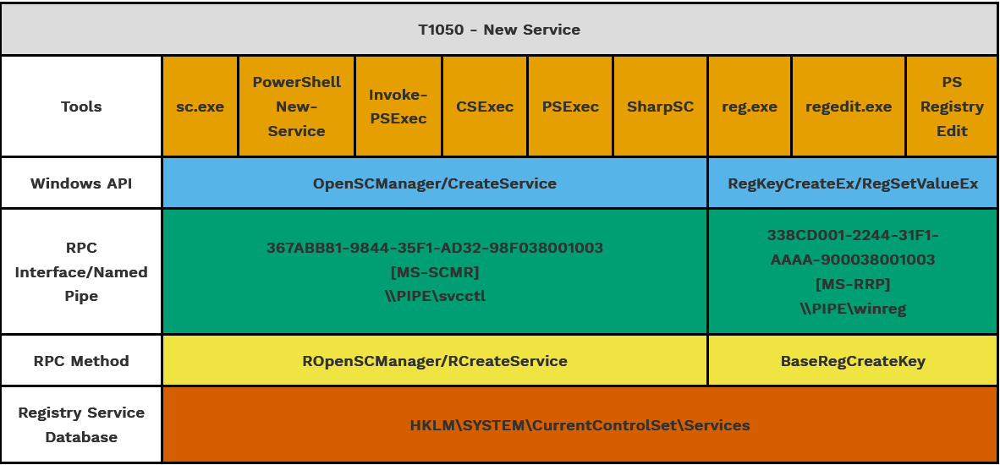

.. _Capability Abstraction:

Capability Abstraction
======================

Capability abstractions document the actions taken by the system, and their associated
observables, once a Technique is executed, and help identify commonalities between
implementations. Those commonalities are excellent candidates for low-variance or
invariant behaviors and therefore, robust observables.

.. figure:: _static/capability_abstraction_specterops.png
   :alt: Kerberoasting - Specter Ops
   :align: center

   Kerberoasting Capability Abstraction Taken From Specter Ops [#f1]_

Capability abstraction, a concept developed by `SpecterOps
<https://posts.specterops.io/capability-abstraction-fbeaeeb26384>`_, seeks to understand
activities that occur on a system when an attacker is accomplishing their goals. It also
introduced a visual graphic, known as an “abstraction map”, which conveys the
relationships between operating system (OS) abstraction layers and begins to highlight
how an adversary can evade a specific detection or a sensor entirely and still
accomplish their goals. The art of capability abstraction showcases how each tool or
behavior can be uncovered into different layers which can be acted upon by defenders. As
seen in the capability abstraction above, tools used for kerberoasting can map to
similar managed code, Windows API functions, RPC calls, and the same network protocol.
Through reverse engineering, defenders can utilize this information to detect behaviors
that might be more difficult for adversaries to evade. For example, if defenders wanted
to detect the tool implementations of kerberoasting shown here, a defender can create an
analytic surrounding the network protocol Kerberos TGS-REQ/REP, a behavior that
adversaries would not be able to evade based on the research conducted.

The capability abstraction map below for `T1543 - Create or Modify System Process:
Windows Service <https://attack.mitre.org/techniques/T1543/003/>`_ illustrates how
multiple tools can create a new service.

   New Service Capability Abstraction created by SpecterOps. The relevant MITRE ATTACK
   Technique ID was changed to T1543.003 after this capability abstraction was published
   [#f2]_

These tools and implementations include standard Windows or commonly abused binaries, OS
API calls or functions, and open-source or custom code that an adversary might copy or
develop. These different implementations may call the Windows API differently, which in
turn might call different RPC interface and methods. However, ultimately they all
utilize the same registry key within the Registry Service Database. If an adversary
wanted to evade detection at the tool level, they could create a new service by directly
interacting with the Windows API, RPC, or Registry. This is not a hypothetical, but has
actually been seen in the wild. Threat group APT41 has utilized Windows service creation
within their attacks not only through the utilization of the service creation tool
(sc.exe), but also by directly modifying the registry itself [#f3]_.

The Summiting the Pyramid team is utilizing capability abstraction mappings to map
certain observables to :ref:`Analytic Robustness Categories` and :ref:`Event Robustness
Categories` outlined by our methodology. As observables are assigned, further research
can be conducted to identify detections based off those observables, especially for
observables which might cover part or all of a technique. For example, if a kernel call
is detected, is there a specific Windows Event ID that is fired? Are there registry keys
that are updated? Does a registry key change over all implementations of a technique?
This gives the defender a broader perspective of not only the tools that use similar
behaviors towards the lower-levels of the operating system, but also how to think of
detecting behaviors the closer an adversary gets to the kernel.

.. rubric:: References

.. [#f1] https://posts.specterops.io/capability-abstraction-fbeaeeb26384
.. [#f2] https://abstractionmaps.com/maps/t1050/
.. [#f3] https://www.mandiant.com/resources/blog/apt41-initiates-global-intrusion-campaign-using-multiple-exploits
