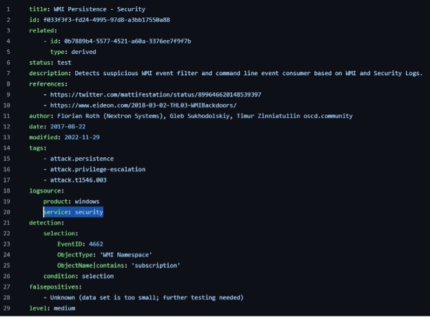
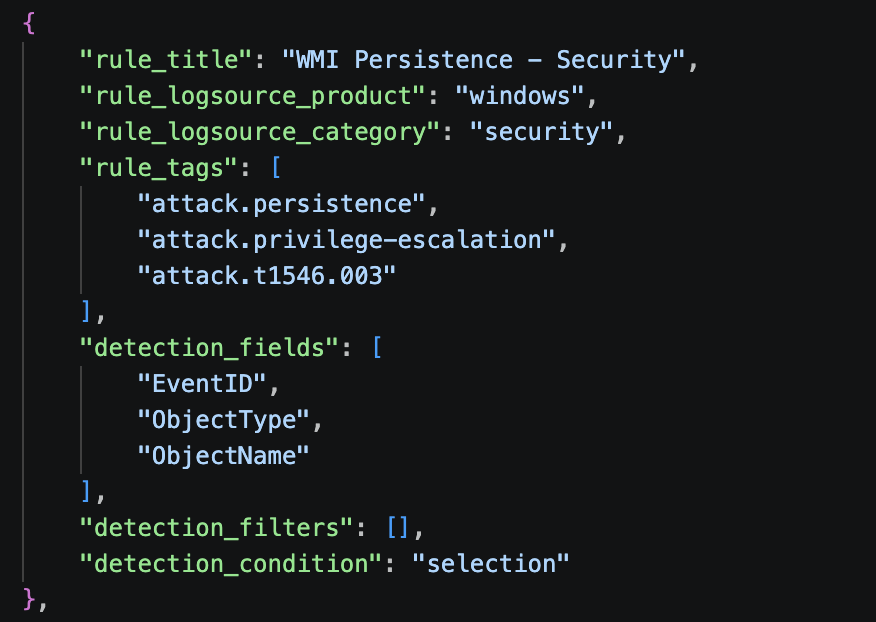

How It Works
==============

Implementation Catalog
-------------------------

Sensor Mappings
----------------
This project produced a structured dataset of Windows Event Log reference fields indexed by Windows Event ID. The purpose of the dataset was to create a consistent set of XML fields found within common and advanced Windows Security auditing events, and to provide a foundation for later analytic work.

The work was limited to documenting the published XML structure and normalizing to appropriate fields. The derived data set does not directly interpret the meaning of individual fields or create specific detection mappings. 

The example below demonstrates how a Windows Event Log entry is mapped.

*Example Usage:*
::
   <System>
      <Provider Name="Microsoft-Windows-Security-Auditing"/>
      <EventID>4624</EventID>
      <Version>2</Version>
      ...
   </System>

   <EventData>
      <Data Name="SubjectUserSid"/>
      <Data Name="SubjectUserName"/>
      <Data Name="SubjectDomainName"/>
      <Data Name="TargetUserSid"/>
      <Data Name="TargetUserName"/>
      <Data Name="TargetDomainName"/>
      <Data Name="LogonType"/>
      <Data Name="IpAddress"/>
      <Data Name="IpPort"/>
   </EventData>

*System Fields*

=========================  ==========================================
XML field                  Reference field
=========================  ==========================================
Provider.Name              System.Provider.Name
EventID                    System.EventID
Version                    System.Version
TimeCreated.SystemTime     System.TimeCreated.SystemTime
Computer                   System.Computer
=========================  ==========================================

*Event Data Fields*

=========================  ==========================================
XML field                  Reference field
=========================  ==========================================
SubjectUserSid             EventData.SubjectUserSid
SubjectUserName            EventData.SubjectUserName
SubjectDomainName          EventData.SubjectDomainName
TargetUserSid              EventData.TargetUserSid
TargetUserName             EventData.TargetUserName
TargetDomainName           EventData.TargetDomainName
LogonType                  EventData.LogonType
IpAddress                  EventData.IpAddress
IpPort                     EventData.IpPort
=========================  ==========================================
+—————––+–––––––––––––+

Analytic Ingestion
---------------------
The Ingestion step in the pipeline automates rule processing for all of your detection logic. The script recursively steps through a rule directory and its subdirectories and pulls the values from each rule that the calculator needs to determine a coverage score. 

There is no need to clean up the directory. It steps through level by level and only loads in YAML files. The process then uses a combination of regular expressions and context clues to extract the information. 

*Extracted Fields:*

=========================  ======================================================================
Field Extracted            Description
=========================  ======================================================================
rule_title                 The title of the SIGMA rule
rule_logsource_product     The product that the rule was created to defend
rule_logsource_category    | The type of log that the rule is from
rule_tags                  Any tags that the rule is with. Mainly ATT&CK Techniques and Tactics
detection_fields           The fields the rule uses to detect the activity
detection_filters          Any filters the rule may use
detection_condition        What causes the rule to trigger a positive detection
=========================  ======================================================================

Example
*********

Take the following rule, for example.

It is a rule to detect WMI Persistance from the Windows Security logs.

The script, analyzes the rule, and creates the following JSON.

With this formatted output, the next step in the pipeline can now take place.

Scoring Dictionary
--------------------
