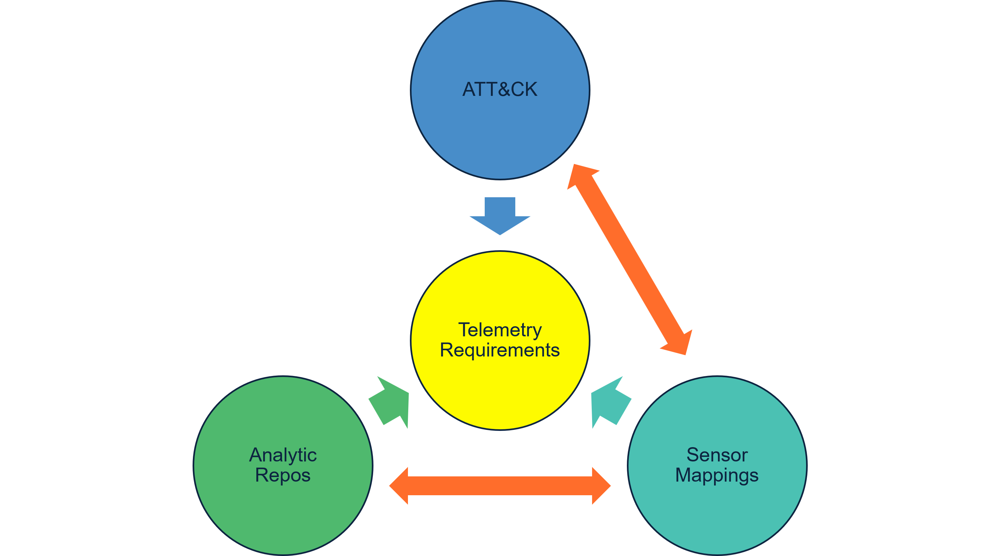
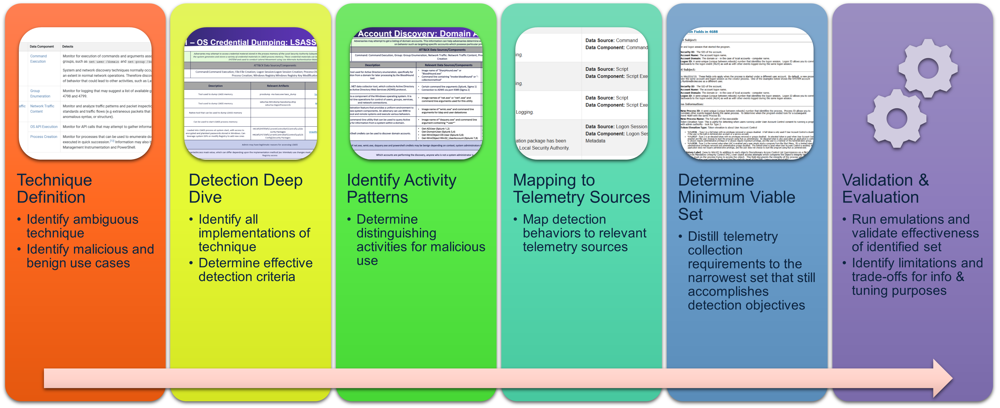
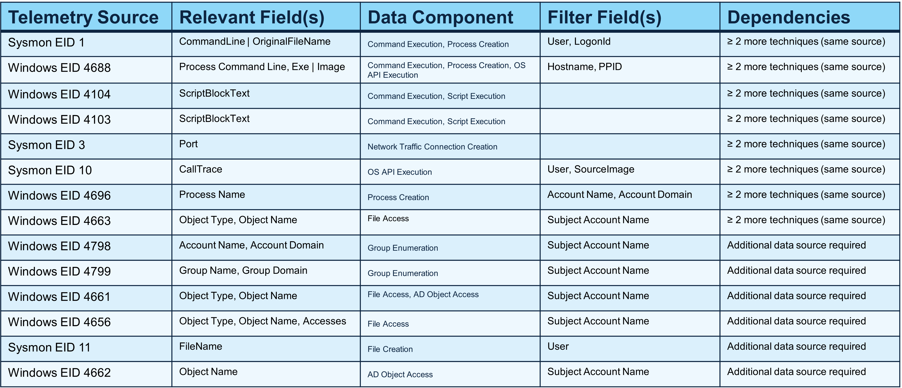

Minimum Telemetry Requirements
===============================

Minimum Telemetry Requirements are the narrowest set of telemetry collection requirements needed to detect an ambiguous technique while still accomplishing the detection objective. They exist because the observables of some techniques are not sufficient by themselves to determine malicious intent, and so defenders need a repeatable way to identify which telemetry sources (and which specific fields) are truly required to detect the behavior with lower false positives and enough context to understand the adversary’s activity.

--------------------

A key part of deriving minimum telemetry requirements is mapping detection needs to the right log source by using a recursive combination of references, focusing on the ATT&CK framework, CTID's Sensor Mappings to ATT&CK work, and reviews of analytic repositories:

- ATT&CK provides the foundation for technique definition and known technique variants
- Sensor Mappings help connect behaviors to candidate telemetry sources
- Analytic repositories help validate how detection behaviors are commonly implemented and what data those analytics depend on. 

This combined mapping approach helps focus collection on telemetry that is genuinely effective for detecting the technique rather than collecting every and all potential sources.

--------------------

The process to derive minimum telemetry requirements follows a repeatable 6-step workflow:

#. Technique Definition: Identify the ambiguous technique and explicitly document both malicious and benign use cases so detection is built to disambiguate intent rather than simply “detect the action.”
#. Detection Deep Dive: Research how the technique is implemented in practice and define effective detection criteria, ensuring the detection logic is tied to observable behaviors that matter for the technique.
#. Identify Activity Patterns: Determine the distinguishing activities and sequences that characterize malicious use, focusing on what separates attacker behavior from expected administrative or operational behavior.
#. Mapping to Telemetry Sources: Map those required behaviors to telemetry sources that can actually observe them, aligning the detection criteria and activity patterns to specific logging coverage.
#. Determine Minimum Viable Set: Distill the collection requirements down to the narrowest set of telemetry sources and fields that still achieves the detection objective, removing sources that do not materially contribute.
#. Validation & Evaluation: Run emulations to validate that the identified minimum set is effective in practice, then document limitations and trade-offs so teams understand tuning needs and what gaps may remain.

--------------------

An example output of this approach is the Domain Account Discovery telemetry requirements table, which makes the collection requirements explicit and operational. 

- The “Telemetry Source” column anchors the requirement to a concrete log stream a defender can enable and ingest. 
- “Relevant Field(s)” specifies the exact data elements needed to build detection logic and investigative pivots, rather than treating the entire log source as uniformly useful. 
- “Data Component” provides a normalized description of what type of visibility the data represents (for example, whether it reflects execution, access, or another category of behavior) aligned to ATT&CK Data Components, which helps compare and consolidate requirements across techniques. 
- “Filter Field(s)” captures which attributes are needed to scope, correlate, and reduce false positives (for example, to tie activity to a user or host context), making the requirements actionable for detection engineering.
- “Dependencies” documents when a source is only sufficient in combination with additional telemetry, helping teams understand where a single source is incomplete and where additional data is required to meet the detection objective.

--------------------

By combining behavior-focused decomposition, structured mapping of detection needs to telemetry, and validation through emulation, this approach can help organizations prioritize and justify what telemetrry sources to collect, reduce false positives, and ensure detections have enough context to reliably infer adversary activity without over-collecting data.  This process, however, does not give any indication of which telemetry sources may be more worthwhile or effective to collect given a certain detection strategy or objective - for that, we need to evaluate the :ref:`Telemetry Quality<Telemetry Quality>` of each identified source.
