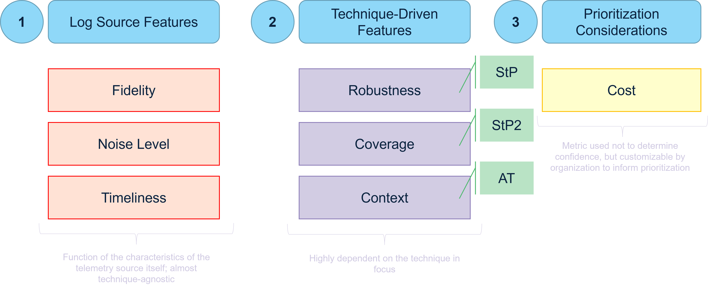
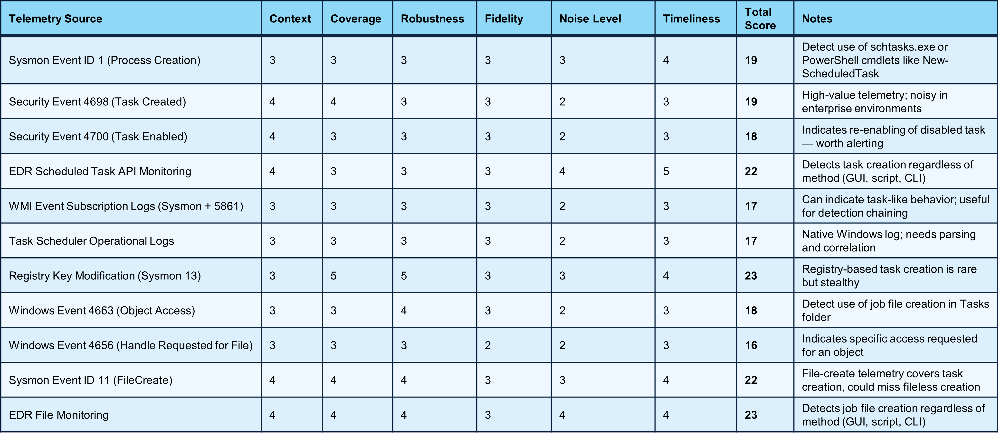

.. _Telemetry Quality:

Telemetry Confidence Scoring
=============================

Overview
----------
Minimum telemetry requirements identify the narrowest set of telemetry that can accomplish a given detection objective, but by themselves they don’t tell defenders which log sources are most effective or how to prioritize collection and ingestion when multiple sources could work. In practice, defenders need a way to rank and compare telemetry sources, because simply knowing what is “sufficient” does not convey how robust, noisy, or operationally practical each option will be (especially for ambiguous techniques where intent cannot be determined from observables alone).

Telemetry Confidence scoring addresses this by assigning an aggregate score based on seven metrics: Fidelity, Noise Level, Timeliness, Context, Coverage, Robustness, and Cost. Together, these metrics measure key factors that contribute to estimating a log source’s effectiveness against ambiguous techniques (or techniques in general). These metrics capture both log source characteristics (e.g., richness of data, event volume, and latency) and technique-driven usefulness (e.g., breadth of technique visibility and how much differentiating detail the telemetry provides), producing a quantitative, customizable model that supports more actionable detection strategy planning and prioritization. The Telemetry Confidence (TC) score aims to approximate a log source's potential utility or effectiveness for use in the detection of technique behaviors, but does not prescribe or evaluate specific analytics or detection logic; it is a tool that is primarily designed to inform data collection prioritization and strategy development by giving a relative assessment of relevant telemetry sources.

Fidelity
----------
Fidelity measures the quality, richness, and detail of the event data. High-fidelity logs provide granular, actionable fields that are invaluable for analysis and pivoting during an investigation. The steps for scoring Fidelity are as follows:

- Examine Log Schema: Obtain a sample event from the log source and list all available fields (e.g., CommandLine, ParentProcessGUID, LogonType, SourceIpAddress). 
- Assess Field Value: Determine the investigative value of the fields. Do they provide strong, unique identifiers (like a ProcessGUID) or weak, common ones (like a generic timestamp)? 
- Evaluate Pivot Potential: Count how many fields are reliable pivot points. The more fields that allow an analyst to easily and accurately find related events, the higher the fidelity. 
- Assign Score: Using the rubric below, assign a score based on the depth and investigative utility of the data provided. 

.. admonition:: Fidelity Scoring Rubric 

   - **Score 1 (Low):** The log provides minimal information, often just indicating an event occurred. It lacks key details for investigation (e.g., a basic firewall log showing only a blocked connection without port or protocol). 
   - **Score 2 (Medium):** Provides basic contextual data like source/destination, user, or hostname. It is useful but requires significant correlation with other logs to build a full picture. 
   - **Score 3 (High):** Provides rich, detailed data, including specific and valuable attributes like command-line arguments, hashes, or authentication package names. 
   - **Score 4 (Very High):** Contains extremely granular, reliable data with unique identifiers (GUIDs, etc.) that make pivoting and correlation trivial. The data is often difficult for an adversary to fake. 

Noise Level
-------------
Noise measures the volume of events generated by the log source in a typical environment. A high volume of benign events can obscure threats. For this metric, a higher score indicates a lower (better) noise level. The steps for scoring Noise Level are as follows: 

- Establish Baseline: In a representative environment, query the source to determine the average number of events generated over a fixed period (e.g., 24 hours). 
- Categorize Volume: Classify the volume as extremely high, high, moderate, low, or very low relative to other sources in your environment. 
- Assign Score: Use the inverted rubric below to assign a score.

.. admonition:: Noise Level Scoring Rubric 

   - **Score 1 (Extremely Noisy):** Unmanageable volume without significant pre-processing or aggregation (e.g., raw, unfiltered NetFlow). 
   - **Score 2 (Very Noisy):** High volume that requires heavy filtering and tuning to be useful (e.g., unfiltered Process Creation logs). 
   - **Score 3 (Noisy):** Moderate volume that includes many benign events but is manageable (e.g., Network Connection logs). 
   - **Score 4 (Moderate):** Relatively low volume where events are often significant (e.g., Service Installation logs). 
   - **Score 5 (Low):** Very low volume where an event is almost always anomalous and high-value (e.g., LSASS process access). 

Timeliness
------------
Timeliness measures the latency between an event occurring on a system and that event becoming available for analysis in your security platform (e.g., SIEM). The steps for scoring Timeliness are as follows:

- Measure Latency: Trigger a test event on a source system. Using synchronized time, measure the time difference between the event timestamp and its arrival in the SIEM. 
- Consult SLAs: For cloud or API-based sources, check the provider's documentation for stated ingestion delays. 
- Assign Score: Use the rubric below to score the average delay. 

.. admonition:: Timeliness Scoring Rubric 

   - **Score 1 (Days):** Data is available in days. 
   - **Score 2 (Hours):** Data is available in hours. 
   - **Score 3 (Minutes):** Data is available in a few or more minutes. 
   - **Score 4 (Near Real-Time):** Data is available within seconds to a few minutes. 
   - **Score 5 (Real-Time):** Data is available virtually instantaneously. 

Context
----------
:ref:`Context<Context>` quantifies how much useful, differentiating information a log source provides when trying to determine if a specific adversary technique is occurring. The steps for scoring Context are as follows:

- Identify All Relevant Techniques: For the log source being scored, identify all the techniques within the given use case for which this log could provide any evidence.
- Score Each Technique Individually: For each technique that the log source covers, perform the following assessment:

  - Analyze Log Fields: Examine the data fields available in the log source (e.g., for Event 4624, this includes Logon Type, Account Name, Source Network Address).
  - Apply the Rubric: Compare what those fields tell you against the rubric's definitions. 
  - Assign a Score (1-5): Assign a single numerical score based on the rubric.

- Calculate the Final Average Score: Once you have scored the log source against every relevant technique, you average those scores to get a single value.

.. admonition:: Context Scoring Rubric 

   - **Score 1 (No context):** The telemetry source provides no information relevant to determining malicious intent or activity.
   - **Score 2 (Peripheral-level context:** The source offers only indirect or peripheral data, insufficient for confidently identifying malicious behavior.
   - **Score 3 (Chain-level context):** The source enables visibility into activity chains, but not enough detail to attribute actions to specific techniques.
   - **Score 4 (Technique-level context under certain conditions):** The source can provide technique-level detail, but only in specific scenarios or with additional enrichment.
   - **Score 5 (Technique-level context):** The source reliably provides detailed information directly relevant to the technique being detected, enabling conclusive attribution

Coverage
----------
Coverage measures the breadth of a log source's visibility across the relevant techniques and their implementations within a use case.  The steps for scoring Coverage are as follows:

- Define Technique Set: List all ATT&CK techniques for the use case (e.g., for Lateral Movement, T1021.001, T1021.002, etc.). 
- Map Source to Techniques: For the log source being scored, iterate through the technique list. Determine if the source provides any data that could contribute to detecting each technique. 
- Assess Implementation Coverage: For each technique the source can detect, estimate the percentage of known implementations or variations it can see. For example, can your Process Creation log see PowerShell execution via powershell.exe, but not via a .NET library? 
- Calculate & Score: The final score is the average of the implementation coverage percentages across all applicable techniques. 

.. admonition:: Coverage Scoring Rubric 

   - **Score 1:** Covers <20% of the techniques/implementations. 
   - **Score 2:** Covers 20-39% of the techniques/implementations. 
   - **Score 3:** Covers 40-59% of the techniques/implementations. 
   - **Score 4:** Covers 60-79% of the techniques/implementations. 
   - **Score 5:** Covers 80-100% of the techniques/implementations. 

Robustness
-----------
:ref:`Robustness<Summiting Levels>` measures how difficult it is for an adversary to tamper with or evade the specific observables a log source provides for detection. The steps for scoring Robustness are as follows:

- Score at the Technique Level: For each technique the log source covers: 

  - Identify the key fields or artifacts used for detection logic (e.g., a process name vs. a process GUID). 
  - Assess the volatility of these artifacts. Are they easily user-controllable, or are they immutable kernel-level artifacts? 
  - Assign a score from 1-5 for that specific log source-technique pair using the rubric. 

- Calculate the Average: The final Robustness score is the average of these scores across all relevant techniques for the use case. 

.. admonition:: Robustness Scoring Rubric 

   - **Score 1 (Ephemeral/Brittle):** Detection relies on easily changed, user-mode artifacts (e.g., command-line arguments, process names). 
   - **Score 2 (Mutable):** Relies on artifacts an adversary can modify with some effort (e.g., unprotected registry keys). 
   - **Score 3 (Reliable):** Based on artifacts of a standard tool/OS feature that are hard to alter without breaking functionality. 
   - **Score 4 (Very Robust):** Based on lower-level OS artifacts like GUIDs, parent process relationships, or specific API call patterns. 
   - **Score 5 (Invariant):** Based on fundamental, kernel-level behaviors that are virtually impossible for an adversary to perform the technique without generating. 

Cost
----------
Cost is a metric that is included only for prioritization purposes, and thus can be defined as customized by the organization based on internal priorities and considerations. Given that it is highly dependent on the operating environment, it is the only optional metric listed, and can be defined as needed by the user.

Telemetry Confidence Evaluation
---------------------------------

The Telemetry Confidence (TC) is calculated by scoring a telemetry source across the defined metrics and rolling them up into a single total that can be used to rank and compare sources. The scoring process is explicitly two-step: technique-agnostic scoring focuses on characteristics of the telemetry source itself, and technique-focused scoring evaluates how that source performs for the technique in question. In execution, the scorer evaluates each log source against the metrics, averages technique-focused measures across the relevant techniques where applicable, and then sums the final metric values into a single total score (Telemetry Confidence). For defenders, that total represents a comparative, quantitative way to estimate which sources will be most effective (and practical) for detection, which they can use to prioritize which telemetry to enable, ingest, and tune first, and use lower-scoring sources as supporting context rather than primary detection drivers.

-----------------------------------

**Example: T1053: Scheduled Task/Job**

The Scheduled Task/Job example table illustrates how this scoring produces actionable differentiation across common endpoint telemetry options. In that example, the highest Telemetry Confidence scores are achieved by sources that provide more direct, high-context visibility into task creation artifacts and related change, such as registry modification telemetry and file monitoring, while more general sources (like basic process creation or native task-related security events) score lower or are flagged with operational trade-offs. The notes reinforce this interpretation: some sources are “high-value telemetry” but can be “noisy in enterprise environments,” some are useful because they detect creation “regardless of method (GUI, script, CLI),” and others are worth alerting on because they indicate meaningful state changes (like re-enabling a disabled task). The result is a defensible, side-by-side way to decide which telemetry sources are best positioned to drive primary detections for Scheduled Tasks and which are better used for correlation and investigation support.
