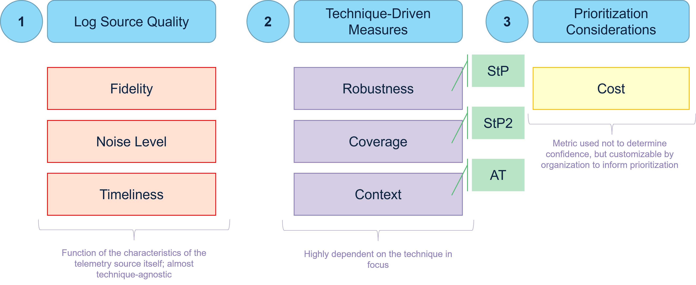

Telemetry Quality Scoring
==========================

Overview
----------
Overview goes here

Fidelity
----------
Fidelity measures the quality, richness, and detail of the event data. High-fidelity logs provide granular, actionable fields that are invaluable for analysis and pivoting during an investigation. The steps for scoring Fidelity are as follows:

- Examine Log Schema: Obtain a sample event from the log source and list all available fields (e.g., CommandLine, ParentProcessGUID, LogonType, SourceIpAddress). 
- Assess Field Value: Determine the investigative value of the fields. Do they provide strong, unique identifiers (like a ProcessGUID) or weak, common ones (like a generic timestamp)? 
- Evaluate Pivot Potential: Count how many fields are reliable pivot points. The more fields that allow an analyst to easily and accurately find related events, the higher the fidelity. 
- Assign Score: Using the rubric below, assign a score based on the depth and investigative utility of the data provided. 

.. admonition:: Scoring Rubric
   | Score 1 (Low): The log provides minimal information, often just indicating an event occurred. It lacks key details for investigation (e.g., a basic firewall log showing only a blocked connection without port or protocol). 
   | Score 2 (Medium): Provides basic contextual data like source/destination, user, or hostname. It is useful but requires significant correlation with other logs to build a full picture. 
   | Score 3 (High): Provides rich, detailed data, including specific and valuable attributes like command-line arguments, hashes, or authentication package names. 
   | Score 4 (Very High): Contains extremely granular, reliable data with unique identifiers (GUIDs, etc.) that make pivoting and correlation trivial. The data is often difficult for an adversary to fake. 

Noise Level
-------------
Noise measures the volume of events generated by the log source in a typical environment. A high volume of benign events can obscure threats. For this metric, a higher score indicates a lower (better) noise level. The steps for scoring Noise Level are as follows: 

- Establish Baseline: In a representative environment, query the source to determine the average number of events generated over a fixed period (e.g., 24 hours). 
- Categorize Volume: Classify the volume as extremely high, high, moderate, low, or very low relative to other sources in your environment. 
- Assign Score: Use the inverted rubric below to assign a score.

Timeliness
------------
Timeliness measures the latency between an event occurring on a system and that event becoming available for analysis in your security platform (e.g., SIEM). The steps for scoring Timeliness are as follows:

- Measure Latency: Trigger a test event on a source system. Using synchronized time, measure the time difference between the event timestamp and its arrival in the SIEM. 
- Consult SLAs: For cloud or API-based sources, check the provider's documentation for stated ingestion delays. 
- Assign Score: Use the rubric below to score the average delay. 

Context
----------
:ref:`Context<Context>` quantifies how much useful, differentiating information a log source provides when trying to determine if a specific adversary technique is occurring. The steps for scoring Context are as follows:

- Identify All Relevant Techniques: For the log source being scored, identify all the techniques within the given use case for which this log could provide any evidence.
- Score Each Technique Individually: For each technique that the log source covers, perform the following assessment:

  - Analyze Log Fields: Examine the data fields available in the log source (e.g., for Event 4624, this includes Logon Type, Account Name, Source Network Address).
  - Apply the Rubric: Compare what those fields tell you against the rubric's definitions. 
  - Assign a Score (1-5): Assign a single numerical score based on the rubric.

- Calculate the Final Average Score: Once you have scored the log source against every relevant technique, you average those scores to get a single value.

Coverage
----------
Coverage measures the breadth of a log source's visibility across the relevant techniques and their implementations within a use case.  The steps for scoring Coverage are as follows:

- Define Technique Set: List all ATT&CK techniques for the use case (e.g., for Lateral Movement, T1021.001, T1021.002, etc.). 
- Map Source to Techniques: For the log source being scored, iterate through the technique list. Determine if the source provides any data that could contribute to detecting each technique. 
- Assess Implementation Coverage: For each technique the source can detect, estimate the percentage of known implementations or variations it can see. For example, can your Process Creation log see PowerShell execution via powershell.exe, but not via a .NET library? 
- Calculate & Score: The final score is the average of the implementation coverage percentages across all applicable techniques. 

Robustness
-----------
:ref:`Robustness<Summiting Levels>` measures how difficult it is for an adversary to tamper with or evade the specific observables a log source provides for detection. The steps for scoring Robustness are as follows:

- Score at the Technique Level: For each technique the log source covers: 

  - Identify the key fields or artifacts used for detection logic (e.g., a process name vs. a process GUID). 
  - Assess the volatility of these artifacts. Are they easily user-controllable, or are they immutable kernel-level artifacts? 
  - Assign a score from 1-5 for that specific log source-technique pair using the rubric. 

- Calculate the Average: The final Robustness score is the average of these scores across all relevant techniques for the use case. 

Cost
----------
Cost is a metric that is included only for prioritization purposes, and thus can be defined as customized by the organization based on internal priorities and considerations. Given that it is highly dependent on the operating environment, it is the only optional metric listed.

Telemetry Quality Evaluation
-----------------------------

