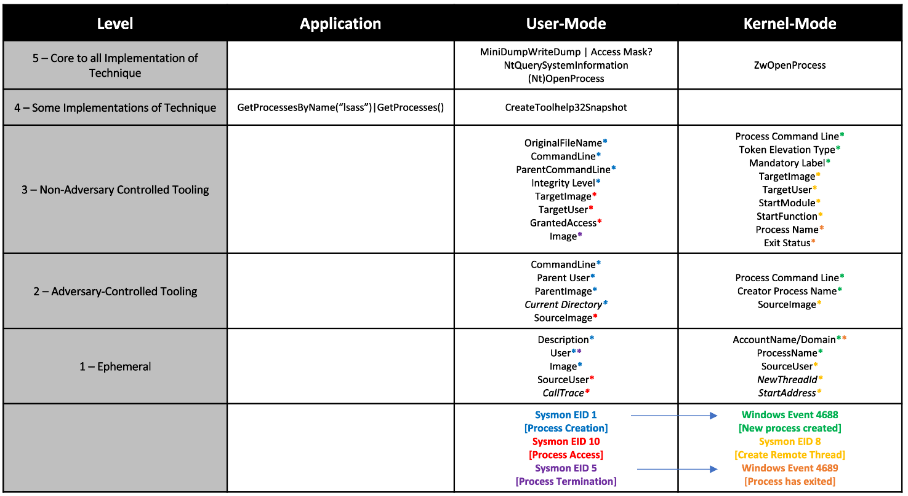
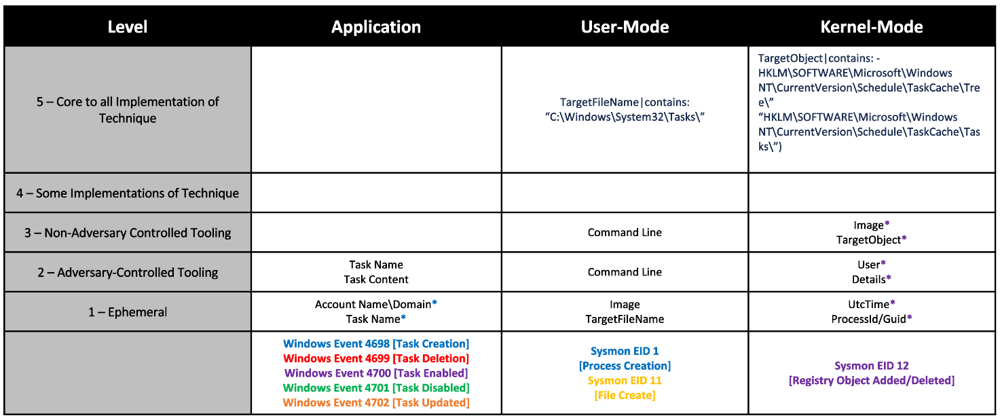

.. _Data Sources:

Example Mappings
================

`T1003.001: LSASS Memory <https://attack.mitre.org/techniques/T1003/001/>`_
---------------------------------------------------------------------------

`T1053.005 Scheduled Tasks <https://attack.mitre.org/techniques/T1053/005/>`_
-----------------------------------------------------------------------------

