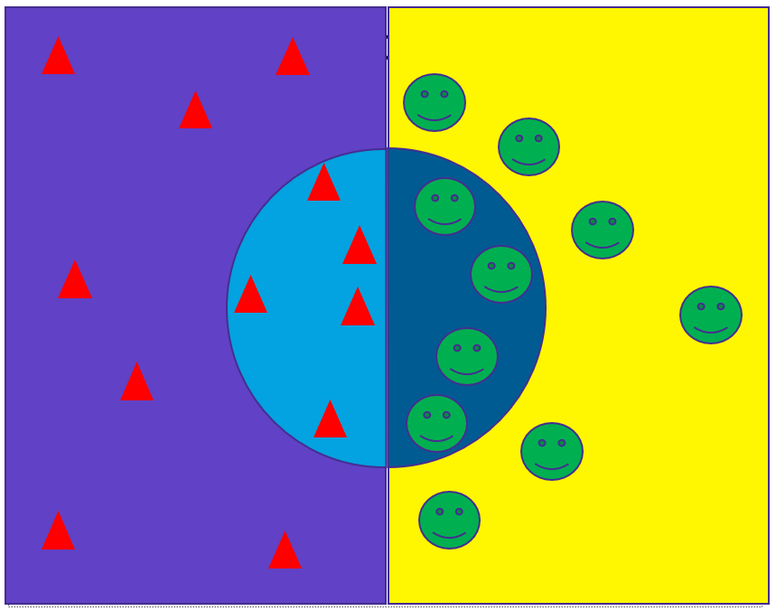
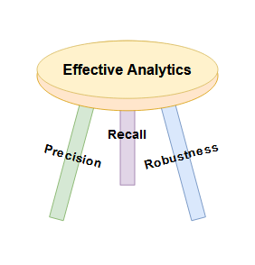

Definitions
===========
This page will be updated with terms key to the development of the Summiting the Pyramid's research and methodology development.

.. _Precision:

Precision
---------
**The ratio of true positives to total positive results given by an analytic** [#f1]_

Precision is extremely important when hunting for adversary activity. High precision analytics can most likely identify true malicious behavior. Precision corresponds to a low false positive rate within a detection environment. Precision can be more challenging to optimize for analytics higher on the pyramid.

.. figure:: _static/pyramid_of_pain.png
   :alt: Pyramid of Pain
   :align: center

   David Bianco's Pyramid of Pain [#f2]_

.. _Recall:

Recall
------
**Recall is the ratio of true positives to total relevant malicious events** [#f1]_

Recall brings in all events related to a specific behavior, regardless of it’s malicious and benign. High recall ensures that all the events a defender is interested in are collected and can be further scrutinized for identifying malicious behavior.

**How Precision and Recall Effect an Analytic**

   Relationship between precision and recall for malicious events (red triangles) and benign events (happy faces) from MAD’s Threat Hunting Course [#f1]_

Recall and precision go hand-in-hand. This can be demonstrated in picture above, where the red triangles are malicious events, smiley faces are benign events, and the circle is the scope of an analytic. Increasing recall on an analytic might decrease precision since you are widening the scope of what needs to be collected. So if the circle is increased, you will get more red triangles, but you will also get more smiley faces. The precise malicious behavior might not be identified if recall is increased. 

On the other hand, increasing precision might decrease recall, since the scope of the activity a defender is interested in narrows. If the circle gets smaller, it will detect the specific red triangles it’s after and lower the amount of green smiley faces. However, it might miss other related activity, since the circle is so small. It is important for defenders to find a balance between precision and recall that works for their environment and security needs.

.. _Observable:

Observable
----------
**An observable is an event, either benign or malicious, that is generated on a network or system and is visible to a defender.** [#f3]_

Example observables include:

+-------------------------------+--------------------------------------------------------------------------------------+
| Observable                    | Generating Activity                                                                  |
+===============================+======================================================================================+
| Windows Event 4688            |  Windows Kernel function monitored by ETW (e.g. PspCreateProcess) creates a process  |
+-------------------------------+--------------------------------------------------------------------------------------+
| Windows Event 4688 Image "foo"|  Windows Kernel function monitored by ETW creates a process with filename "foo"      |
+-------------------------------+--------------------------------------------------------------------------------------+
| Sysmon Event 1                | Windows function monitored by PsSetCreateProcessNotifyRoutine (e.g. CreateProcess)   |
| OriginalFilename="foo"        | creates a process from a source file with "foo" filename in PE Header                |
+-------------------------------+--------------------------------------------------------------------------------------+
| .pcap File                    | Network traffic occurs, visible to a packet analyzer                                |
+-------------------------------+--------------------------------------------------------------------------------------+
| Zeek alert                    | Network traffic occurs, visible to Zeek, which matches a policy                      |
+-------------------------------+--------------------------------------------------------------------------------------+

.. _Analytic:

Analytic
--------
**An analytic is query logic used for detecting activity within different technology mediums using Boolean combinations of, or statistical analysis, of observables**

In most security operations centers (SOCs), analytics are used to alert analysts on what they are concerned about within their environment, or keep track of certain behavior. For example, an analytic can be deployed by a team to send an alert when a new task is scheduled on a machine. Example analytics include CAR pseudocode, SIGMA rules, as well as the Splunk or Elastic queries generated by PySIGMA from SIGMA rules.

An analytic is made of different observables which create detection logic for an analytic. For example, an analytic looking for scheduled task creation could consist of observables such as the 4698 Task Creation Windows Event ID, the registry key path of the scheduled task, or the command line usage of the schtasks.exe tool. These observables can make an analytic more brittle or most robust based on how evadable they are. For example, tracking the command line creation of task scheduling might be more brittle than tracking task scheduler event IDs, due to the fact than an adversary may not utilize the command line to schedule a task. Observables can be changed to create more robust analytics. 

.. _Detection:

Detection
---------
**Detections are the result of an analytic**

Detections are how defenders understand if their analytics are firing correctly. Usually within a detection, a defender will look to see if their analytic is alerting on true positives. This is equal to precision. However, the analytic could be configured incorrectly and be alerting on false positives and false negatives.

.. _Level:

Level
-----
**A level is the grouping of observables and analytics based on difficulty and cost for an adversary to avoid triggering or being detected by them**

The Summiting the Pyramid methodology is focused on scoring analytics based on the difficulty for adversaries to evade them. Different observables are more or less evadable than others. The levels organize observables starting with the most easily evaded observables towards the bottom of the levels, to the least easily evaded observables towards the top of the wall. To read more about how the levels are currently outlined, refer to our :ref:`Levels`.

.. _Robustness:

Robustness
----------
**Robustness measures the effort needed by an adversary to evade an analytic**

Robustness is crucial for the effectiveness of an analytic, and is the focus of the Summiting the Pyramid project. Robustness is directly related to the cost required by an adversary to evade it, including time, resources, and money. High robustness indicates an adversary has to spend a lot to evade it, forcing them to operate at higher levels, such as interacting directly with the kernel. Therefore, robustness is equal to the level at which an adversary must operate to evade a defender’s detection.  

.. _Capability Abstraction:

Capability Abstraction
----------------------
**Capability abstraction attempts to find common touch points between tools, making capabilities less hidden from defenders**

.. figure:: _static/capability_abstraction_specterops.png
   :alt: Kerberoasting - Specter Ops
   :align: center

   Kerberoasting Capability Abstraction Taken From Specter Ops [#f4]_

The art of capability abstraction showcases how each tool or behavior can be uncovered into different layers which can be acted upon by defenders. As seen in the capability abstraction above, tools used for kerberoasting can map to similar managed code, Windows API functions, RPC calls, and the same network protocol. Through reverse engineering, defenders can utilize this information to detect behaviors that might be more difficult for adversaries to evade. For example, if defenders wanted to detect the tool implementations of kerberoasting shown here, a defender can create an analytic surrounding the network protocol Kerberos TGS-REQ/REP, a behavior that adversaries would not be able to evade based on the research conducted.

The Summiting the Pyramid team is utilizing capability abstraction mappings to map certain observables to levels outlined by our methodology. As observables are assigned to levels, further research can be conducted to identify detections based off those observables. For example, if a kernel call is detected, is there a specific Windows Event ID that is fired? Are there registry keys that are updated? This gives the defender a broader perspective of not only the tools that use similar behaviors towards the lower-levels of the operating system, but also how to think of detecting behaviors the closer an adversary gets to the kernel.

.. _Robustness Precision Recall:

Summiting the Pyramid and Precision, Recall, and Robustness
-----------------------------------------------------------
The Summiting the Pyramid methodology is focused on how to create more robust analytics. However, it’s important to consider the different dimensions of effective analytics.

Robustness, precision, and recall are separate concepts and should be considered as different aspects of analytics. Effective analytics can be thought of as a 3-legged stool. The three legs are precision, recall, and robustness. A balance between all the legs is needed to ensure the stool can withstand weight and not fall over. If you kick out one of the stool legs, it’s not a stool anymore! 

To that end, increased robustness does not automatically mean increased precision or recall. Robustness is a different dimension of effective analytics and must not be thought of as precision or recall. However, the robustness of an analytic could affect the precision or recall of an analytic. Finding a balance between precision, recall, and robustness ensures defenders can have the most effective analytics within their environment.

For Summiting the Pyramid 1, we will be looking primarily at the **robustness of analytics**. Future projects will include measuring precision and potential recall of analytics, giving us the broader picture of an analytic.

**References**

.. [#f1] https://www.cybrary.it/course/mitre-attack-threat-hunting/
.. [#f2] https://www.sans.org/tools/the-pyramid-of-pain/
.. [#f3] http://nist.gov/
.. [#f4] https://posts.specterops.io/capability-abstraction-fbeaeeb26384