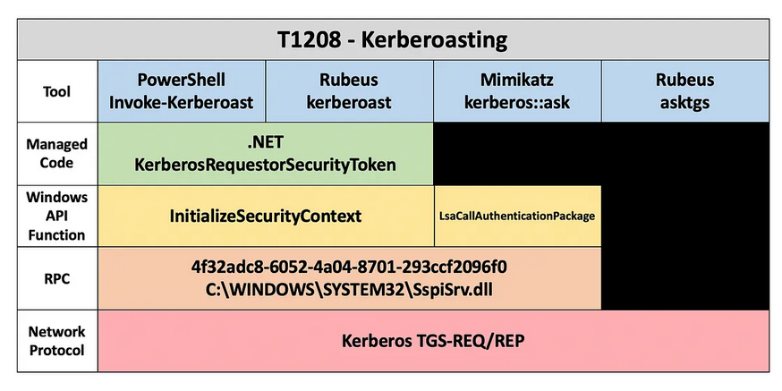

Definitions
===========
This page will be updated with terms key to the development of the Summiting the Pyramid's research and methodology development.

Precision
---------
**Precision is the ratio of true positives to results** [#f1]_

Precision is extremely important when hunting for adversary activity. High precision analytics can most likely identify true malicious behavior. Precision corresponds to a low false positive rate within a detection environment. Precision can be more challenging to optimize for analytics higher on the pyramid.

.. figure:: _static/pyramid_of_pain.png
   :alt: Pyramid of Pain
   :align: center

   David Bianco's Pyramid of Pain [#f2]_

Recall
------
**Recall is the ratio of true positives to total relevant malicious events** [#f1]_

Recall brings in all events related to a specific behavior, regardless of it’s malicious and benign. This ensures that all the events a defender is interested in are collected and can be further scrutinized for identifying malicious behavior.

**How Precision and Recall Effect an Analytic**

.. figure:: _static/SmilesAndTriangles.png
   :alt: Precision and Recall Example
   :align: center

   Relationship between precision and recall for malicious events (red triangles) and benign events (happy faces) from MAD’s Threat Hunting Course [#f1]_

Recall and precision go hand-in-hand. This can be demonstrated in picture above, where the red triangles are malicious events, smiley faces are benign events, and the circle is the scope of an analytic. Increasing recall on an analytic might decrease precision since you are widening the scope of what needs to be collected. So if the circle is increased, you will get more red triangles, but you will also get more smiley faces. The precise malicious behavior might not be identified if recall is increased. 

On the other hand, increasing precision might decrease recall, since the scope of the activity a defender is interested in narrows. If the circle gets smaller, it will detect the specific red triangles it’s after and lower the amount of green smiley faces. However, it might miss other related activity, since the circle is so small. It is important for defenders to find a balance between precision and recall that works for their environment and security needs.

Evadability
-----------
**Evadability describes how difficult or easy it is for an adversary to evade detections without changing their technique**

When we think of an adversary moving through a network, they will attempt to evade detections in multiple ways. They can use applications which have hashes not documented by security vendors, use native tooling to blend in with normal processes, or build their own tools which communicate directly with the kernel. Defenders can use different analytics to detect adversary activity and behavior at different levels. A success might be if the adversary changes their route of attack through a different technique, or if they give up on their attack entirely.

Some behaviors are easier for adversaries to evade compared to others. For example, if a defender is detecting one MD5 hash of a customizable tool, an adversary can change one byte of the application in order to avoid setting off the detection from the defender. This is very trivial for the adversary to change, requiring minimal effort, time, and money. However, if a defender is detecting certain PowerShell commandlets, an adversary might have to change the tool they are using to avoid detection. This requires more effort, time, and potential money, especially if the adversary want to maintain their specific technique, or route of attack.

.. important:: After an adversary has hit multiple walls through their attack, they might transition their attack to **tampering**. 
     Tampering “results in the modification of a system, components of systems, its intended behavior, or data” [#f3]_. For the purposes of this research, an adversary switching to tampering as a method of attack can be considered on the same level as switching their technique, or router, of an attack. Detection of tampering are not captured within our current research, but will be considered during future iterations of this project.

Robustness
----------
**Robustness is the effort needed by an adversary to evade an analytic**

Robustness is crucial for the effectiveness of an analytic, and is the focus of the Summiting the Pyramid project. 

The evadability of an analytic directly affects the robustness of an analytic. For example, an analytic might look for a specific hash value, something that is easy for an adversary to evade. It is cheap for the adversary to evade, making the robustness low. However, an analytic might be looking for the execution of a specific system call, making the evadability of an adversary’s technique increasingly difficult. Since it would cost the adversary more to evade the detection, the robustness of that specific analytic is high.

We are not decreasing the attack’s evasiveness through robustness, nor is robustness about scoring the tradecraft of the adversary. Evasiveness and evadability are two different concepts. Rather, we are scoring the robustness of an analytic in conjunction with the effort to evade the specific detection.

Capability Abstraction
----------------------
**Capability abstraction attempts to find common touch points between tools, making capabilities less hidden from defenders**

   Kerberoasting Capability Abstraction Taken From Specter Ops [#f4]_

The art of capability abstraction showcases how each tool or behavior can be uncovered into different layers which can be acted upon by defenders. As seen in the capability abstraction above, tools used for kerberoasting can map to similar managed code, Windows API functions, RPC calls, and the same network protocol. Through reverse engineering, defenders can utilize this information to detect behaviors that might be more difficult for adversaries to evade. For example, if defenders wanted to detect the tool implementations of kerberoasting shown here, a defender can create an analytic surrounding the network protocol Kerberos TGS-REQ/REP, a behavior that adversaries would not be able to evade based on the research conducted.

The Summiting the Pyramid team is utilizing capability abstraction mappings to map certain observables to levels outlined by our methodology. As observables are assigned to levels, further research can be conducted to identify detections based off those observables. For example, if a kernel call is detected, is there a specific Windows Event ID that is fired? Are there registry keys that are updated? This gives the defender a broader perspective of not only the tools that use similar behaviors towards the lower-levels of the operating system, but also how to think of detecting behaviors the closer an adversary gets to the kernel.

Summiting the Pyramid and Precision, Recall, and Robustness
-----------------------------------------------------------
The Summiting the Pyramid methodology is focused on how to create more robust analytics, therefore, measuring it's evadability. However, it’s important to consider the different dimensions of effective analytics.

Robustness, precision, and recall are separate concepts and should be considered as different aspects of analytics. Effective analytics can be thought of as a 3-legged stool. The three legs are precision, recall, and robustness. A balance between all the legs is needed to ensure the stool can withstand weight and not fall over. If you kick out one of the stool legs, it’s not a stool anymore! 

.. figure:: _static/stool.png
   :alt: Stool of Effective Analytics
   :align: center

To that end, increased robustness does not automatically mean increased precision or recall. Robustness is a different dimension of effective analytics and must not be thought of as precision or recall. However, the robustness of an analytic could affect the precision or recall of an analytic. Finding a balance between precision, recall, and robustness ensures defenders can have the most effective analytics within their environment.

For Summiting the Pyramid 1, we will be looking primarily at the **robustness of analytics**. Future projects will include measuring precision and potential recall of analytics, giving us the broader picture of an analytic.

**References**

.. [#f1] https://www.cybrary.it/course/mitre-attack-threat-hunting/
.. [#f2] https://www.sans.org/tools/the-pyramid-of-pain/
.. [#f3] https://csrc.nist.gov/glossary/term/tampering
.. [#f4] https://posts.specterops.io/capability-abstraction-fbeaeeb26384