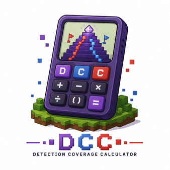
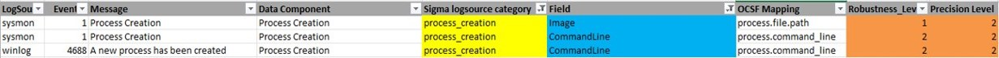
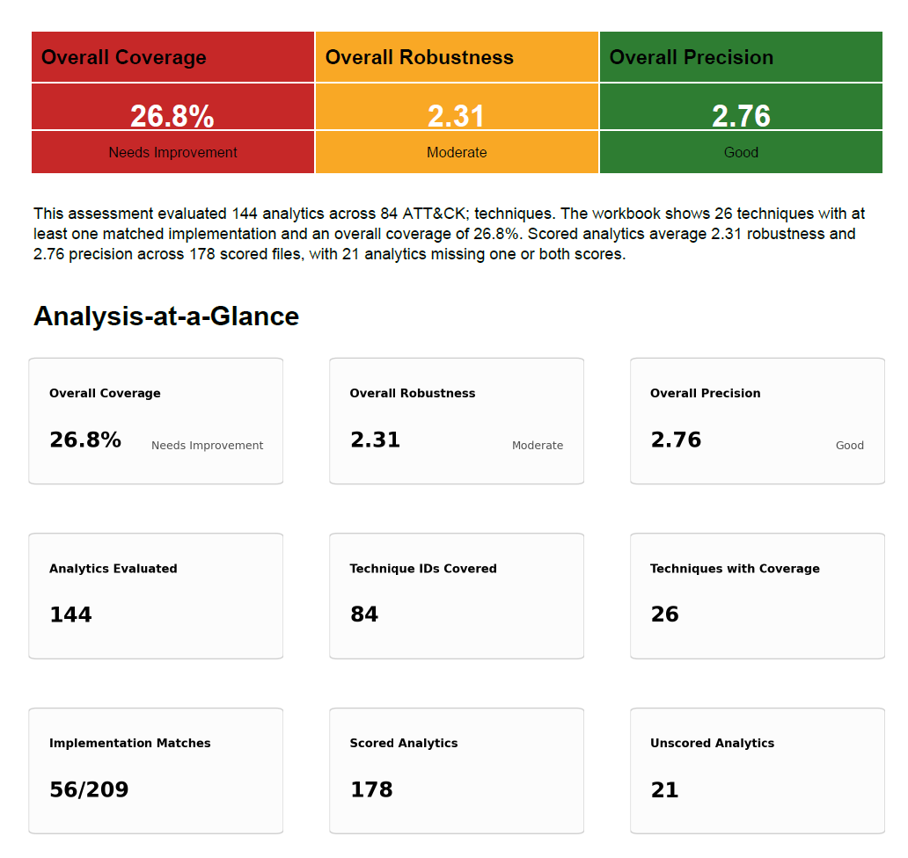

.. _detection-coverage-calculator:

Detection Coverage Calculator
=============================

Calculator Overview
-------------------

The **Detection Coverage Calculator (DCC)** automates the evaluation of
detection coverage by analyzing what detection logic actually observes, looking deeper than just what it is mapped to.

The DCC evaluates detection content across two complementary dimensions:
**Detection Quality**, measured through robustness and precision, and
**Implementation Coverage**, which measures how much of the known behavioral
implementation space for a mapped ATT&CK technique is detected.

The result provides a more evidence-based view of coverage: what behavior is
detected, how durable and precise the underlying detection signals are, and
where meaningful gaps remain.

How It Works
------------

The DCC brings together four components to connect ATT&CK techniques to
observable behavior and detection logic.

Implementation Catalog
~~~~~~~~~~~~~~~~~~~~~~

The :download:`Implementation Catalog <../DCC/implementation_catalog_with_attack_components.xlsx>` describes behaviorally distinct ways of
executing ATT&CK techniques. Built from ATT&CK procedure examples and Atomic
Red Team tests, the catalog normalizes specific examples into reusable
implementation paths and identifies the system interactions required to
perform them.

The DCC uses the catalog as the behavioral baseline against which
Implementation Coverage is measured.

Sensor Mappings
~~~~~~~~~~~~~~~

:download:`Sensor-Field Mappings <../DCC/mappings.xlsx> connect system activity to the telemetry available to
observe it. The DCC extends previous sensor-mapping work with field-level
information for supported telemetry sources, allowing it to evaluate the
specific fields used by detection logic rather than treating the presence of
an event or data source as sufficient evidence of detection.

Analytic Ingestion
~~~~~~~~~~~~~~~~~~

The Ingestion step in the pipeline automates rule processing for all of your detection logic. The script recursively steps through a rule directory and its subdirectories and pulls the values from each rule that the calculator needs to determine a coverage score. 

There is no need to clean up the directory. It steps through level by level and only loads in YAML files. The process then uses a combination of regular expressions and context clues to extract the information. 

*Extracted Fields:*

=========================  ======================================================================
Field Extracted            Description
=========================  ======================================================================
rule_title                 The title of the SIGMA rule
rule_logsource_product     The product that the rule was created to defend
rule_logsource_category    | The type of log that the rule is from
rule_tags                  Any tags that the rule is with. Mainly ATT&CK Techniques and Tactics
detection_fields           The fields the rule uses to detect the activity
detection_filters          Any filters the rule may use
detection_condition        What causes the rule to trigger a positive detection
=========================  ======================================================================

Example

Take the following rule, for example.

.. figure:: ../../_static/sigma-rule.jpg
   :alt: Sigma Rule: WMI Persistence - Security
   :align: center

It is a rule to detect WMI Persistance from the Windows Security logs.

The script, analyzes the rule, and creates the following JSON.

.. figure:: ../../_static/extracted-field-json.png
   :alt: Sigma Rule: WMI Persistence - Security
   :align: center
   :scale: 75

With this formatted output, the next step in the pipeline can now take place.

Scoring Dictionary
~~~~~~~~~~~~~~~~~~

The :download:`Scoring Dictionary <../DCC/scoring_dictionary.xlsx> provides standardized robustness and precision
values for supported telemetry sources and fields. The DCC uses these values
to automatically evaluate the Detection Quality of the signals used by an
analytic.

Understanding Your Results
--------------------------

The DCC produces three primary measurements: robustness, precision, and
Implementation Coverage. Together, they describe both the quality and depth of
detection coverage.

Detection Quality
~~~~~~~~~~~~~~~~~

Detection Quality characterizes the signals used by detection logic through
two measures:

Robustness Score
^^^^^^^^^^^^^^^^

The Robustness Score measures how difficult a detection signal is for an
adversary to evade or manipulate. Higher robustness reflects signals tied to
behaviors or system interactions that require increasingly significant changes
for an adversary to avoid.

Precision Score
^^^^^^^^^^^^^^^

The Precision Score measures how well a detection signal distinguishes
malicious activity from benign activity. Higher precision reflects signals
that provide stronger context for identifying the behavior of interest.

Implementation Coverage
~~~~~~~~~~~~~~~~~~~~~~~

Implementation Coverage measures which known implementations of an ATT&CK
technique are meaningfully observed by the detection logic.

Rather than reporting a technique as simply covered or uncovered, the DCC
expresses coverage against the implementations represented in the catalog.

Detection Coverage
~~~~~~~~~~~~~~~~~~

Detection Coverage brings Detection Quality and Implementation Coverage
together to provide a more complete view of defensive coverage.

Using the Calculator
--------------------

Supported Detection Formats
~~~~~~~~~~~~~~~~~~~~~~~~~~~

The current DCC supports `Sigma specification-formatted <https://github.com/SigmaHQ/sigma/tree/master>`_ YAML detection content and can process
Sigma files stored locally or in a GitHub repository. The ingestion framework
is designed to support additional detection formats as the project evolves.

Running an Assessment
~~~~~~~~~~~~~~~~~~~~~

Users provide detection content for analysis. The DCC parses each analytic,
resolves its ATT&CK mapping and telemetry dependencies, evaluates its detection
logic, and compares that evidence against the Implementation Catalog and
Scoring Dictionary.

A valid ATT&CK mapping is required because the DCC evaluates the analytic
against implementations of its stated technique; it does not infer missing
technique mappings. Telemetry fields must likewise be recognizable within the
supported Sensor Mappings for automated Detection Quality scoring.

Interpreting Results
~~~~~~~~~~~~~~~~~~~~

DCC results should be used to identify opportunities for detection
engineering—not simply to maximize a score.

Results can highlight:

* behavioral implementations that lack detection coverage;
* detections that depend on fragile or low-precision signals;
* ATT&CK mappings that may not be supported by the detection logic;
* telemetry limitations preventing stronger detection; and
* areas where additional engineering investment could meaningfully improve
  coverage.

A low score does not necessarily mean an analytic is ineffective for its
intended purpose. A narrowly targeted analytic may be valuable while providing
limited evidence of broader technique coverage.

Generating Reports
~~~~~~~~~~~~~~~~~~

The DCC produces detailed spreadsheet output containing analytic- and
technique-level results and supports generation of an executive-oriented
coverage report. These outputs provide both the underlying assessment data and
a higher-level view of Detection Quality, Implementation Coverage, and
identified gaps.

We have also developed a ChatGPT skill that takes the spreadsheet as an input to generate an executive-level report highlighting major findings and giving more of an overview of the results to assist in decision-making. Both are available in our STP Github repository!

GitHub / Download
-----------------

`View the Detection Coverage Calculator on GitHub <https://github.com/center-for-threat-informed-defense/summiting-the-pyramid/tree/stp3/docs/detection-ttv/coveragecalculator/DCC>`_

The project repository contains the DCC, supporting data, and documentation
needed to run coverage assessments.
