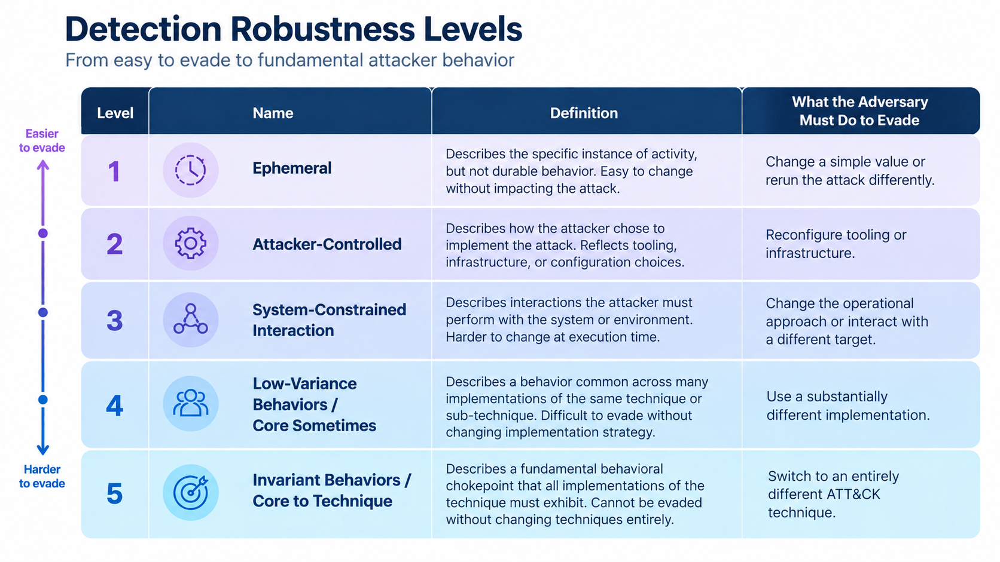
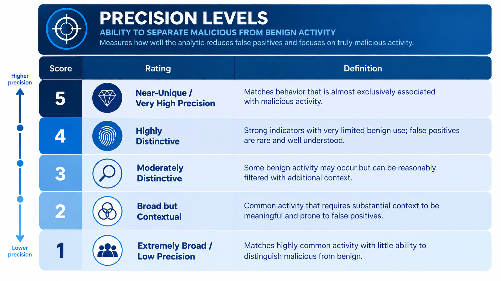

.. _detection-quality:

Detection Quality
=================

Detection Quality describes the quality of the signals and logic used to detect
adversary behavior. It considers two complementary characteristics:
**robustness** and **precision**.

* **Robustness** considers how difficult a detection signal is for an adversary
  to evade or manipulate.
* **Precision** considers how well a detection signal distinguishes malicious
  behavior from benign activity.

A detection can perform well in one dimension without performing well in the
other. A highly specific indicator may provide strong evidence of known
malicious activity but be easy for an adversary to change. Conversely, an
observable tied to a system interaction that an adversary cannot easily avoid
may also occur frequently during legitimate activity. Considering both provides a more complete picture of detection quality.

Balancing Robustness and Precision
----------------------------------

Robustness and precision describe different properties of a detection, and
improving one does not necessarily improve the other. A detection based on a known malicious hash, for example, may be highly
specific when that value is observed. However, an adversary may be able to
change the file and therefore its hash without changing the underlying
behavior. The signal can provide strong confidence when it appears while
remaining relatively easy to evade. At the other extreme, a detection may observe a system interaction that is
required across many implementations of a technique. This can provide more
durable visibility, but the interaction may also occur frequently during
legitimate activity.

The strongest detection is therefore not always the most specific signal or
the signal that observes the most behavior. Detection engineers should
consider both characteristics and determine what combination of evidence
provides useful visibility for the behavior and environment being monitored. Additional fields, conditions, or contextual information can improve the
precision of a robust signal. Conversely, more durable behavioral observables
can strengthen a precise but easily changed signal. See :ref:`Building High-Quality Detections
<high-quality-detection-design-principles>` for guidance on applying these trade-offs
during detection design.

Robustness
----------

Robustness measures how difficult a detection signal is for an adversary to
evade or manipulate.

Signals based on attacker-controlled values—such as filenames, hashes, or
specific command-line arguments—may be effective when those values appear but
relatively inexpensive for an adversary to change. More robust detections rely
on behaviors and system interactions that are increasingly difficult to avoid
while still accomplishing the adversary's objective. At the highest levels of robustness, evasion may require the adversary to
substantially change how the behavior is implemented or abandon the technique
altogether.

The :ref:`Summiting Levels <Summiting Levels>` provide a framework for
describing this progression. :ref:`Combining Observables
<combiningobservables>` explains how multiple observables contribute to the
robustness of a detection. For a worked example of applying the methodology to an analytic, see
:ref:`Scoring Detection Robustness <scoring analytic>`.

Precision
---------

Precision measures how well a detection signal distinguishes malicious
behavior from benign activity.

A signal can be highly robust while still providing limited information about
intent. An operating system interaction required by a technique, for example,
may also occur routinely during legitimate administration. Detecting the
interaction provides visibility, but additional evidence may be necessary to
determine whether the activity is malicious.

Precision can be improved by incorporating fields, values, conditions, or
context that more specifically characterize the behavior of interest.
However, increasing specificity can also narrow the behavior the analytic
detects or introduce conditions an adversary can manipulate. Precision should therefore be considered alongside robustness rather than
optimized independently.

Distinguishing Malicious from Benign Activity
~~~~~~~~~~~~~~~~~~~~~~~~~~~~~~~~~~~~~~~~~~~~~

Telemetry tells us that activity occurred; detection logic must provide enough
context to determine what that activity means. An event or field alone may describe a system interaction without
distinguishing legitimate use from adversary behavior. High-quality detection
logic incorporates the information necessary to narrow that ambiguity and
establish stronger evidence of the behavior being detected.

See :ref:`Using Context to Determine Intent
<Context>` for guidance on incorporating contextual
evidence.

Combining Evidence
------------------

A single signal does not always provide both strong robustness and strong
precision. Detection logic can combine multiple pieces of evidence to improve Detection
Quality. A durable behavioral observable may establish that an important
system interaction occurred, while additional fields or contextual signals
help determine whether that interaction is suspicious or malicious.

Filters and exclusions can similarly improve precision, but they should be
evaluated for the blind spots they may create. A condition that reduces benign
activity may also create an opportunity for an adversary to evade the analytic. In some cases, multiple analytics may provide a better balance than trying to
make a single analytic perform every function.

See :ref:`Chaining Analytics <Chaining Analytics>` for guidance on combining
multiple analytics.

