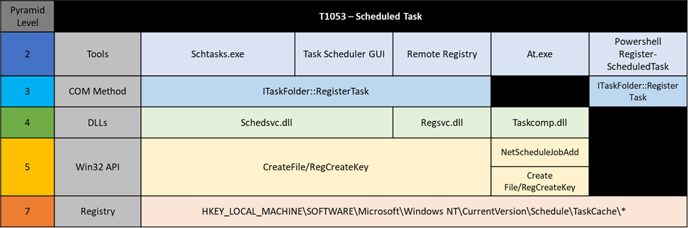
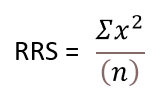

.. _Evadability and Boolean Logic:

Evadability & Boolean Logic
===========================

Now that the Summiting Team has developed the Levels of Evadability framework for 
categorizing individual observables used in analytics according to their difficulty 
to evade, we can open the aperture a bit more to examine how we can examine and 
categorize combinations of those observables in various analytics.  Oftentimes 
in real-world applications, an analytic consists of several observables chained 
together using some form of Boolean logic, and just as with the individual 
observables, it is extremely useful to have some objective indication of the 
evadability and strength of a composite analytic. 

   Example of Capability Abstraction for ATT&CK Technique T1053: Scheduled Task [#f1]_ [#f2]_

Basic Guidelines
----------------

In order to devise an objective method of scoring complex analytics, we began by 
examining common Boolean logic operations and how they factor into important 
analytic metrics, including recall and precision, before concluding on a new 
metric, evadability.

+-------------------------------------------------+-------------------------------------------------+
| Operations Increasing Recall/Limiting Precision | Operations Increasing Precision/Limiting Recall |
+=================================================+=================================================+
| OR                                              | AND                                             |
+-------------------------------------------------+-------------------------------------------------+
| IN                                              | NOT                                             |
+-------------------------------------------------+-------------------------------------------------+

Here we have determined a general set of guidelines for what effects the employment of Boolean logic has 
on an overall analytic:

    - OR and IN operations help to expand the aperture, most likely increasing recall but sacrificing some precision

    - AND and NOT functions constrain the aperture, most likely increasing precision but sacrificing some recall

We do not try to claim that maximizing recall or maximizing precision makes for the best analytic, as 
it is highly dependent on what the objective of the analytic is and the environment it is being used in.  
We can, however, speak objectively on what effect various combinations of observables have an analytic’s 
difficulty to evade, which brings us to our new metric, evadability.

Evadability as a Metric
-----------------------

*Definition and Relationship to Robustness*

Evadability is a metric that we have devised to give a relative score for the difficulty an attacker would have in evading a candidate 
analytic when executing a given Technique.  We are proposing that evadability value be determined by the lowest level that an analytic 
contains (according to our levels of evadability) that could be evaded by an adversary and lead to a successful attack.  Thus, a high 
evadability level, such as 7, would mean that the adversary would have to evade detection by changing their approach via interactions 
with the kernel, whereas a low evadability level, such as 1, would mean that an adversary could evade detection through 
use of different operational or environmental variables.

Evadability has a fairly strong correlation with robustness but is independent from how robustness itself is scored.  Key differences 
include that robustness is focused on the ability of an analytic to hold against a given attack, whereas evadability is focused 
on the amount of effort it would take for an attacker to successfully evade a given analytic - to simplify it a little more, robustness 
is centered on the attack, while evadability is centered on the defense.

Determining Evadability Level
-----------------------------

The Evadability Level *E(X)* for a given observable is equivalent to the Level of Evadability that the observable resides at:

  - For an observable A, **E(A) = Level of Evadability of A**

In determining the Evadability Level *E(X)* for a more complex analytic, we can apply a set of Boolean logic rules to find the resulting value.  
The set of rules below are for use in comparing two analytic components at levels A and B:

  - **E(A AND B) → MIN(E(A), E(B)) [when A ∩ B ≠ ∅]** - The evadability level of A and B is equal to the lowest level value of the two observables, 
    as long as there exists some overlap between the data that can be detected by each observable; if this were not true, the analytic would never return any results.
  
  - **E(A OR B) → MAX(E(A), E(B))** - The evadability level of A OR B is equal to the highest level value of the two observables; if all 
    implementations of the attack technique were known, the evadability level could be represented as E(A OR B) ≥ MAX(E(A), E(B)), where the 
    evadability score could surpass the highest level if the observables at that level were fully detectable by the analytic.
  
  - **E(NOT A) → E(A)** - The evadability level of NOT A would be equivalent to the evadability level of the observable A itself, since the 
    detection focus is still at A’s level of evadability.
  
  - **E(A AND B | A) → E(B)** - The evadability level of A and B predicated on observing A is equivalent to the evadability level of B, since 
    observing A is a given in this context.

Relative Robustness Score
-------------------------

While Evadability Level is a useful metric to determine the difficulty involved in evading an analytic, it does not give any indication as 
to the relative strength of analytics at the same level.  The Relative Robustness Score was developed to give that indication, because while 
the goal for improving analytic robustness is to get it to the highest level of evasion feasible, there are also steps that can be taken to 
strengthen analytic robustness if increasing the evadability level is not feasible, and should be quantified somehow.  This score is relative 
because the quantifiable values should only be interpreted in comparison to the scores of other analytics, and do not stand alone as some metric 
of analytic strength.  The Relative Robustness Score is calculated via the following equation:

   Relative Robustness Score equation

In this equation, *n* is the number of observables present in the analytic, and x represents the level of evadability for a given observable.  
This calculated value allows us to take into consideration the various evadability levels of the total observables contained in an analytic 
to make meaningful comparisons of approximate robustness.

Evadability Tuple Score
-----------------------

Putting all of the elements described above together, we have the Evadability Tuple Score, which consists of the Evadability Level and Relative 
Robustness Score and gives an indication of not only an analytic’s difficulty to evade, but also the relative strength of an analytic with 
others within the same evadability level.

.. figure:: _static/evadability_tuple_calculation.png
   :alt: Evadability Tuple Example Calculations
   :align: center

   Evadability Tuple Example Calculations

To illustrate this process, let’s take the example of the SIGMA analytic focused on ``adfind.exe`` [#f3]_: 

.. code-block:: yaml

    selection:
        CommandLine|contains:
            - 'objectcategory'
            - 'trustdmp'
            - 'dcmodes'
            - 'dclist'
            - 'computers_pwdnotreqd'
        Image|endswith: '\adfind.exe'

Through analysis of the original analytic’s Levels of Evadability for the listed observables, we have proposed the following change to the analytic that will increase its robustness and difficulty to evade:

.. code-block:: yaml
   
    selection:
        CommandLine|contains:
            - 'objectcategory'
            - 'trustdmp'
            - 'dcmodes'
            - 'dclist'
            - 'computers_pwdnotreqd'
        OriginalFileName: 'adfind.exe'

The observables for both analytics aligned to the Levels of Evadability can be seen in the table below:

.. list-table::
    :widths: 30 35 35
    :header-rows: 1

    * - Level
      - Observables for Original Analytic
      - Observables for Improved Analytic
    * - Kernel
      - 
      -
    * - System Calls
      - 
      -
    * - OS API
      - 
      -
    * - Library API
      - 
      -
    * - Tools Outside Adversary Control
      - 
      -
    * - Tools Within Adversary Control
      - | CommandLine|contains:
        |   - 'objectcategory'
        |   - 'trustdmp'
        |   - 'dcmodes'
        |   - 'dclist'
        |   - 'computers_pwdnotreqd'
      - | CommandLine|contains:
        |   - 'objectcategory'
        |   - 'trustdmp'
        |   - 'dcmodes'
        |   - 'dclist'
        |   - 'computers_pwdnotreqd'
        | OriginalFileName: 'adfind.exe'
    * - Operational/Environmental Variables
      - Image|endswith: '\\adfind.exe'
      - 

By calculating the Evadability Tuple Score for both analytics, we can confirm that the updated analytic should be both harder to 
evade (via higher Evadability Level), and relatively stronger in terms of robustness (via the Relative Robustness Score)

+----------+-------------------------------+---------------------------+---------------------------+-------------------------+
| Analytic | Levels of Evadability Present | Overall Evadability Level | Relative Robustness Score | Evadability Tuple Score |
+==========+===============================+===========================+===========================+=========================+
| Original | 1, 2                          | 1                         | 2.5                       | (1, 2.5)                |
+----------+-------------------------------+---------------------------+---------------------------+-------------------------+
| Updated  | 2, 2                          | 2                         | 4                         | (2, 4)                  |
+----------+-------------------------------+---------------------------+---------------------------+-------------------------+

.. rubric:: References

.. [#f1] https://posts.specterops.io/abstracting-scheduled-tasks-3b6451f6a1c5
.. [#f2] https://mitre-engenuity.org/cybersecurity/mad/
.. [#f3] https://github.com/SigmaHQ/sigma/blob/30bee7204cc1b98a47635ed8e52f44fdf776c602/rules/windows/process_creation/win_susp_adfind.yml