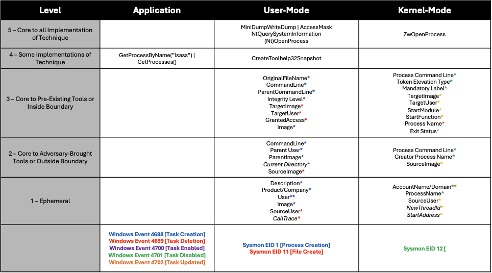
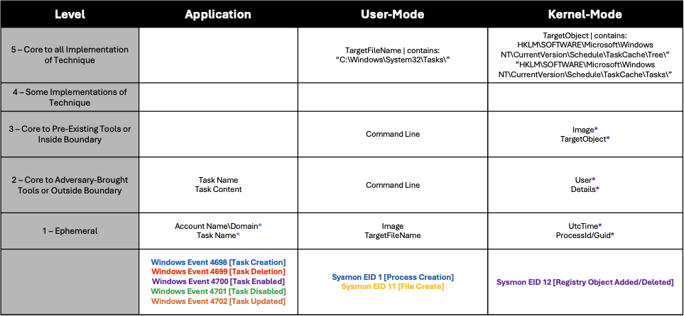
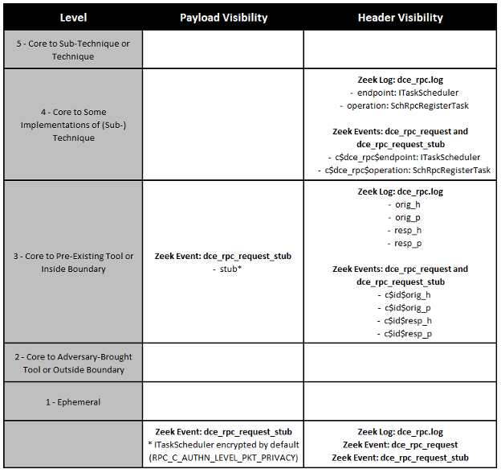
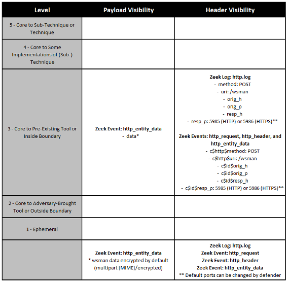
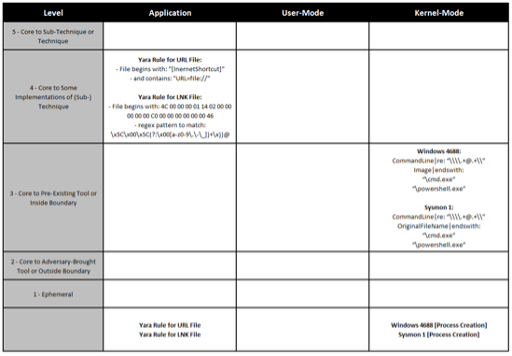
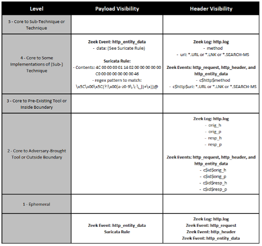

.. _Example Mappings:

Example Mappings
================

`T1003.001: LSASS Memory <https://attack.mitre.org/techniques/T1003/001/>`_
---------------------------------------------------------------------------

`T1053.005 Scheduled Tasks <https://attack.mitre.org/techniques/T1053/005/>`_
-----------------------------------------------------------------------------

Remote Procedure Call (RPC) Protocol
------------------------------------

We examined remote execution of `T1053.005 <https://attack.mitre.org/techniques/T1053/005/>`_ and the relevant observables from the network traffic perspective. Two specific procedures, the Task Scheduler command-line interface (``schtasks.exe``) and the Task Scheduler graphical user interface (``mmc.exe``), generate RPC network traffic to communicate with the ITaskScheduler RPC interface on the remote device.

Data sources from the network traffic include network sensors such as Zeek network security monitor (NSM) and packet capture (PCAP) tools. For the RPC protocol, we used Zeek logs and Zeek real-time protocol parser events as our data sources, including MITRE’s Bro/Zeek ATT&CK-based Analytics and Reporting (BZAR), [#f1]_  which is a set of Zeek scripts utilizing the Sever Message Block (SMB) and Distributed Computing Environment Remote Procedure Call (DCE RPC, or just RPC for short) protocol analyzers to detect ATT&CK behaviors like Lateral Movement and Remote Execution. Zeek and BZAR are useful tools to detect RPC-based threats. The relevant fields within each log or parser event are assigned a robustness score according to our new network robustness matrix. First, let’s provide a little more background and context on the RPC protocol, Zeek logs, and Zeek protocol parser events.

**RPC Network Traffic.** The relevant observables from RPC network traffic between the two endpoints include the RPC interface and operation, which are transmitted in plain-text within the RPC header, and the RPC stub or data payload, which may sometimes be encrypted. This data can be very insightful. To understand RPC a little better, let’s use an analogy between security monitoring of the RPC interface, operation, and data payload and security monitoring of the dynamic loading of dynamic-link libraries (DLLs), API function calls, and API input parameters. Observing the RPC interface to which a device connects remotely is like observing which DLL is being dynamically loaded into a given process. Similarly, observing which RPC operation a device is requesting remotely is like observing which API function is being called. Lastly, observing the RPC data payload (also known as the data stub) for a given RPC operation is like observing the input parameters to an API function call. Each item provides more detail and more context. When observing RPC network traffic, the RPC protocol header contains the interface and operation data, which is unencrypted in ordinary Windows environments. The RPC data payload, on the other hand, is often encrypted by default for certain operating system services, and the details are obscured from observation. For example, the RPC data payload is encrypted for the Windows Task Scheduler Service (T1053.005) and Windows Remote Registry Service (`T1053.003 <https://attack.mitre.org/techniques/T1053/003/>`_, `T1112 <https://attack.mitre.org/techniques/T1012/>`_, and `T1012 <https://attack.mitre.org/techniques/T1012/>`_), but the RPC data payload is unencrypted for the Windows At Service (`T1053.002 <https://attack.mitre.org/techniques/T1053/002/>`_).

**Observables within RPC Protocol Headers.** Using Zeek data, there are two means by which to analyze the RPC protocol headers and observe the RPC interface and operation, as follows:

* **Zeek RPC Log.** Zeek’s dce_rpc.log contains two very important fields: ``endpoint`` (also known as the RPC interface) and ``operation``. Using a log parser or ideally a Security Information and Event Management (SIEM) system, these two fields are analyzed to identify the RPC interface/operation tuple of interest. Also, the dce_rpc.log contains the originator IP address, originator port, responder IP address, and responder port labeled as the fields ``orig_h``, ``orig_p``, ``resp_h``, and ``resp_p``, respectively.
* **Zeek RPC Protocol-Parser Events.** Zeek’s protocol parsers also generate events in near real time when various aspects of a given protocol are parsed. For example, when Zeek parses an RPC Request packet, it generates an event called ``dce_rpc_request``. [#f2]_ An analyst would create an event handler (via Zeek script) for the ``dce_rpc_request`` event to identify the RPC interface/operation tuple of interest and then perform some analysis or perhaps create a separate log file. MITRE’s BZAR scripts [#f3]_ for Zeek contain detection logic for handling Zeek protocol-parser events in near real time. Though instead of handling the ``dce_rpc_request event``, BZAR is designed to focus on the ``dce_rpc_response`` event, which indicates the responder endpoint received, processed, and responded to the RPC interface/operation tuple of interest. The ``dce_rpc_request`` event contains various records with the same relevant fields that are stored in the dce_rpc.log file, including ``c$dce_rpc$endpoint``, ``c$dce_rpc$operation``, ``id$orig_h``, ``id$orig_p``, ``id$resp_h``, and ``id$resp_p``.

**Observables within RPC Data Payload.** Zeek does not log the contents of the RPC data payload (also known as RPC data stub) by default, which is a reasonable design choice because the data payload can be quite large, making it costly in terms of storage, and is often encrypted, making it of little value to an analyst if encrypted. Fortunately, Zeek is flexible and still makes the RPC data payload available to the analyst via the protocol-parser event ``dce_rpc_request_stub``. [#f4]_  Therefore, an analyst would create an event handler (via Zeek script) for the ``dce_rpc_request_stub`` event to identify the RPC interface/operation tuple of interest and then either add the data payload to the dce_rpc.log or create a separate log file for the RPC data payload. Of course, to make this approach worthwhile, the analyst would be knowledgeable of which RPC interface/operation tuples have unencrypted data payloads. The ``dce_rpc_request_stub`` event contains various records with the same relevant fields that are stored in the dce_rpc.log file, including ``c$dce_rpc$endpoint``, ``c$dce_rpc$operation``, ``id$orig_h``, ``id$orig_p``, ``id$resp_h``, and ``id$resp_p``. The event also has one extra field, ``stub``, which contains the RPC data payload.

**Conclusion.** For RPC network traffic, protocol header visibility is sufficient to identify remote access to the RPC interface and operation, ITaskScheduler and RpcSchRegisterTask, respectively, which maps directly to T1053.005 for (and similarly ``AtSvc::NetrJobAdd`` maps directly to T1053.002). Protocol payload visibility is not necessary to create robust detection analytics; rather, payload visibility would facilitate accurate analytics.

Hypertext Transfer Protocol (HTTP)
----------------------------------

Another procedure used for remote execution of T1053.005 is the PowerShell commandlet ``Register-ScheduledTask``. This procedure generates Windows Remote Management traffic over the HTTP protocol. Data sources include both Zeek logs and Zeek real-time protocol parser events. The relevant fields within each log or parser event are assigned robustness scores according to the :ref:`Summiting the Pyramid new network robustness model<Network Traffic Columns>`.

**Observables within HTTP Protocol Headers.** Using Zeek data, just as with the RPC traffic, there are two means by which to analyze the HTTP protocol headers, as follows:

* **Zeek HTTP Log.** Zeek’s http.log contains numerous very important fields extracted from the HTTP headers. Using a log parser or ideally a SIEM, these fields include the ``method``, ``uri``, ``user_agent``, ``host``, and other header values. Also, the http.log contains the originator IP address, originator port, responder IP address, and responder port labeled as ``orig_h``, ``orig_p``, ``resp_h``, and ``resp_p``, respectively.
* **Zeek HTTP Protocol-Parser Events.** Zeek’s protocol parsers also generate events in near real time when various aspects of a given protocol are parsed. For example, when Zeek parses an HTTP Request packet, it generates an event called ``http_request``. [#f5]_ An analyst would create an event handler (via Zeek script) for the ``http_request`` event to identify the HTTP method, URI, and version of interest and then perform some analysis or perhaps create a separate log file. When Zeek parses an HTTP header, it generates an event called ``http_header``, [#f6]_  and an analyst would create an event handler for the ``http_header`` event to identify the header name and value in order to identify values of interest. Both the ``http_request`` and ``http_header`` events contain various records with the same relevant fields that are stored in the http.log file, including ``c$http$method``, ``c$http$uri``, ``c$http$user_agent``, ``c$http$host``, ``c$id$orig_h``, ``c$id$orig_p``, ``c$id$resp_h``, and ``c$id$resp_p`` (and more).

**Observables within HTTP Data Payload.** Zeek does not log the contents of the HTTP data payload (also known as HTTP entity data) by default, which is a reasonable design choice because the data payload can be quite large, making it costly in terms of storage. Fortunately, Zeek is flexible and still makes the HTTP data payload available to the analyst via the protocol-parser event ``http_entity_data``. [#f7]_  Therefore, an analyst would create an event handler (via Zeek script) for the ``http_entity_data`` event to identify any observables of interest and then either add the data payload to the http.log or create a separate log file for the HTTP data payload. The ``http_entity_data`` event contains various records with the same relevant fields that are stored in the http.log file, including ``c$http$method``, ``c$http$uri``, ``c$http$user_agent``, ``c$http$host``, ``c$id$orig_h``, ``c$id$orig_p``, ``c$id$resp_h``, and ``c$id$resp_p`` (and more). The event also contains one extra field, ``data``, which contains the HTTP data payload.

**Conclusion.** For HTTP network traffic, protocol header visibility is sufficient to identify remote access to the Windows Remote Management (WinRM) Service, via the URI ``/wsman``, which is generally aligned with `T1021.006 Remote Services: WinRM <https://attack.mitre.org/techniques/T1021/006/>`_ more so than with T1053.005 specifically. This would be a very robust detection analytic for remote access to WinRM in general, which would necessarily include remote execution of T1053.005 via HTTP/WinRM, but it would not conclusively identify T1053.005 via WinRM. In this case, protocol payload visibility would be beneficial to create detection analytics specific to T1053.005 via HTTP/WinRM.

T1204.001: User Execution: Malicious Link (i.e., Web Distributed Authoring and Versioning [WebDAV])
---------------------------------------------------------------------------------------------------

This write-up analyzes a class of malicious links related to Web Distributed Authoring and Versioning (WebDAV). Recent articles by cybersecurity researchers at Proofpoint and Any Run describe initial access and execution techniques that employ cunning usage of internet shortcut files (\*.URL), Windows shortcut files (\*.LNK), and Windows saved-search files (\*.SEARCH-MS) to manipulate victims into clicking on malicious links which then execute malicious content hosted on a WebDAV share controlled by the adversary. [#f8]_ 

Detection analytics should focus on finding WebDAV URLs or Universal Naming Convention (UNC) paths within URL, link files (LNK), and SEARCH-MS files. Two approaches can be used: :ref:`endpoint-based detection analytics<Host-Based Columns>` and :ref:`network-based detection analytics<Network Traffic Columns>`.

**Endpoint-Based Observables**

One detection analytic approach is to look at the file system of the target endpoint, using a regular expression pattern matching tool like Yara, to find instances of WebDAV links in the web cache, specifically within URL, LNK, and possibly SEARCH-MS files (if present). Any Run published Yara rules for detecting WebDAV links on the file system, and we scored these detection analytics on the endpoint robustness matrix. In most cases, the analytic robustness was :ref:`Some Implementations`, and the event robustness was :ref:`Application`, for a total score of **4A**.

Another approach on the endpoint is to look for a process creation event with WebDAV links in the command-line parameters of cmd.exe or powershell.exe, which would indicate that the user actually clicked on the malicious LNK file. The analytic robustness was :ref:`Pre-Existing Tools`, and the event robustness was :ref:`Kernel-Mode`, for a total score of **3K**.

**Network-Based Observables**

Another detection analytic approach is to monitor HTTP network traffic, using tools like Zeek or Suricata, looking for instances of WebDAV links within URL, LNK, and possibly SEARCH-MS files downloaded onto the target endpoint. Any Run also published a Suricata rule for detecting WebDAV links within HTTP network traffic, and we scored this detection analytic on the network robustness matrix. The analytic robustness was :ref:`Some Implementations`, and the event robustness was :ref:`Payload`, for a total score of **4P**. Of course, both Proofpoint and Any Run showed multiple examples of the adversary using the HTTPS protocol, instead of HTTP, which would obscure visibility into the Layer 7 payload and ultimately evade detection.

.. rubric:: References

.. [#f1] https://github.com/mitre-attack/bzar
.. [#f2] https://docs.zeek.org/en/current/script-reference/proto-analyzers.html#id-dce_rpc_request
.. [#f3] https://github.com/mitre-attack/bzar/blob/master/scripts/bzar_dce-rpc_detect.zeek
.. [#f4] https://docs.zeek.org/en/current/script-reference/proto-analyzers.html#id-dce_rpc_request_stub
.. [#f5] https://docs.zeek.org/en/current/script-reference/proto-analyzers.html#id-http_request
.. [#f6] https://docs.zeek.org/en/current/script-reference/proto-analyzers.html#id-http_header
.. [#f7] https://docs.zeek.org/en/current/script-reference/proto-analyzers.html#id-http_entity_data
.. [#f8] https://www.proofpoint.com/us/blog/threat-insight/malware-must-not-be-named-suspected-espionage-campaign-delivers-voldemort
