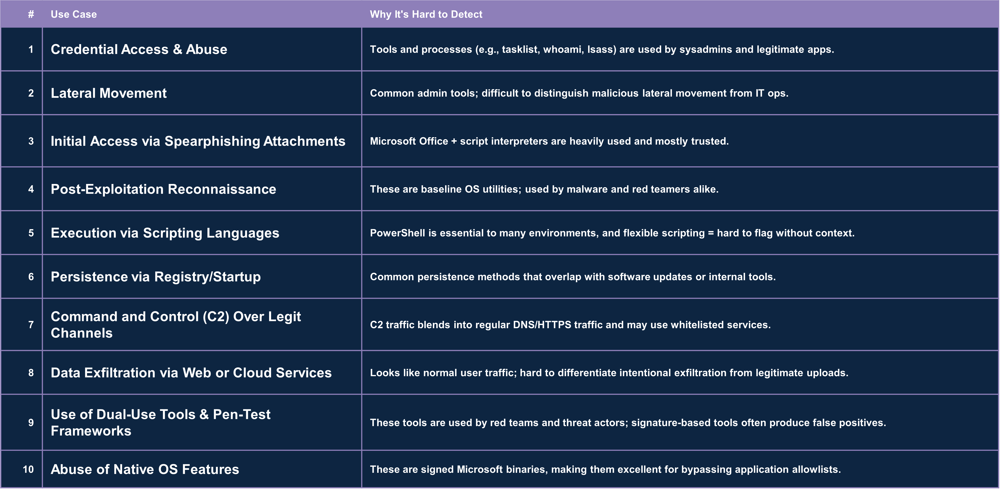

Use Cases
==========

Use cases are groupings of techniques with similar objectives that are analyzed together to make telemetry evaluation and prioritization more practical and operationally relevant. Rather than scoring or planning collection around a single technique in isolation, the use case approach focuses on the broader behavior pattern defenders care about, allowing telemetry sources to be assessed based on how well they support detection across the full set of related techniques and implementations that commonly appear together. This framing helps connect telemetry decisions directly to real defensive goals and makes it easier to rank and compare log sources based on their overall usefulness for detecting that category of activity.

The Use Cases that we evaluated were internally-generated by our team based on common ambiguous attack objectives that generated significant amount of false positives in a typical enterprise environment.
Full Telemetry Quality scoring data can be found on each use case page linked below.

-----------------------

.. toctree::
    :maxdepth: 1

    automation
    c2-legit
    cred-access
    data-exfil
    execution-via-script
    initial-access
    lateral-mvmt
    native-tools
    pentesting
    persistence
    post-recon

