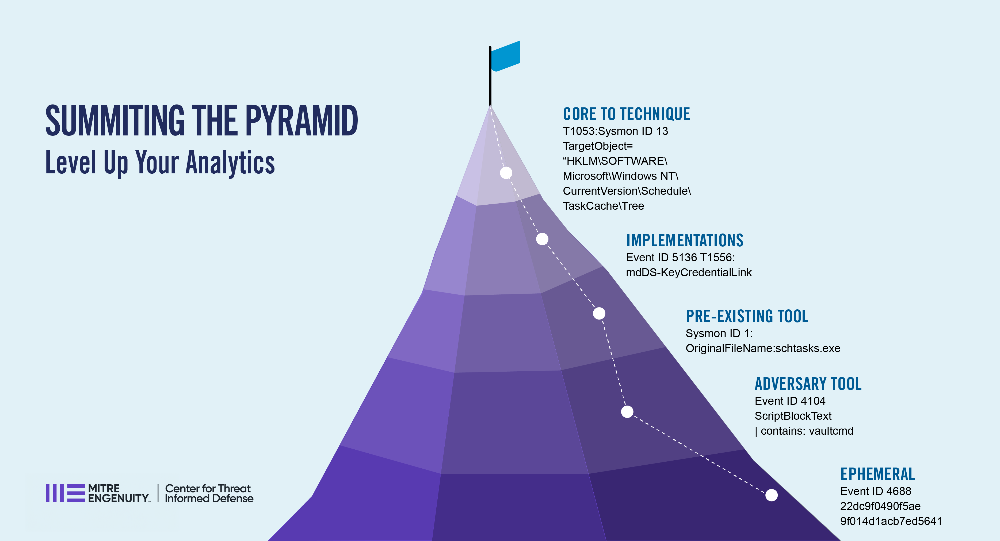

Summiting the Pyramid |version|
===============================

Summiting the Pyramid is a research project focused on engineering cyber analytics to
make adversary evasion more difficult. This project is created and maintained by the
`MITRE Engenuity Center for Threat-Informed Defense
<https://ctid.mitre-engenuity.org/>`__ in futherance of our mission to advance the state
of the art and the state of the practice in threat-informed defense globally.

.. toctree::
    :maxdepth: 2
    :caption: Contents

    overview
    introduction
    definitions
    levels/index
    evadability
    datasources
    scoringanalytic
    analytics/index
    capability-abstraction
    futurework
    thanks
    changelog

Notice
------

© 2023 MITRE Engenuity. Approved for public release. Document number CT0078.

Licensed under the Apache License, Version 2.0 (the "License"); you may not use this
file except in compliance with the License. You may obtain a copy of the License at
http://www.apache.org/licenses/LICENSE-2.0

Unless required by applicable law or agreed to in writing, software distributed under
the License is distributed on an "AS IS" BASIS, WITHOUT WARRANTIES OR CONDITIONS OF ANY
KIND, either express or implied. See the License for the specific language governing
permissions and limitations under the License.

This project makes use of ATT&CK®: `ATT&CK Terms of Use
<https://attack.mitre.org/resources/terms-of-use/>`__
