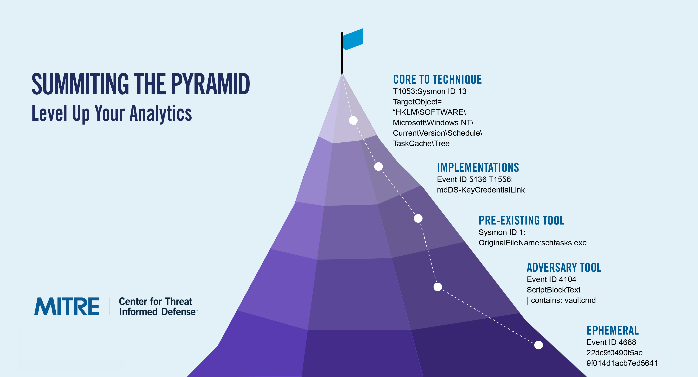

Summiting the Pyramid |version|
===============================

Summiting the Pyramid is a research project focused on engineering cyber analytics to
make adversary evasion more difficult. This project is created and maintained by the
`MITRE Center for Threat-Informed Defense <https://ctid.mitre.org/>`__ in futherance of
our mission to advance the state of the art and the state of the practice in
threat-informed defense globally.

.. important::
    **What's New In V4:**

    In version 4.0, we updated and improved the project in the following ways!

    * Defined a methodology for identifying the :ref:`minimum telemetry requirements<mintelreq>` for ambiguous techniques.
    * Developed a process for calculating :ref:`Telemetry Quality<Telemetry Quality>' scores that provide relative detection effectiveness potentials. We also extended this work to look at groupings of techniques with similiar objectives called :ref:`use cases<Use Cases>` and leveraged :ref:`automation via AI/LLM<automation>` to assist with the analysis.
    * Re-factored the Summiting website to better align to CTID's portfolio of :ref:`Detection Engineering<Detection Engineering>` work.

----------------------------------

.. toctree::
    :titlesonly:
    :includehidden:
    :maxdepth: 2
    :caption: Site Contents

    overview/index
    data-readiness/index
    analytic-design/index
    detection-ttv/index
    examples/index
    changelog

---------------------------------------

Notice
------

© |copyright_years| MITRE. Approved for public release. Document number(s)
|prs_numbers|.

Licensed under the Apache License, Version 2.0 (the "License"); you may not use this
file except in compliance with the License. You may obtain a copy of the License at
http://www.apache.org/licenses/LICENSE-2.0

Unless required by applicable law or agreed to in writing, software distributed under
the License is distributed on an "AS IS" BASIS, WITHOUT WARRANTIES OR CONDITIONS OF ANY
KIND, either express or implied. See the License for the specific language governing
permissions and limitations under the License.

This project makes use of ATT&CK®: `ATT&CK Terms of Use
<https://attack.mitre.org/resources/terms-of-use/>`__
