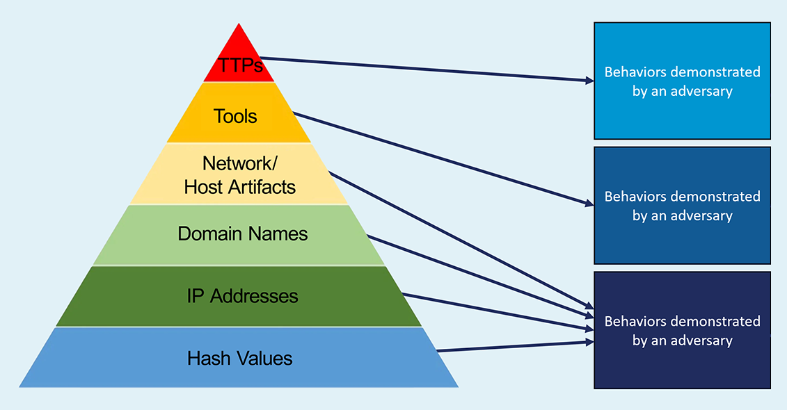
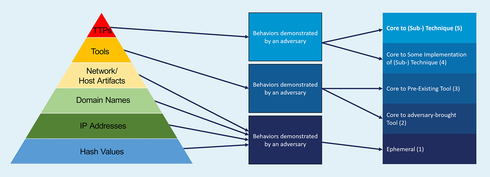
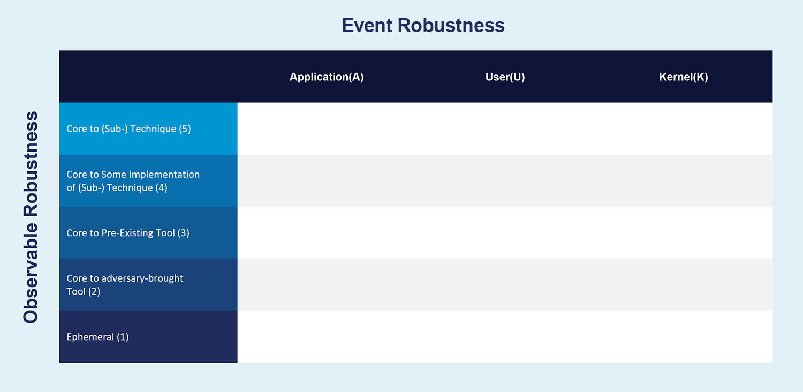

Introduction
============

Project Goal
------------

The Pyramid of Pain [#f1]_ has been used by detection engineers to determine the cost or
“pain” it would cause an adversary to evade defenses that are effective at that level of
the pyramid. Starting at the bottom, changing indicators of hash values, IP addresses,
and domains are trivial for an adversary to change and continue their attack. Indicators
further up the pyramid are more difficult for an adversary to change and consume more
time and money. Tactics, Techniques, and Procedures (TTPs), such as those in MITRE
ATT&CK®, are at the top of the pyramid because they are the most costly to change.

.. figure:: _static/pyramid_of_pain.png
   :alt: Pyramid of Pain - Created by David Bianco
   :align: center

   Pyramid of Pain by David Bianco

Detection engineers can leverage the Pyramid of Pain to understand how difficult it is
for adversaries to evade their analytics. A detection analytic focused on identifying
hash values will be precise in detecting a specific malware binary but will not detect a
variant of that malware that has been altered by even a single byte. A detection at the
tool level might be robust in detecting specific implementations of a technique but
could create more false positives, pick benign user activity, and alert on
system-generated noise if the implemented tool is native to the OS. Some analytics might
use a combination of various indicators to increase both the :ref:`Precision` and
:ref:`Recall` of an adversary attack. In this work, we introduce--and focus on
improving--a new metric called :ref:`robustness`.

.. important::

    Adversaries can attack different parts of the OS and might be operating at a level
    that the deployed sensors cannot detect. Therefore, it is imperative that defenders
    understand *where* and *what type* of activity their analytics are detecting.

Deconstructing the Pyramid
--------------------------

Let’s break down the pyramid into the different types of activity a defender can build
their analytics around.

   Consolidating the pyramid of pain into three groupings.

The first four levels of the pyramid are focused on ephemeral values which are easy for
an adversary to change. The next level is not focused on values, but the types of tools
an adversary will attempt to use during an attack. Finally, the top level is strictly
focused on behaviors which an adversary will demonstrate during an attack.

   Deriving the five rows of the Summiting model.

Having consolidated the pyramid of pain into three new groupings, the next step is to
break out the tools and behavior groupings to derive the five rows used in the Summiting
model. Each row corresponds to a group of :ref:`observables<Observable>` that we can use
to build analytics. The bottom row (purple) represents ephemeral values, which are
trivial for an adversary to change.

The next two rows distinguish two types of tools. Adversary-brought tools (blue) are
brought in by an adversary to accomplish an attack. Pre-existing tools (green) such as
`LOLbins <https://en.wiktionary.org/wiki/LOLBin>`__) are available to defenders before
adversary use, making it more difficult for an adversary to modify. These two levels
were split in recognition of the fact that an adversary will have more control over
tools they bring to an attack, making it easier for them to evade specific tool
detections. Tools which are managed by the target organization, on the other hand, may
not be as easy for the attacker to modify.

The behavior grouping is also split into two levels. These groupings are focused on
identifying behaviors that are associated with MITRE ATT&CK Techniques, making them the
most difficult to evade, and providing defenders the tools to create the most robust
analytics. The observables core to some implementations (beige) of a technique are
associated with low-variance behaviors which are unavoidable without a substantially
different implementation. Observables core to a technique (red) are the choke points or
invariant behaviors, which are unavoidable by any implementation.

In addition to these five rows, the Summiting model also contains three columns that
correspond to where detection signals come from. An OS will generate events, which can
be used by a defender to detect malicious activity. These are usually seen in the form
of event IDs. However, not all event IDs are generated in the same part of the OS. Some
are generated by applications, some can be called by the user, some are functions of the
kernel, and so on. Adversaries may be able to bypass certain event IDs by calling
lower-level APIs in the OS or making direct syscalls into the kernel.

Understanding this concept can help defenders build more robust analytics, by looking at
different sensor data throughout the OS. This second dimension in our model represents
sensor data robustness.

   The Summiting model contains five rows and three columns.

There are three different layers within the OS in which sensor data can be generated.
The application column identifies observables which are associated with the use of
libraries, such as DLLs, available to defenders before adversary use. These are
difficult for the adversary to modify, but can be evaded. User-mode observables are
associated with user-mode OS activity, such as Sysmon process creation. Finally,
kernel-mode observables are associated with kernel-mode activity occurring at ring 0.
Each of these columns provide the defender a different layer to detect activity within
the OS, going deeper as the columns move to the right.

This model can be used to visualize the robustness of an analytic, based on its
evadability and log source.

Improving Analytic Robustness
-----------------------------

Let's step through an example. The below analytic looks for specific command line
arguments of the ADFind tool [#f2]_, identified when the process image ends with
``adfind.exe``.

.. code-block:: yaml

   title: Suspicious AdFind Execution
   id: 75df3b17-8bcc-4565-b89b-c9898acef911
   status: experimental
   description: Detects the execution of a AdFind for Active Directory enumeration
   references:
      - https://social.technet.microsoft.com/wiki/contents/articles/7535.adfind-command-examples.aspx
      - https://github.com/center-for-threat-informed-defense/adversary_emulation_library/blob/master/fin6/Emulation_Plan/Phase1.md
      - https://thedfirreport.com/2020/05/08/adfind-recon/
   author: FPT.EagleEye Team, omkar72, oscd.community
   date: 2020/09/26
   modified: 2021/05/12
   tags:
      - attack.discovery
      - attack.t1018
      - attack.t1087.002
      - attack.t1482
      - attack.t1069.002
   logsource:
      product: windows
      category: process_creation
   detection:
      selection:
         CommandLine|contains:
               - 'objectcategory'
               - 'trustdmp'
               - 'dcmodes'
               - 'dclist'
               - 'computers_pwdnotreqd'
         Image|endswith: '\adfind.exe'
      condition: selection
   falsepositives:
      - Administrative activity
   level: medium

First, we have to understand and score this analytic's event robustness. The data source
for this analytic is ``process_creation``, so it could potentially trigger Windows Event
ID 4688 or Sysmon Event ID 1. This analytic references the ``Image`` field which does
not exist in Event ID 4688, but it does exist in Sysmon Event ID 1 [#f3]_. 4688 has the
field ``NewProcessName``, though it could be mapped to another field name in your SIEM
of choice. As a result, we assume the intent of this analytic is to identify command
line activity in Sysmon Event ID 1s.

Sysmon Event ID 1 is generated when Win32 API functions are called to create a new
process [#f4]_. Therefore it is a **user-mode data source** and we place the observables
in the U column.

Next, ``Image|endswith: '\adfind.exe'`` is placed at the **Ephemeral level**. An
adversary can easily obfuscate or change the ``Image`` value by renaming the file. The
command line arguments are placed at the **Core to Adversary-Brought Tool** level, since
the command line arguments are specific to the ADFind tool and require modifying source
code to evade. Since the ``CommandLine`` and ``Image`` observables in the analytic are
are combined with the boolean ``AND`` operator, the :ref:`net robustness<Robustness and
Boolean Logic>` is the lower of the two, resulting in a Level 1 score for the overall
analytic. The entire analytic scores as a **1U**.

.. list-table::
    :widths: 20 20 30 20
    :header-rows: 1

    * -
      - Application (A)
      - User-mode (U)
      - Kernel-mode (K)
    * - Core to (Sub-) Technique (5)
      -
      -
      -
    * - Core to Part of (Sub-) Technique (4)
      -
      -
      -
    * - Core to Pre-Existing Tool (3)
      -
      -
      -
    * - Core to Adversary-brought Tool (2)
      -
      - | EventID: 1
        | CommandLine|contains:
        |   - 'objectcategory'
        |   - 'trustdmp'
        |   - 'dcmodes'
        |   - 'dclist'
        |   - 'computers_pwdnotreqd'
      -
    * - Ephemeral
      -
      - Image|endswith: '\\adfind.exe'
      -

.. important::

    An adversary can easily evade this analytic by renaming the executable. *Can we
    engineer this analytic to make it more robust?* Our options for increasing
    robustness are pivoting to a sensor that monitors kernel-level activity (moving to
    the right) or increasing the level our analytic operates at (moving up).

The robustness of this analytic can be increased by leveraging the ``OriginalFileName``
field in Sysmon Event ID 1 instead of ``Image``. It is trivial for an adversary to
change the ``Image`` name to avoid detection, but it is a bit more challenging for an
adversary to change the ``OriginalFileName``, since that is derived from the
executable's PE header. An adversary would need to recompile the tool or modify the
existing tool in a hex editor, both of which are more costly than simply renaming the
file. By instead detecting ``OriginalFileName|endswith: '\adfind.exe'``, this analytic moves
up a level to **2U**.

.. list-table::
    :widths: 20 20 30 20
    :header-rows: 1

    * -
      - Application (A)
      - User-mode (U)
      - Kernel-mode (K)
    * - Core to (Sub-) Technique (5)
      -
      -
      -
    * - Core to Part of (Sub-) Technique (4)
      -
      -
      -
    * - Core to Pre-Existing Tool (3)
      -
      -
      -
    * - Core to Adversary-brought Tool (2)
      -
      - | EventID: 1
        | CommandLine|contains:
        |   - 'objectcategory'
        |   - 'trustdmp'
        |   - 'dcmodes'
        |   - 'dclist'
        |   - 'computers_pwdnotreqd'
        | OriginalFileName|endswith: '\\adfind.exe'
      -
    * - Ephemeral
      -
      -
      -

Using the Summiting methodology, we have improved our analytic by just changing one
field to identify adversary behavior and make it more difficult for them to evade
detection of this analytic. This is the key goal of the project: to study how to
engineer more robust analytics using threat-informed defense.

Assumptions and Caveats
-----------------------

While the process and goals described here could be extended to cover any attack
surface, this Summiting 1.0 project has the following scoping and limitations:

* **Focused on Windows systems.** There is
  definitely room to create guidance for networks, cloud, virtual machines, and other
  platform types to improve analytics across various platforms. See: :doc:`futurework`.
* **Engineered for robustness.** While the efficacy of detection analytics are
  frequently described in terms such as *precision* and *recall*, this work emphasizes
  *robustness*. See :doc:`definitions`.
* **Tampering is out of scope.** Adversaries may evade detection by tampering with the
  data sources, but this project focuses on scenarios where the data source is trusted.
* **Tools and techniques change over time.** The analytic score might change as
  well. This goes for updates of the OS, pre-existing tools, and new adversary tool
  functionality, not just at levels 4 and 5.
* **Higher scoring analytics are harder to build.**  This is due to the level of
  research required for defenders to map the higher level abstractions of TTPs behavior
  into the lower level of observables.
* **Other considerations.** In addition to scoping out precision and recall, there are
  other important properties of analytics that are not considered here, such as the cost
  to engineer the analytic, the cost to collect the corresponding data, the cost to run
  the analytics at scale, etc. This is briefly touched on in :doc:`futurework`.

We are always looking for feedback and public contributions! Open a `GitHub issue
<https://github.com/center-for-threat-informed-defense/summiting-the-pyramid/issues/new/choose>`_
to share your ideas, feedback, and scored analytics.

.. rubric:: References

.. [#f1] http://detect-respond.blogspot.com/2013/03/the-pyramid-of-pain.html
.. [#f2] https://github.com/SigmaHQ/sigma/blob/30bee7204cc1b98a47635ed8e52f44fdf776c602/rules/windows/process_creation/win_susp_adfind.yml
.. [#f3] https://www.ultimatewindowssecurity.com/securitylog/encyclopedia/event.aspx?eventid=90001
.. [#f4] https://learn.microsoft.com/en-us/windows/win32/api/processthreadsapi/nf-processthreadsapi-createprocessa
