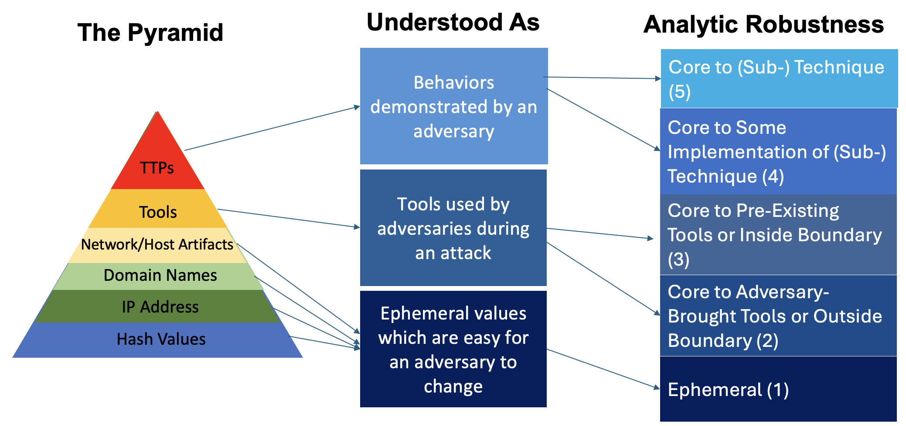
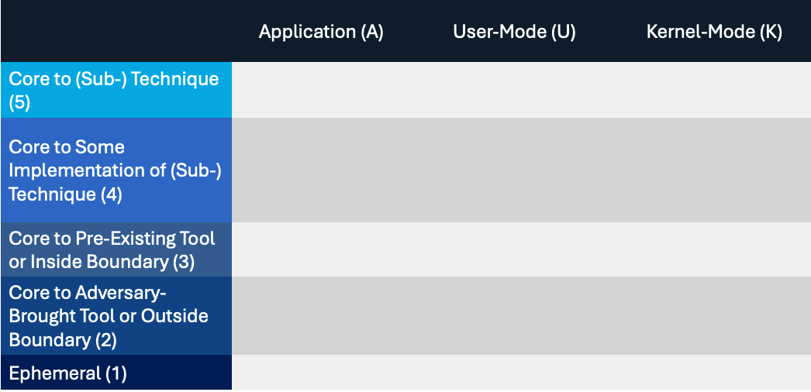
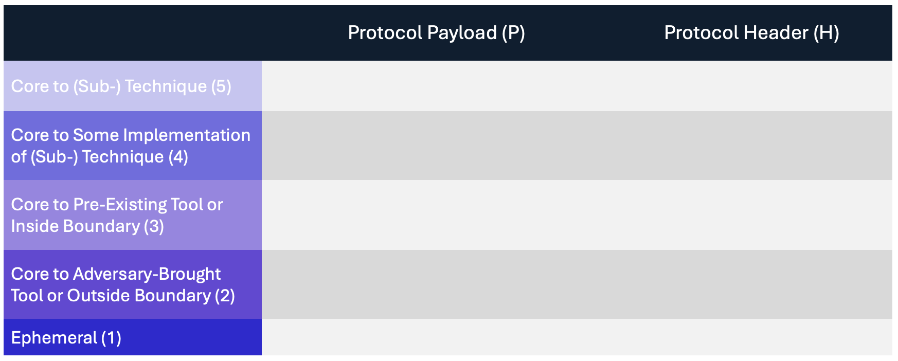

Introduction
============

Project Goal
------------

The Pyramid of Pain [#f1]_ has been used by detection engineers to determine the cost or “pain” it would impose on an adversary to evade defenses at a given level of the pyramid. Starting at the bottom: hash values, IP addresses, and domains are trivial for an adversary to change and continue their attack. Indicators further up the pyramid are more difficult for an adversary to change and consume more time and money, imposing more pain. Tactics, Techniques, and Procedures (TTPs), such as those in MITRE ATT&CK®, are at the top of the pyramid because they are the most costly for an adversary to change

.. figure:: _static/pyramid_of_pain.png
   :alt: Pyramid of Pain - Created by David Bianco
   :align: center

   Pyramid of Pain by David Bianco

Detection engineers can leverage the Pyramid of Pain to understand how difficult it is for adversaries to evade their analytics. A detection analytic focused on identifying hash values will be accurate in achieving a low false positive rate by detecting a specific malware binary but will not detect a variant of that malware that has been altered by even a single byte. A detection at the tool level might be resistant to adversary evasion in detecting specific implementations of a technique but could create more false positives, pick benign user activity, and alert on system-generated noise if the implemented tool is native to the operating system (OS). Some analytics might use a combination of various indicators to increase the :ref:`accuracy<Accuracy>` of an adversary attack. In this work, we look to understand how adversaries evade detections to build stronger detection mechanisms, resulting in :ref:`robust detections<Robust Detection>`.

.. important::

    Adversaries can attack different parts of the OS and might be operating at a level
    that the deployed sensors cannot detect. Therefore, it is imperative that defenders
    understand *where* and *what type* of activity their analytics are detecting.

.. _what-is-robust-detection:

What is a Robust Detection?
---------------------------
A :ref:`robust detections<Robust Detection>` is one that is :ref:`accurate<Accuracy>` and resistant to adversary evasion over time. An accurate detection will capture all malicious implementations of a technique, while also being less likely to alert on benign activity. The Summiting the Pyramid project pays extra special attention to understanding resistance to adversary evasion over time. The Pyramid of Pain can help us understand the components of a detection that are less susceptible to adversary evasion, and even help build analytics that are accurate.

Deconstructing the Pyramid
--------------------------

Let’s break down the pyramid into the different types of activity a defender can build
their analytics around.

The first four levels of the pyramid are focused on ephemeral values, which are easy for an adversary to change. The next level is not focused on values but on the types of tools an adversary will attempt to use during an attack. Finally, the top level is strictly focused on behaviors that an adversary will demonstrate during an attack.

   Deriving the five rows of the Summiting model.

Having consolidated the Pyramid of Pain into three new groupings, the next step is to break out the tools and behavior groupings to derive the five rows used in the Summiting model. Each row corresponds to a group of observables that we can use to build analytics. The bottom row represents :ref:`ephemeral values<Ephemeral Values>`, which are trivial for an adversary to change.

The next two rows distinguish two types of tools. :ref:`Adversary-brought tools or outside boundary<Adversary Brought Tool>` are brought in by an adversary to accomplish an attack or are detected from outside the victim environment. :ref:`Pre-existing tools<Pre-Existing Tools>` such as `LOLbins <https://www.sentinelone.com/blog/how-do-attackers-use-lolbins-in-fileless-attacks/>`__) are available to defenders before adversary use, making it more difficult for an adversary to modify. Additionally, the inside boundary includes activities that are detected from inside the boundary and cannot be manipulated by the adversary. These two levels were split in recognition of the fact that an adversary will have more control over the tools and detections they bring to an attack or control, making it easier for them to evade specific tool detections. Tools and detections that are managed by the target organization, on the other hand, may not be as easy for the attacker to modify.

The behavior grouping is also split into two levels. These groupings are focused on identifying behaviors that are associated with MITRE ATT&CK techniques, making them the most difficult to evade, and providing defenders the tools to create the most robust detections. The :ref:`observables core to some implementations of a technique<Some Implementations>` are associated with low-variance behaviors, which are unavoidable without a substantially different implementation. :ref:`Observables core to a technique<Technique>` are the choke points or invariant behaviors, which are unavoidable by any implementation.

Event Observables for Hosts and Networks
----------------------------------------

In addition to these five rows, the Summiting model also contains columns that correspond to a different dimension of adversary evasion depending on the type of detections being built.

The :ref:`host-based model<Host-Based Columns>` corresponds to where in the OS detection signals originate from. An OS will generate events, which can be used by a defender to detect malicious activity. These events are usually seen in the form of event IDs (EID). However, not all event IDs are generated in the same part of the OS—some are generated by applications, some can be called by the user, some are functions of the kernel, and so on. Adversaries may be able to bypass certain event IDs by calling lower-level APIs in the OS or making direct syscalls into the kernel.

   The Summiting host-based model contains five rows and three columns.

The :ref:`network-based model<Network Traffic Columns>` looks to understand how an adversary can evade detection from network sensors. This is not as straightforward as host-based events, in which the adversary would go deeper into the operating system. For network traffic, an adversary could evade detection by hiding in traffic that is obfuscated in some capacity, translating network-based robustness to visibility of the defender to detect malicious activity with the least amount of data possible. The network-based model has two columns: protocol header and protocol payload. Observables are mapped based on their protocol and the portion of the network protocol where the information lives. Detections are more susceptible to adversary evasion if observables live in the payload. Depending on the protocol, encryption or obfuscation of the protocol payload could be controlled by the adversary, or it may result from the intrinsic behavior of the operating system, service, or application. This deeper understanding of the network traffic can help defenders understand what protocol information is necessary for detecting malicious activity and use that information to both build and improve network-traffic detections.

   The Summiting network traffic model contains five rows and two columns.

How Do We Create Robust Detections?
-----------------------------------

A robust detection is one that is accurate and resistant to adversary evasion over time. The Summiting Project provides various resources to help a defender build robust detections, changing the game on the adversary:

* :ref:`Score Analytics for Resistance to Adversary Evasion:<scoring analytic>` Score your analytic observables against the Summiting host-based model or network traffic model to determine their resistance to adversary evasion over time and their impact on a detection’s accuracy.
* :ref:`Robust Detection Guidance:<Build Robust Detection>` Combine the Summiting model scoring model with other concepts to build accurate detections. This includes building filters that are specific and difficult for adversaries to manipulate and combining those filters with additional detections for stronger confidence in malicious activity.
* :ref:`Analytic Repository:<analytics>` Use various examples of scored analytics against the Summiting scoring models, and how accuracy and resistance to adversary evasion over time can be improved.

Assumptions and Caveats
-----------------------

The Summiting 2.0 project has the following scope and limitations:

* **Tampering is out of scope.** Adversaries may evade detection by tampering with data sources, but this project focuses on scenarios where the data source is trusted.
* **Tools and techniques change over time.** The analytic score might change as well. This goes for updates to the OS, pre-existing tools, changes to network infrastructure, and new adversary tool functionality, not just at Levels 4 and 5.
* **Higher scoring analytics are harder to build.**  This is due to the level of research required for defenders to map the higher-level abstractions of TTPs into the lower level of observables, and it may not be within the realm of the defender’s control (or data sources and detection tools) whether the requisite observables are contained within the network protocol header or the payload. In many cases, the intrinsic behavior of the operating system, service, or application dictates which observables are in the header and which observables are in the payload.
* **Not all networks are the same.** The research completed for accuracy attempts to translate generally the steps and considerations for building robust detections. However, not all networks are the same. Defenders should take stock of their own network and apply Summiting best practices based on their use case.
* **Not all network-based ATT&CK techniques are the same.** There are some network-based ATT&CK (sub-)techniques in which the adversary may control both endpoints involved in a network connection, which would be the case for tactics such as Command and Control and Data Exfiltration. There are also some (sub-)techniques in which the adversary controls only one endpoint involved in the connection, such as during the initial stages of remote Execution and Lateral Movement.
* **Other considerations.** There continues to be important properties of detections that have not been researched in-depth, such as the cost to engineer detections, the cost to collect corresponding data, the cost to run detections at scale, and so on. This is briefly touched on in :doc:`futurework`.

We are always looking for feedback and public contributions! Open a `GitHub issue
<https://github.com/center-for-threat-informed-defense/summiting-the-pyramid/issues/new/choose>`_
to share your ideas, feedback, and scored analytics.

.. rubric:: References

.. [#f1] http://detect-respond.blogspot.com/2013/03/the-pyramid-of-pain.html
