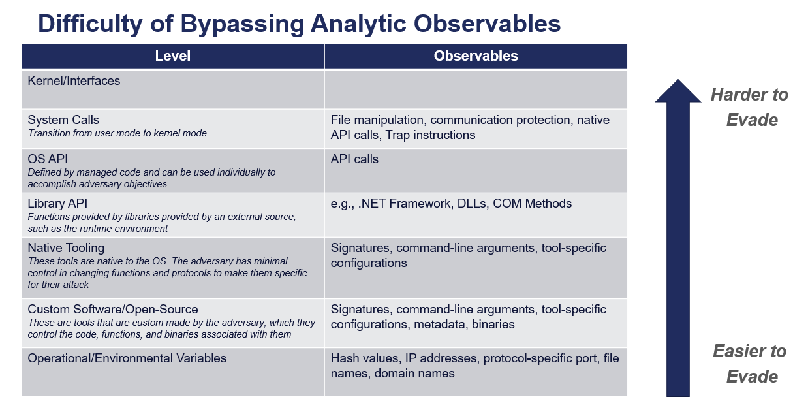
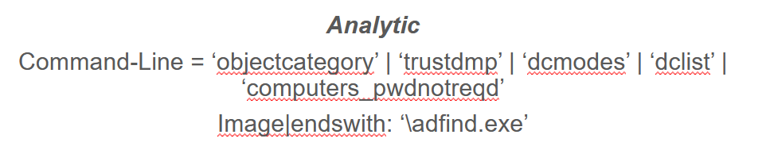
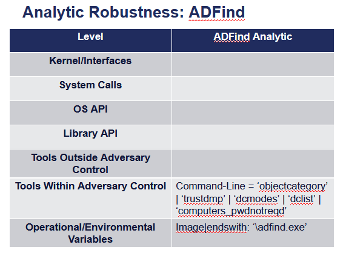
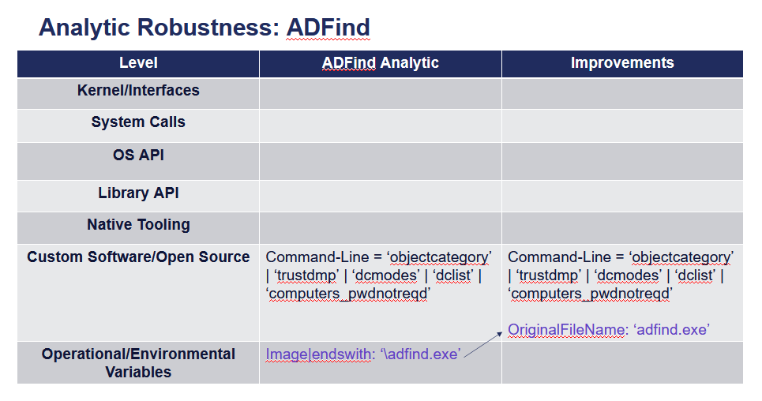

Summit the Pyramid
==================
Updated: 03/23/2023

Goal of Summiting the Pyramid
-----------------------------
The Pyramid of Pain has been used by detection engineers to determine the cost or “pain” it would take for an adversary to evade defenses that are effective at that level of the pyramid. Starting at the bottom, changing indicators of hash values, IP addresses, and domains are trivial for an adversary to change and continue their attack. Indicators further up the pyramid, are more difficult for an adversary to change and consume more time and money from the adversary. Finally, Tactics, Techniques, and Procedures (TTPs), outlined by the MITRE ATT&CK Framework, describe an adversary’s behavior when achieving their goals. New TTPs are the hardest for adversaries to develop, as behaviors are limited by the environment they are acting in.

.. figure:: _static/pyramid_of_pain.png
   :alt: Pyramid of Pain - Created by David Bianco (http://detect-respond.blogspot.com/2013/03/the-pyramid-of-pain.html)
   :align: center

   Pyramid of Pain - Created by David Bianco

Detection engineers can leverage the Pyramid of Pain to understand how precise or robust their analytics might be when detecting adversarial behavior. A detection analytic focused on identifying hash values will be precise in detecting a snapshot of malware but will not detect a variant of that malware that has been altered by an adversary. A detection at the tool level might be robust in detecting specific implementations of a technique but could create more false positives and even pick up benign activity if the implemented tool is native to the OS. Some analytics might use a combination of various indicators to increase both the precision and recall of an adversary attack. Capability Abstraction, a concept developed by SpecterOps, seeks to understand activities that occur on a system when an attacker is accomplishing their goals. It also introduced a visual graphic, known as an “abstraction map”, which conveys the relationships between abstraction layers and begins to highlight how an adversary can evade a specific detection or data source entirely and still accomplish their goals.

The following capability abstraction map for T1050 - New Service illustrates how multiple tools can create a new service. These tools include standard Windows binaries, commonly abused bins, and open-source implementations that an adversary may implement in custom code. These different implementations may call the Windows API differently, which in turn might call different RPC interface and methods. However, ultimately they all utilize the same registry key within the Registry Service Database. If an adversary wanted to evade detection at the tool level, they can create a new service using the Windows API, RPC, or Registry.

.. figure:: _static/new_service_capability_abstraction.png
   :alt: New Service Capability Abstraction - Created by Specter Ops (https://abstractionmaps.com/maps/t1050/)
   :align: center

   New Service Capability Abstraction - Created by Specter Ops (https://abstractionmaps.com/maps/t1050/)

**How can we create analytics that detect adversary behavior and attacks while using the Pyramid of Pain and capability abstraction as references?**

Levels and Observables
-------------------------
The table of levels and observables attempts to show the relationship between indicators used to detect adversary activities and robustness of resulting analytics in order to determine relative complexity of evasion. When analytics are created, the question should be asked, “How difficult would it be for an adversary to evade this analytic?” The Pyramid of Pain shows us how difficult it is for an adversary to change their behavior. These levels will focus on understanding how some analytic observables are more evasive or more difficult to bypass than others, resulting in more robust analytics which detect further into the OS.

   Levels and Observables

While these levels are used to inform defenders about the state of their analytic, it is not meant to imply judgement of certain analytics. As Jared Atkinson mentioned in his write-up on the Detection Spectrum, “There is a place for precise detections just like there is a place for broad detections” (https://posts.specterops.io/detection-spectrum-198a0bfb9302 ). These levels are used to inform how defenders can utilize indicators further down the technical stack to create less evade-able analytics, saving time, resources, and analyst workload. This can be used not only to create new analytics, but to improve current detections by reducing dependencies on lower levels on the Pyramid of Pain and the levels listed here. Creating more defense-in-depth can be utilized to defend against future adversaries, and inform how to improve current analytic detections.

Example: ADFind.exe
-------------------
Analytic: ADFind (https://github.com/SigmaHQ/sigma/blob/30bee7204cc1b98a47635ed8e52f44fdf776c602/rules/windows/process_creation/win_susp_adfind.yml)

   ADFind Analytic

We are given this analytic that looks for specific command line arguments dealing with the ADFind tool. It also looks for the key word ‘\adfind.exe’ within the image path. Looking at the current data sources provided by the analytic and the Levels of Evasiveness, we can begin to place where everything is. First, we place Image|endswith: ‘\adfind.exe’ within the **Operational and Environmental Variables** level. While the intention of this analytic is looking for the execution of commands through this tool, this image path can be obfuscated by adversaries within the command line. We put the command line arguments into the **Custom Software and Open Source** level, since these command line arguments are specific to the tool itself. The final placement of the analytic is below.

   ADFind Analytic scored against Levels of Evasiveness

As it stands, this analytic could be easily evaded by adversaries if they were to rename the binary. **How can we improve this analytic so it is more robust in terms of the tools that could be used to evade it?** We don’t need to improve it down all the way to the system application or kernel layer, so let’s take it one step at a time.

As mentioned previously, adversaries can change the image path name so detection tools do not detect the real tool they are attempting to use. However, they must declare the tool they are using somewhere. Adversaries must embed tools into their malware in order to know where to find the specific file to use. This can be identified through the data source **OriginalFileName**, a data source that is available through parsing in Sysmon. By tracking the embedded file rather than the image name, we can identify the tool the adversary is going to use. We can make the analytic improvements here, which have been highlighted in purple.

   ADFind Analytic after improvements were made based on various indicators

Through this process, we have improved our analytic by just changing one data source to identify adversary behavior and make it more difficult for them to evade detection of this analytic. An adversary could evade this improved analytic by utilizing a hex editor to change the file name there. This highlights the importance of being able to go up the levels and identify different areas for improvement. Not everyone is going to be able to collect Sysmon or make these analytic improvements. However, it gets us thinking of where we can begin to make these small, incremental steps within our environment to create more robust analytics.

Assumptions and Caveats
-----------------------
* Our current guidance addresses data sources and levels within endpoint systems. There is definitely room to create guidance for networks, cloud, virtual machines, and other platform types to improve analytics across various platforms. We will attempt to begin guidance for these other platforms, but is open to future work.
* The levels of evasiveness lean towards addressing recall as you travel down further in the stack. The more precise data points are towards the top of the pyramid, while the data sources towards the bottom of the stack are designed for recall, potentially leading to more false positives. This can be because as adversaries will go further down the stack to evade more precise detections, they might begin to blend in with normal computer system functionality. While context of the analytic will be a big part in developing the analytic, we will continue to address precision while developing this functionality.
* Tampering is a big part of an adversary attack. If an adversary can’t go any further to evade a specific analytic, they may try to use tampering to accomplish their goal. Switching from evasion to tampering increases cost for the adversary, which is a victory for the defender. The team will be cognizant of this as we continue to draft best practice guidance, and though a more detailed study of when an adversary changes tactic to tamper may be out of scope for this initial effort, it may be prime for future work.

**We are always looking for feedback and integrating your thoughts and ideas! Please feel free to leave comments on the GitHub, or reach out to Ross or Roman.**
