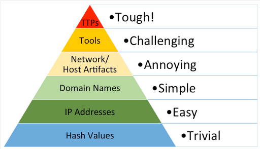
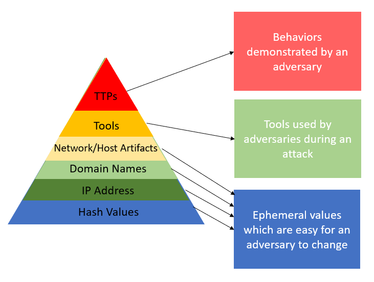
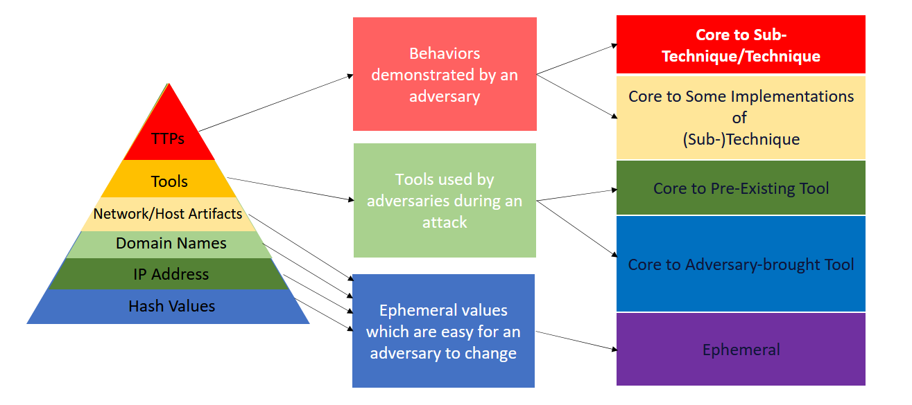
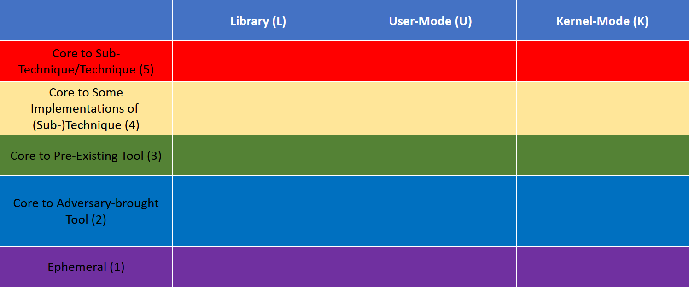

Summit the Pyramid
==================
Updated: 07/03/2023

Goal of Summiting the Pyramid
-----------------------------
The Pyramid of Pain has been used by detection engineers to determine the cost or “pain” it would take for an adversary to evade defenses that are effective at 
that level of the pyramid. Starting at the bottom, changing indicators of hash values, IP addresses, and domains are trivial for an adversary to change and 
continue their attack. Indicators further up the pyramid are more difficult for an adversary to change and consume more time and money from the adversary. 
Finally, Tactics, Techniques, and Procedures (TTPs), outlined by the MITRE ATT&CK Framework, describe an adversary’s behavior when achieving their goals. 
New TTPs are the hardest for adversaries to develop, as behaviors are limited by the environment they are acting in.

   Pyramid of Pain - Created by David Bianco [#f1]_

Detection engineers can leverage the Pyramid of Pain to understand how :ref:`precise<Precision>` or :ref:`robust<Robustness>` their analytics are when detecting 
dversarial behavior. A detection analytic focused on identifying hash values will be precise in detecting a snapshot of malware but will not detect a variant of 
that malware that has been altered by an adversary. A detection at the tool level might be robust in detecting specific implementations of a technique but could 
create more false positives, pick benign user activity, and alert on system generated noise if the implemented tool is native to the OS. Some analytics might use 
a combination of various indicators to increase both the precision and :ref:`recall<Recall>` of an adversary attack.

:ref:`Capability Abstraction`, a concept developed by `SpecterOps <https://posts.specterops.io/capability-abstraction-fbeaeeb26384>`_, seeks to 
understand activities that occur on a system when an attacker is 
accomplishing their goals. It also introduced a visual graphic, known as an “abstraction map”, which conveys the relationships between operating system (OS)
abstraction layers and begins to highlight how an adversary can evade a specific detection or data source entirely and still accomplish their goals. 
The following capability abstraction map for `T1543 - Create or Modify System Process: Windows Service <https://attack.mitre.org/techniques/T1543/003/>`_ illustrates 
how multiple tools can create a new service.

.. figure:: _static/new_service_capability_abstraction.png
   :alt: New Service Capability Abstraction - Created by SpecterOps
   :align: center

   New Service Capability Abstraction created by SpecterOps. The relevant MITRE ATTACK Technique ID was changed to T1543.003 after this capability abstraction was published [#f3]_

These tools and implementations include standard Windows or commonly abused binaries, OS API calls or functions, and open-source or custom code that an adversary might copy or develop. These 
different implementations may call the Windows API differently, which in turn might call different RPC interface and methods. However, ultimately they all utilize 
the same registry key within the Registry Service Database. If an adversary wanted to evade detection at the tool level, they could create a new service by directly 
interacting with the Windows API, RPC, or Registry. This is not a hypothetical, but has actually been seen in the wild. Threat group APT41 has utilized Windows service 
creation within their attacks not only through the utilization of the service creation tool (sc.exe), but also by directly modifying the registry itself [#f2]_. 

.. important::
   Adversaries attack different parts in the OS and might be operating at a level that deployed sensors cannot detect. Therefore, it is imperative that defenders understand 
   where their analytics are detecting activity and the type of activity their analytics are detecting when building robust analytics.

Summiting the Pyramid
---------------------
Let’s break down the pyramid into the different types of activity a defender can build their analytics around. 

The first four levels of the pyramid are focused on ephemeral values which are easy for an adversary to change. The next level is not focused on values, but 
the types of tools an adversary will attempt to use during an attack. Finally, the top level is strictly focused on behaviors which an adversary will demonstrate 
during an attack. These groups can better break down what a defender can focus building their analytic upon. 

We can further break that down into rows for our model, which will display how to make it more specific for building robust analytics. In each row, we will be 
looking for observables :ref:`observables<Observable>` in which we can build analytics for each grouping, based on the difficult for an adversary to evade each grouping.

The bottom row is focused on the first grouping of ephemeral values. These are trivial for an adversary to change, or that change even without adversary intervention. 

The next two rows are split from the tools which can be used by an adversary during an attack. Observables core to an adversary-brought tool are associated with 
tools that are brought in by an adversary to accomplish an attack. The observables core to a pre-existing tool are tools which are available to defenders before 
adversary use, making it more difficult for an adversary to modify. These two tool levels were split to understand that an adversary will have more control over 
tools they bring to an attack, making it easier for them to evade specific tool detections. Tools which are managed by an organization or team will provide less 
opportunities for adversaries to plan, configure, and accomplish an attack. These are also much more difficult for an adversary to evade, since they are not in 
control of the configuration or prepared for the tool.

The final grouping is also split into two levels. These groupings are focused on identifying behaviors that are associated with MITRE ATT&CK Techniques, making 
them the most difficult to evade, and providing defenders the tools to create the most robust analytics. The observables core to some implementations of a technique 
or sub-technique are associated with low-variance behaviors which are unavoidable without a substantially different implementation. Observables core to a technique or 
sub-technique are the choke points or invariant behaviors, which are unavoidable by any implementation. 

Each of these rows visualize the cost for an adversary to evade observables at each row. However, there is another dimension in which adversaries can evade 
detection. Certain operations within the OS will generate events, which can be used by a defender to detect malicious activity. These are usually seen in the 
form of event IDs. However, not all event IDs are generated in the same part of the OS. Some are generated by applications, some can be called by the user, some 
are functions of the kernel, and so on. If adversaries want to bypass certain event IDs, they can just call certain API functionality lower within the OS. 

Understanding this concept can help defenders build more robust analytics, by looking at different data sources throughout the OS. We now take our rows, and make it a two-dimensional model to reflect data sources.

There are three different layers within the OS in which data sources can be generated. The library level identifies observables which are associated with the use of libraries, such as DLLs, available to defenders before adversary use. These are difficult for the adversary to modify, but can be evaded. User-mode observables are associated with user-mode OS activity. Finally, kernel-mode observables are associated with kernel-mode activity occurring at ring 0. Each of these columns provide the defender a different layer to detect activity within the OS, going deeper as the columns move to the right. 

This 2D model provides the visualization of how to score the robustness of an analytic, based on the log source and the behavior associated with an attack.

Improving Analytic Robustness
-----------------------------
Let's step through an example. The below analytic looks for specific command line arguments of the ADFind tool [#f4]_, identified when Image ends with ``adfind.exe``.

.. code-block:: yaml
   
   title: Suspicious AdFind Execution
   id: 75df3b17-8bcc-4565-b89b-c9898acef911
   status: experimental
   description: Detects the execution of a AdFind for Active Directory enumeration 
   references:
      - https://social.technet.microsoft.com/wiki/contents/articles/7535.adfind-command-examples.aspx
      - https://github.com/center-for-threat-informed-defense/adversary_emulation_library/blob/master/fin6/Emulation_Plan/Phase1.md
      - https://thedfirreport.com/2020/05/08/adfind-recon/
   author: FPT.EagleEye Team, omkar72, oscd.community
   date: 2020/09/26
   modified: 2021/05/12
   tags:
      - attack.discovery
      - attack.t1018
      - attack.t1087.002
      - attack.t1482
      - attack.t1069.002
   logsource:
      product: windows
      category: process_creation
   detection:
      selection:
         CommandLine|contains:
               - 'objectcategory'
               - 'trustdmp'
               - 'dcmodes'
               - 'dclist'
               - 'computers_pwdnotreqd'
         Image|endswith: '\adfind.exe'
      condition: selection
   falsepositives:
      - Administrative activity
   level: medium

First, we have to understand and score this analytic's data source. The data source for this analytic is ``process_creation``, so it could potentially fire for Windows Event ID 4688 or Sysmon Event ID 1. 
This analytic references the Image field which does not exist in Event ID 4688, but it does exist in Sysmon Event ID 1 [#f5]_. 4688 has the field 
NewProcessName, though it could be mapped to another field name in your SIEM of choice. As a result, we assume 
the intent of this analytic is to identify command line activity in Sysmon Event ID 1s.

Sysmon Event ID 1 is generated when Win32 API functions are called to create a new process [#f6]_. Therefore it is a user-mode logsource and we can place the other observables in the U column.

.. list-table::
    :widths: 20 20 30 20
    :header-rows: 1

    * - 
      - Library
      - User-mode
      - Kernel-mode
    * - Core to (Sub-) Technique (5)
      - 
      - EventID: 1
      - 
    * - Core to Part of (Sub-) Technique (4)
      - 
      - EventID: 1
      -
    * - Core to Pre-Existing Tool (3)
      - 
      - EventID: 1
      -
    * - Core to Adversary-brought Tool (2)
      - 
      - EventID: 1
      - 
    * - Ephemeral (1)
      - 
      - EventID: 1
      - 

Next, ``Image|endswith: '\adfind.exe'`` is placed at the **Ephemeral level**. An adversary can easily obfuscate or change the Image value by renaming 
the file. The command line arguments are placed at the **Core to Adversary-Brought Tool** level, since the command line arguments are 
specific to the ADFind tool and require modifying source code to change. Since the CommandLine and Image observables in the analytic are 
ANDed together, according to our Boolean logic, the entire analytic scores as a **1U**.

.. list-table::
    :widths: 20 20 30 20
    :header-rows: 1

    * - 
      - Library (L)
      - User-mode (U)
      - Kernel-mode (K)
    * - Core to (Sub-) Technique (5)
      - 
      - 
      - 
    * - Core to Part of (Sub-) Technique (4)
      - 
      -
      -
    * - Core to Pre-Existing Tool (3)
      - 
      - 
      -
    * - Core to Adversary-brought Tool (2)
      - 
      - | EventID: 1
        | CommandLine|contains:
        |   - 'objectcategory'
        |   - 'trustdmp'
        |   - 'dcmodes'
        |   - 'dclist'
        |   - 'computers_pwdnotreqd'
      - 
    * - Ephemeral
      - 
      - Image|endswith: '\\adfind.exe'
      - 

.. important:: 
   An adversary can easily evade this analytic by renaming the executable. *Can we improve this analytic so it is more robust?* Our options for increasing robustness are pivoting to a data source that operates
   at kernel-mode (moving a column to the right) or increasing the level our analytic operates at (moving up a row).

The robustness of this analytic can be increased by leveraging the OriginalFileName field in Sysmon Event ID 1 instead of Image. It is trivial 
for an adversary to change the Image name ending with ``adfind.exe`` to avoid detection. It is more challenging for an adversary to 
change the OriginalFileName, since it is derived from the PE header. Changing the PE header requires either modifying changing values at 
the executable's compile time or modifying raw bytes with a hex editor, both of which are more complex for an adversary than 
renaming a file on a compromised system.

By instead detecting ``OriginalFileName|endswith: '\adfind.exe'``, this analytic moves up a level to **2U**.

.. list-table::
    :widths: 20 20 30 20
    :header-rows: 1

    * - 
      - Library (L)
      - User-mode (U)
      - Kernel-mode (K)
    * - Core to (Sub-) Technique (5)
      - 
      - 
      - 
    * - Core to Part of (Sub-) Technique (4)
      - 
      -
      -
    * - Core to Pre-Existing Tool (3)
      - 
      - 
      -
    * - Core to Adversary-brought Tool (2)
      - 
      - | EventID: 1
        | CommandLine|contains:
        |   - 'objectcategory'
        |   - 'trustdmp'
        |   - 'dcmodes'
        |   - 'dclist'
        |   - 'computers_pwdnotreqd'
        | OriginalFileName|endswith: '\\adfind.exe'
      - 
    * - Ephemeral
      - 
      - 
      - 

Through this process, we have improved our analytic by just changing one field to identify adversary behavior and make it more difficult for them to evade detection 
of this analytic. Not everyone is going to be able to collect Sysmon data or implement all analytic improvements. However, it gets us thinking of where and how to make small, incremental steps within our environment and increase the robustness of analytics.

Assumptions and Caveats
-----------------------
* Our current guidance addresses data sources and levels within Windows systems. There is definitely room to create guidance for networks, cloud, virtual machines, and other platform types to improve analytics across various platforms. We will attempt to begin guidance for these other platforms, but is open to future work.
* The levels and observables currently defined by Summiting the Pyramid address the robustness of analytics, compared to precision and recall. To read more, :ref:`read this entry here <Robustness Precision Recall>`.
* Tampering is a big part of an adversary attack. If an adversary can’t go any further to evade a specific analytic, they may try to use tampering to accomplish their goal. Switching from evasion to tampering increases cost for the adversary, which is a victory for the defender. The StP team will be cognizant of this as we continue to draft best practice guidance, and though a more detailed study of when an adversary changes tactic to tampering may be out of scope for this initial effort, it may be prime for future work.
* The scoring of analytics at the Technique levels at 4 and 5 introduce the concept of analytic decay. The MITRE ATT&CK Framework is updated on a bi-annual basis, with changes to tactics, techniques, and procedural implementations. Since TTPs are subject to change, analytics looking at implementations or the whole of a sub-technique or a technique are subject to change, potentially making some analytics less effective. The Summiting project recognizes that analytic decay can be an issue for scoring analytics, and will continue to conduct research into the topic. For short-term solutions, the teams will revisit technique-oriented analytics after bi-annual ATT&CK releases and update analytics as needed. Additionally, the Summiting team will work with members of the ATT&CK team to ensure observables are in the proper rows.
* This 2D model for the Summiting methodology opens opportunity for adding additional dimensions for creating more robust and potentially more precise analytics. This can include factors such as timing, efficiency, and additional implementations. As the model continues to evolve, the focus on additional dimensions will be further explored.

We are always looking for feedback and integrating your thoughts and ideas! Open a `GitHub issue here <https://github.com/center-for-threat-informed-defense/summiting-the-pyramid/issues>`_ to share your ideas, feedback, and scored analytics.

.. rubric:: References

.. [#f1] http://detect-respond.blogspot.com/2013/03/the-pyramid-of-pain.html
.. [#f2] https://www.mandiant.com/resources/blog/apt41-initiates-global-intrusion-campaign-using-multiple-exploits
.. [#f3] https://abstractionmaps.com/maps/t1050/
.. [#f4] https://github.com/SigmaHQ/sigma/blob/30bee7204cc1b98a47635ed8e52f44fdf776c602/rules/windows/process_creation/win_susp_adfind.yml
.. [#f5] https://www.ultimatewindowssecurity.com/securitylog/encyclopedia/event.aspx?eventid=90001
.. [#f6] https://learn.microsoft.com/en-us/windows/win32/api/processthreadsapi/nf-processthreadsapi-createprocessa