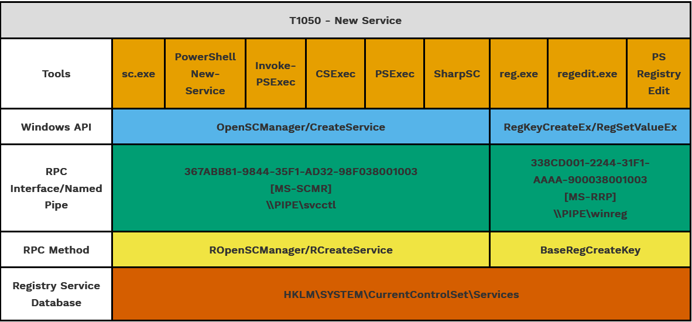
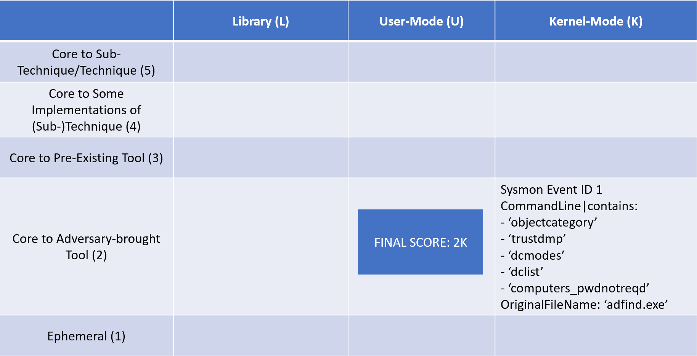

Summit the Pyramid
==================
Updated: 07/03/2023

Goal of Summiting the Pyramid
-----------------------------
The Pyramid of Pain has been used by detection engineers to determine the cost or “pain” it would take for an adversary to evade defenses that are effective at that level of the pyramid. Starting at the bottom, changing indicators of hash values, IP addresses, and domains are trivial for an adversary to change and continue their attack. Indicators further up the pyramid are more difficult for an adversary to change and consume more time and money from the adversary. Finally, Tactics, Techniques, and Procedures (TTPs), outlined by the MITRE ATT&CK Framework, describe an adversary’s behavior when achieving their goals. New TTPs are the hardest for adversaries to develop, as behaviors are limited by the environment they are acting in.

.. figure:: _static/pyramid_of_pain.png
   :alt: Pyramid of Pain - Created by David Bianco
   :align: center

   Pyramid of Pain - Created by David Bianco [#f1]_

Detection engineers can leverage the Pyramid of Pain to understand how :ref:`precise<Precision>` or :ref:`robust<Robustness>` their analytics are when detecting adversarial behavior. A detection analytic focused on identifying hash values will be precise in detecting a snapshot of malware but will not detect a variant of that malware that has been altered by an adversary. A detection at the tool level might be robust in detecting specific implementations of a technique but could create more false positives, pick benign user activity, and alert on system generated noise if the implemented tool is native to the OS. Some analytics might use a combination of various indicators to increase both the precision and :ref:`recall<Recall>` of an adversary attack.

:ref:`Capability Abstraction`, a concept developed by SpecterOps `SpecterOps <https://posts.specterops.io/capability-abstraction-fbeaeeb26384>`_., seeks to understand activities that occur on a system when an attacker is 
accomplishing their goals. It also introduced a visual graphic, known as an “abstraction map”, which conveys the relationships between 
abstraction layers and begins to highlight how an adversary can evade a specific detection or data source entirely and still accomplish their goals. The following capability abstraction map for `T1543 - Create or Modify System Process: Windows Service <https://attack.mitre.org/techniques/T1543/003/>`_, illustrates how multiple tools can create a new service.

   New Service Capability Abstraction - Created by SpecterOps [#f3]_

These tools include standard Windows binaries, commonly abused binaries, and open-source implementations that an adversary may implement in custom code. These different implementations may call the Windows API differently, which in turn might call different RPC interface and methods. However, ultimately they all utilize the same registry key within the Registry Service Database. If an adversary wanted to evade detection at the tool level, they could create a new service by directly interacting with the Windows API, RPC, or Registry. This is not a hypothetical, but has actually been seen in the wild. Threat group APT41 has utilized Windows service creation within their attacks not only through the utilization of the service creation tool (sc.exe), but also by directly modifying the registry itself [#f2]_. 

**Understanding that adversaries will attempt attacks at different parts in the OS and look to evade detections at different, defenders must understand two factors when attempting to build robust analytics: where their analytics are detecting activity, and the type of activity their analytics are detecting.**

Summiting the Pyramid
---------------------
Let’s break down the pyramid into the different types of activity a defender can build their analytics around. 

The first four levels of the pyramid are focused on ephemeral values which are easy for an adversary to change. The next level is not focused on values, but the types of tools an adversary will attempt to use during an attack. Finally, the top level is strictly focused on behaviors which an adversary will demonstrate during an attack. These groups can better break down what a defender can focus building their analytic upon. 

.. figure:: _static/pyramid_breakdown_pt1.png
   :alt: Breaking down the Pyramid of Pain
   :align: center

We can further break that down into rows for our model, which will display how to make it more specific for building robust analytics. In each row, we will be looking for observables :ref:`observables<Observable>` in which we can build analytics for each grouping, based on the difficult for an adversary to evade each grouping.

The bottom row is focused on the first grouping of ephemeral values. These are trivial for an adversary to change, or that change even without adversary intervention. 

The next two rows are split from the tools which can be used by an adversary during an attack. Observables core to an adversary-brought tool are associated with tools that are brought in by an adversary to accomplish an attack. The observables core to a pre-existing tool are tools which are available to defenders before adversary use, making it more difficult for an adversary to modify. These two tool levels were split to understand that an adversary will have more control over tools they bring to an attack, making it easier for them to evade specific tool detections. Tools which are managed by an organization or team will provide less opportunities for adversaries to plan, configure, and accomplish an attack. These are also much more difficult for an adversary to evade, since they are not in control of the configuration or prepared for the tool.

The final grouping is also split into two levels. These groupings are focused on identifying behaviors that are associated with MITRE ATT&CK Techniques, making them the most difficult to evade, and providing defenders the tools to create the most robust analytics. The observables core to some implementations of a technique or sub-technique are associated with low-variance behaviors which are unavoidable without a substantially different implementation. Observables core to a technique or sub-technique are the choke points or invariant behaviors, which are unavoidable by any implementation. 

.. figure:: _static/pyramid_breakdown_pt2.png
   :alt: Breaking down the Pyramid of Pain
   :align: center

Each of these rows visualize the cost for an adversary to evade observables at each row. However, there is another dimension in which adversaries can evade detection. Certain operations within the OS will generate events, which can be used by a defender to detect malicious activity. These are usually seen in the form of event IDs. However, not all event IDs are generated in the same part of the OS. Some are generated by applications, some can be called by the user, some are functions of the kernel, and so on. If adversaries want to bypass certain event IDs, they can just call certain API functionality lower within the OS. 

Understanding this concept can help defenders build more robust analytics, by looking at different collection mechanisms throughout the OS. We now take our rows, and make it a two-dimensional model to reflect collection mechanisms.

.. figure:: _static/2Dmodel_07032023.png
   :alt: Summiting the Pyramid 2D model
   :align: center

There are three different layers within the OS in which collection can occur. The library level identifies observables which are associated with the use of libraries, such as DLLs, available to defenders before adversary use. These are difficult for the adversary to modify, but can be evaded. User-mode observables are associated with user-mode OS activity. Finally, kernel-mode observables are associated with kernel-mode activity occurring at ring 0. Each of these columns provide the defender a different layer to detect activity within the OS, going deeper as the columns move to the right. 

This 2D model provides the visualization of how to score the robustness of an analytic, based on the log source and the behavior associated with an attack.

Improving Analytic Robustness
-----------------------------
For example, this ADFind analytic looks for specific command line arguments used in conjunction with the ADFind tool [#f5]_, identified by ``adfind.exe`` within the image path. 

First, we have to understand the collection mechanism that is generating this alert. In Sigma, the category says this analytic falls under ``Process Creation``. This can either be Windows Event ID 4688 or Sysmon Event ID 1. However, the ``Image`` field in the analytic is specific to Windows Event IDs. So this analytic is looking for the 4688 event code. Understanding that process creation is generated by the kernel and inferring that this is a Windows, we will be looking to place the final analytic under the Kernel column under event ID 4688.

.. figure:: _static/adfind_datasource.png
   :alt: Summiting the Pyramid 2D model
   :align: center

The observables seen within this analytic can be broken up into two different rows. The ``Image | endswith: \adfind.exe`` within the Ephemeral level. While the intention of this analytic is looking for the execution of the ADFind tool, the image path can be obfuscated by adversaries within the command line. The command line arguments, specific to ADFind, are place into the Core to Adversary-Brought Tool level, since these arguments can be modified by the adversary. If we apply our Boolean logic to these components, this final analytic is placed under Level 1: Ephemeral value.

.. figure:: _static/adfind_fields.png
   :alt: Summiting the Pyramid 2D model
   :align: center

This analytic could be easily evaded by adversaries if they were to rename the binary. **How can we improve this analytic so it is more robust?** We don’t need to improve it down all the way to the system application or kernel level, so let’s take it one step at a time.

As mentioned previously, adversaries can change the image name so detection tools do not detect the real tool they are attempting to use. However, adversaries must declare the tool they are using somewhere. Adversaries can compile tools with their corresponding filepath into their software in order to know where to find the specific file to use. This means that compared to utilizing this tool within the command line, the filepath cannot be obfuscated in the code. It must have the correct filepath to point to for use within the software within the PE header. File attributes can be parsed and identified through the data source **OriginalFileName**, a data source that is available through parsing in Sysmon. By tracking the file attribute rather than the image name, we can identify the tool the adversary is going to use. We can make the analytic improvements here.

Through this process, we have improved our analytic by just changing one field to identify adversary behavior and make it more difficult for them to evade detection of this analytic. To evade this improved analytic, and adversary must use a hex editor to change the filepath pointing to adfind. This highlights the importance of being able to go up the levels and identify different areas for improvement. Not everyone is going to be able to collect Sysmon data or make these analytic improvements. However, it gets us thinking of where we can begin to make these small, incremental steps within our environment to create more robust analytics.

Assumptions and Caveats
-----------------------
* Our current guidance addresses data sources and levels within Windows systems. There is definitely room to create guidance for networks, cloud, virtual machines, and other platform types to improve analytics across various platforms. We will attempt to begin guidance for these other platforms, but is open to :ref:`future work<Future-Work>`.
* The levels and observables currently defined by Summiting the Pyramid address the robustness of analytics, compared to precision and recall. To read more, :ref:`read this entry here <Robustness Precision Recall>`.
* Tampering is a big part of an adversary attack. If an adversary can’t go any further to evade a specific analytic, they may try to use tampering to accomplish their goal. Switching from evasion to tampering increases cost for the adversary, which is a victory for the defender. The StP team will be cognizant of this as we continue to draft best practice guidance, and though a more detailed study of when an adversary changes tactic to tampering may be out of scope for this initial effort, it may be prime for future work.
* The scoring of analytics at the Technique levels at 4 and 5 introduce the concept of analytic decay. The MITRE ATT&CK Framework is updated on a bi-annual basis, with changes to tactics, techniques, and procedural implementations. Since TTPs are subject to change, analytics looking at implementations or the whole of a sub-technique or a technique are subject to change, potentially making some analytics less effective. The Summiting project recognizes that analytic decay can be an issue for scoring analytics, and will continue to conduct research into the topic. For short-term solutions, the teams will revisit technique-oriented analytics after bi-annual ATT&CK releases and update analytics as needed. Additionally, the Summiting team will work with members of the ATT&CK team to ensure observables are in the proper rows.
* This 2D model for the Summiting methodology opens opportunity for adding additional dimensions for creating more robust and potentially more precise analytics. This can include factors such as timing, efficiency, and additional implementations. As the model continues to evolve, :ref:`the focus on additional dimensions will be further explored<Future-Work>`.

We are always looking for feedback and integrating your thoughts and ideas! Open a `GitHub issue here <https://github.com/center-for-threat-informed-defense/summiting-the-pyramid/issues>`_ to share your ideas, feedback, and scored analytics.

.. rubric:: References

.. [#f1] http://detect-respond.blogspot.com/2013/03/the-pyramid-of-pain.html
.. [#f2] https://www.mandiant.com/resources/blog/apt41-initiates-global-intrusion-campaign-using-multiple-exploits
.. [#f3] https://abstractionmaps.com/maps/t1050/
.. [#f4] https://posts.specterops.io/detection-spectrum-198a0bfb9302
.. [#f5] https://github.com/SigmaHQ/sigma/blob/30bee7204cc1b98a47635ed8e52f44fdf776c602/rules/windows/process_creation/win_susp_adfind.yml
