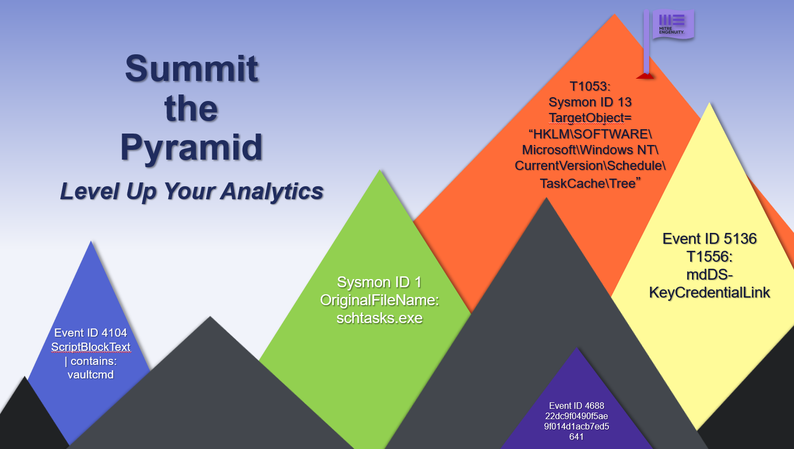
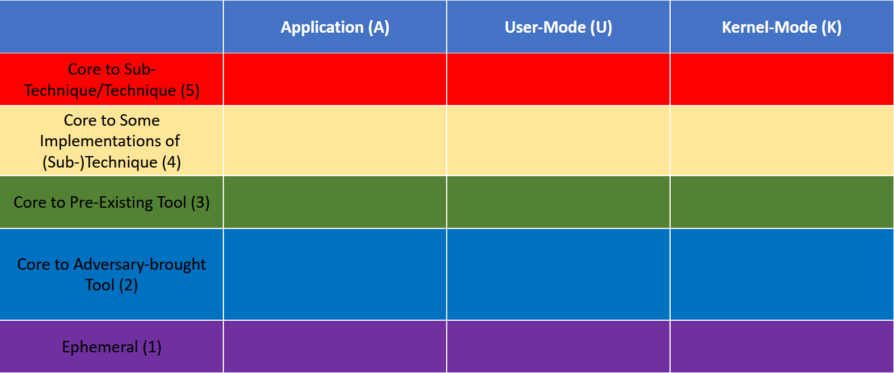
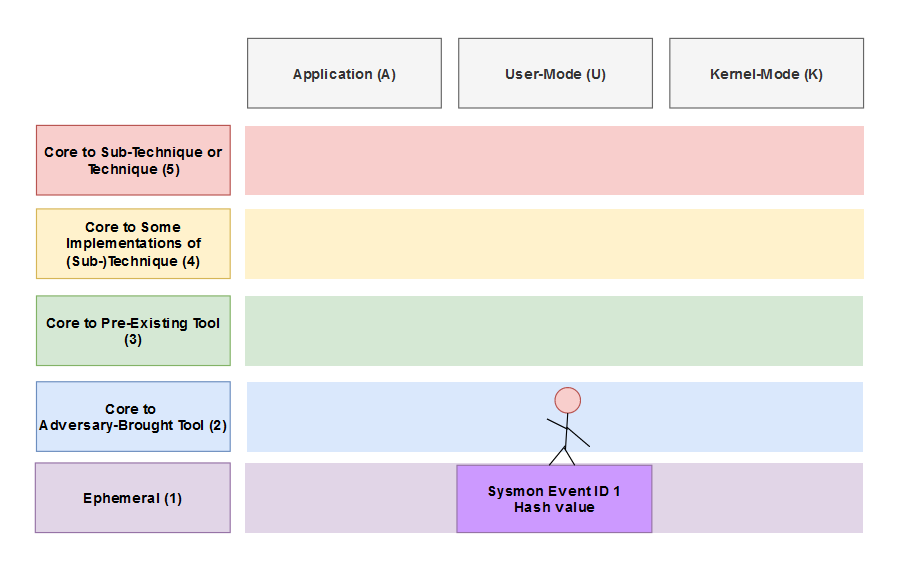
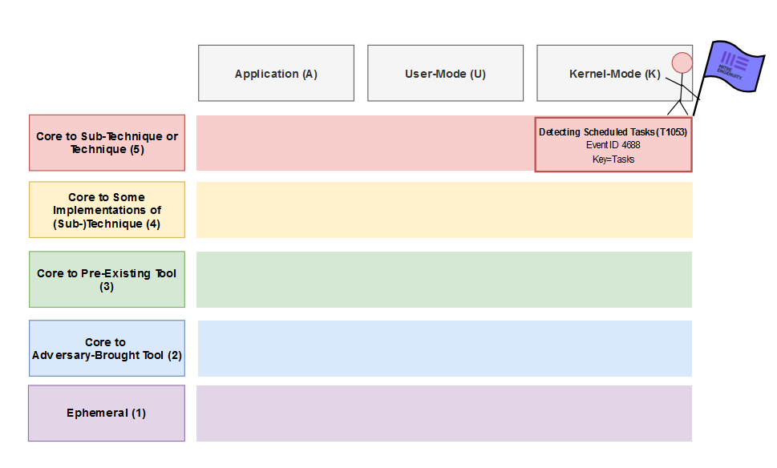

Overview
========

..
  Whenever you update overview.rst, also look at README.md and consider whether
  you should make a corresponding update there.

.. epigraph::

   Welcome to Summiting the Pyramid!

Introduction
------------
The Pyramid of Pain has been used by detection engineers to determine the cost or “pain” it would take for an adversary to evade defenses that are effective at certain levels of the pyramid. However, how can that knowledge be utilized by defenders to understand where adversaries can evade detections? The goal of the Summiting the Pyramid project is to give the defenders the power to regain control of their environment, by creating robust analytics based on relative complexity of adversary evasion. 

The Summiting the Pyramid methodology outlines a 2-D model, with rows outlining behaviors similar to the Pyramid of Pain, and columns determining where data sources are generated. These rows and columns group behaviors and analytics based on the difficulty and cost for an adversary to avoid triggering or being detected by them. These models map observables, events, whether benign or malicious, which are visible to a user. A defender can utilize these levels and observables to create and score analytics to determine how robust their own analytic might be.

The Summiting the Pyramid methodology is focused on giving defenders the ability to create and elevate analytics higher up in the pyramid of pain. How far up the pyramid a defender can go depends on which observable groups are available and used, both in the rows and columns. For example, a defender can utilize an analytic that alerts if a certain hash is detected, staying towards the base of the pyramid and not in the best position to defend against an adversary. An adversary can easily evade their defenses by recompiling their tools or malware with a one-byte difference and evade a defender’s analytic.

However, an analytic can be built utilizing observables that are grouped in higher levels and data sources which are generated deeper in the OS stack. These can include observables which are out of an adversary’s control, making it more difficult to evade. This allows a defender the ability to summit the pyramid, being in a better position to understand and defend against adversarial behavior.

The Summiting the Pyramid methodology can be used to score analytics based on the data source, observables present within the analytic, and the detection logic. The Summiting the Pyramid team is continuously looking to score analytics based on the methodology and additionally looks for analytic candidates to improve. 

Ultimately, this project looks to put control back in the hands of the defender. An adversary will look to evade defenses by bypassing a defender’s analytics. However, utilizing this research and documenting levels and observables to track behavior, a defender can better understand how an adversary can evade defenses, and better defend their environment.

**Looking to get started? Check out these resources!**

* :ref:`Model Mapping Pages<Model Mapping Pages>`
* :ref:`Scored Analytics Repository<Scored Analytics>`

Looking to contribute to the project? Have an analytic you would like scored? `Please create an issue on our GitHub here <https://github.com/center-for-threat-informed-defense/summiting-the-pyramid/issues/new?assignees=marvel90120&labels=analytic%2Cissue&projects=&template=analytic_submission.yml&title=%5BAnalytic-Submission%5D%3A+>`_

License
-------

© 2023 MITRE Engenuity. Approved for public release. Document number PRS NUMBER.

Licensed under the Apache License, Version 2.0 (the "License"); you may not use this
file except in compliance with the License. You may obtain a copy of the License at
http://www.apache.org/licenses/LICENSE-2.0

Unless required by applicable law or agreed to in writing, software distributed under
the License is distributed on an "AS IS" BASIS, WITHOUT WARRANTIES OR CONDITIONS OF ANY
KIND, either express or implied. See the License for the specific language governing
permissions and limitations under the License.

This project makes use of ATT&CK®: `ATT&CK Terms of Use
<https://attack.mitre.org/resources/terms-of-use/>`__
