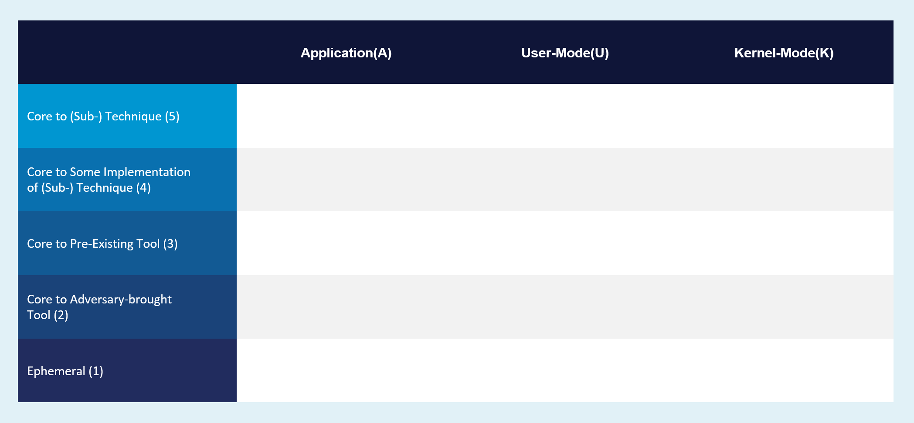
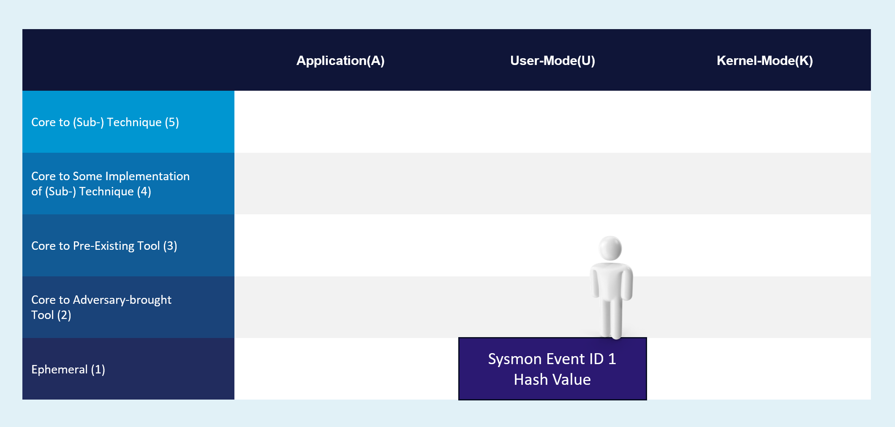
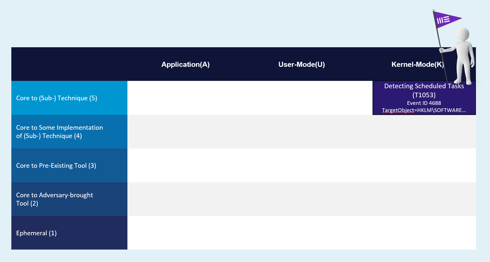

Summiting the Pyramid Overview
=======================================

..
  Whenever you update overview.rst, also look at README.md and consider whether
  you should make a corresponding update there.

.. epigraph::

   The entire point of detecting indicators is to respond to them, and once you can
   respond to them quickly enough, you have denied the adversary the use of those
   indicators when they are attacking you. Not all indicators are created equal, though,
   and some of them are far more valuable than others.

   -- David Bianco, `The Pyramid of Pain <https://detect-respond.blogspot.com/2013/03/the-pyramid-of-pain.html>`__

The `Pyramid of Pain
<https://detect-respond.blogspot.com/2013/03/the-pyramid-of-pain.html>`__ depicts the
relationship between different categories of threat indicators and the adversary's
ability to evade detections based on those indicators. Summiting the Pyramid builds on
this conceptual foundation with a rigorous analysis of how to engineer analytics to
increase robustness and make adversary evasion as costly as possible.

The Summiting the Pyramid methodology is based on a two-dimensional model. The rows
represent indicator categories (similar to the Pyramid of Pain), and columns represent
the data sources for detection analytics. Observables can be mapped onto locations
within the grid, which visually represents the difficulty and cost for adversaries to
avoid creating that observable. A defender can use this model to analyze existing
analytics for robustness and evadeability, as well as to engineer new and improved
analytics.

For example, a defender can utilize an analytic that alerts if a certain hash is
detected. An adversary can easily evade detection by recompiling their tools with a
one-byte difference. This is visually represented by placing the observable on the first
row:

The analytic can be improved by using observables that are in higher level groups (i.e.
moving up the grid) or more reliable data sources (i.e. moving to the right). Moving up
reflects the selection of indicators that are more costly for the adversary to change.
Moving right reflects the use of data sources that are harder for the attacker to
manipulate. Taken together, these lead to analytics that are more difficult and
expensive to evade:

This project includes a complete toolkit for defenders to start analyzing and improving
detection analytics: a model for evasiveness, a methodology for mappings detection
analytics onto that model, and many worked examples of mapping real-world analytics.

