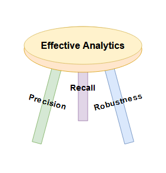
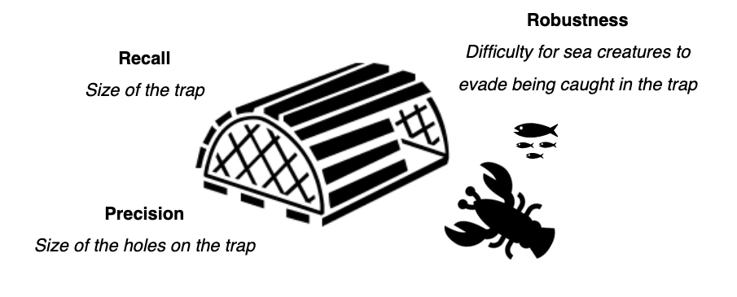
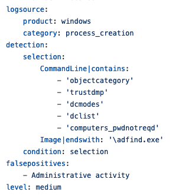
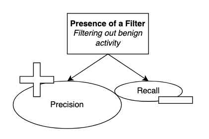
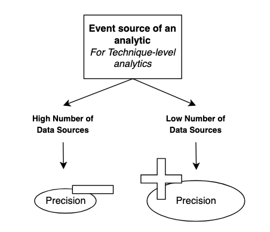
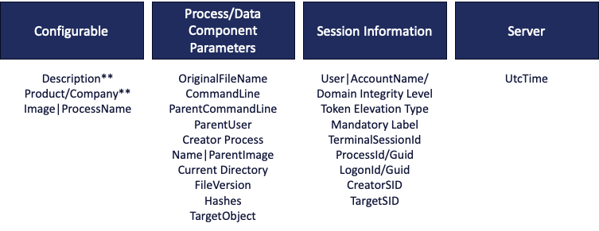
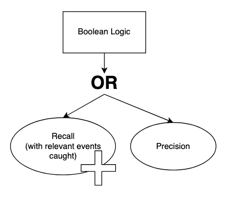
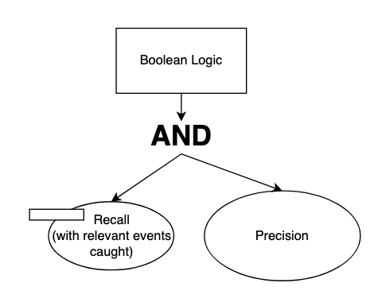

Precision, Recall, Robustness
=============================

This is a draft and will be updated as research continues. Please send us feedback!

**Robustness will help us make the best analytics! Right?**

The goal of Summiting the Pyramid was to develop a methodology to better understand how adversaries could evade analytics, and improve onto them. The Robustness Matrix reflects this effort, showing the difficulty for an adversary to evade both analytic observables and events generated within the Operating System. However, robustness is not the only component of building effective analytics. Effective analytics need to consider precision, recall, and robustness to create analytics which can effectively catch adversary activity.

Let's review some terminoloty:

  - **Precision is the fraction of relevant malicious events among all events matched by an analytic.** High precision analytics create fewer false positives.
  - **Recall is the fraction of relevant malicious events that are detected by an analytic.** High recall analytics are less likely to miss malicious activity. 

There is often a tradeoff between precision and recall: as one increases, the other decreases. This requires dialing the right balance between minimizing detections while not getting overwhelmed with false positives. With Summiting the Pyramid, a third component has been introduced to the mix.

  - **Robustness measures the effort needed by an adversary to evade an analytic.** Robustness is directly related to the cost required by an adversary to evade detection, including time, resources, and money.

Robustness, recall, and precision work in tandem together to build an effective analytic. While precision and recall usually have a tradeoff between each other, robustness is an added metric for understanding adversary behavior. It’s like when you go crab lobster catching (as all security engineers do). The size of the holes in the cage will ensure that lobster and crabs are caught, but smaller fish can get through (precision). In order to ensure you can catch enough crabs and lobster, you might increase the size of the cage to catch fish that might come through (recall). Then, the fisher needs to understand how it might look to avoid getting caught (robustness). You can also control the environment where you catch (where you collect logs), and the types of tools you use. This analogy reflects how recall, precision, and robustness all play together in the grand scheme of building robust analytics. 

Now, we will look at how we can utilize all of these components to build an effective analytic, and the tradeoffs between each.

Step 1: Determine the Robustness of the Analytic
------------------------------------------------
First, we will determine the robustness of the analytic in question. This will allow us to better understand not only what the analytic is looking to detect, but how robust it will be in detecting adversary activity.

For example, let's take this analytic that is looking to detect the execution of ADFind.exe.[#f1]_

Utilizing the Summiting the Pyramid methodology, we follow the steps to score its robustness. Understanding that the logsource is looking for a process creation event and analyzing the fields present, we determine this analytic using Windows Event ID 4688, which operates in Kernel Mode (K). We have two different fields to score in this analytic. The commandline instance is looking for arguments specific to adfind, which can be scored at Core to Pre-Existing Tool (3). Meanwhile, the Image field is looking for the filename of the adfind executable file. Since this can be easily changed and evaded by the adversary, this is scored as an Ephemeral Value (1). **Since this analytic looks for both the command line argument and the image argument to fire, the analytic is determinant on the lowest-level score. With these considerations, the analytic is scored as a 1K.** 

It is important to score the robustness of the analytic first as we move into additional analysis on the analytic. **The type of robust analytic presented (Ephemeral, Adversary Tool, Existing Tool, Partial Technique, Whole Technique)** will help us better understand how precision and recall effect its robustness, and how those components could potentially be improved.

Step 2: Determine Presence of a Filter
--------------------------------------
The presence of a filter is meant to avoid capturing certain false positives, or benign activity, when an analytic is running. **A filter will normally increase the precision of an analytic,** lowering the false positive rate of an analytic. An analytic which has a filter will usually have a ``filter`` tag attached to it.

However, **since the recall of the analytic is lowered,** the defender needs to be aware of the blind spots present due to the filtering out of certain activity. Since certain activity is filtered out, how can you ensure that activity that might occur in the analytic can be captured in other ways, potentially increasing robustness? This might be more relevant to Tool level analytics (Levels 2-3) and Technique-level analytics (Levels 4-5). However, it is important to understand the trade-offs of a filter and how it might be mitigated.

After determining the presence of a filter, we can focus on identifying the precision and recall of the selection. It is nearly impossible to consider all possible intentions, actions, and implementations that can be accomplished by the adversary in this context; we can’t know the intentions of the adversary. This is why the robustness goal of the analytic will help us determine how precise and encompassing the analytic is.

Unlike the filter, we will need to investigate further to determine the impact of precision and recall on the analytic. The precision and recall of an analytic that is detecting malicious activity will depend on the steps later in this process.

Step 3: Analyze Individual Observables and Place in Precision Buckets
---------------------------------------------------------------------
The steps to determine the impact of precision and recall on an analytic are similar to the steps we would take to score the robustness of an analytic. Through these steps, we will look at the event source observable, the analytic observables, and the boolean logic of the analytic to see its impact on precision and recall. 

**Step 3.1: Analyze the impact of the event source on the precision and recall of an analytic**
The event source used within the analytic will have an impact on how many observables, fields, and related behavior could be pulled into the analytic. This will be most impactful for Technique-level analytics, as there is more of a chance that certain Techniques will be more prone to false positives.

Our team did an in-depth analysis to determine which ATT&CK data sources were used for each ATT&CK Technique. Some data sources are connected to multiple Techniques, with some attaching to hundreds of Techniques. Others came in with only a few to detect the Technique. This shows us that some Techniques may require more data sources to detect the whole of the Technique or specific implementations. 

This is not to say that Techniques with a higher number of connected data sources are bad to build detections for. It gives us defenders an understanding of how to balance precision, recall, and robustness within an analytic.

**Step 3.2: Place analytic observables in precision buckets**
Next, we will analyze the individual observables in the perspective of precision and recall.

Previously, we scored each of these observables for robustness, as in the effort needed by an adversary to evade an analytic. Now, we will determine if each of these might limit or increase precision, and the adverse affect on recall. To do this, we have created additional groupings to bucket certain behaviors as precise, malicious behavior or generated, potentially benign behavior. These are what we call precision buckets. Each of these buckets represent different groupings of activities which have varying impacts on the precision of an analytic based on how they are generated within the OS. 

  - **Configurable:** Observables which can be edited, changed, or updated by the user.
  - **Data Component Parameters:** Observables which result from processes running in the OS
  - **Session Information:** Observables which relate to the specific session, process, or application running.
  - **Server:** Observables managed by and generated by the server.

Each of these buckets have a different impact on precision and recall. We’ve grouped observables into the buckets below.

**Step 3.3: Identify the Boolean logic for each selection of the analytic**
Finally, we will determine how the boolean logic for an analytic will increase or decrease its precision or recall. 

First, we will start with OR. If an analytic is looking to detect observable A OR observable B, as long as its in the context of the malicious activity, it will increase the recall of the activity, as its widening the scope of the activity caught.

An AND boolean operator will decrease the recall of an event, since it will limit the number of relevant activities which are caught by an analytic. It could potentially increase precision, if an analytic at the specific context requires more than one observable in order to identify malicious context.

**Now What?**
Through this guidance, we now understand how precision, recall, and robustness work together to build analytics. Based on this guidance, you can now update your analytic based on what you’re looking to accomplish within your detections.

  - Want to increase robustness? Raise your analytics to Tool- or Technique-level robustness detections.
  - Want to increase precision? Add a filter, or alert on specific IOCs.
  - Want to increase recall? Widen your analytic scope to encompass more events in the specific-robustness level.

.. rubric:: References

.. [#f1] https://github.com/SigmaHQ/sigma/blob/30bee7204cc1b98a47635ed8e52f44fdf776c602/rules/windows/process_creation/win_susp_adfind.yml

