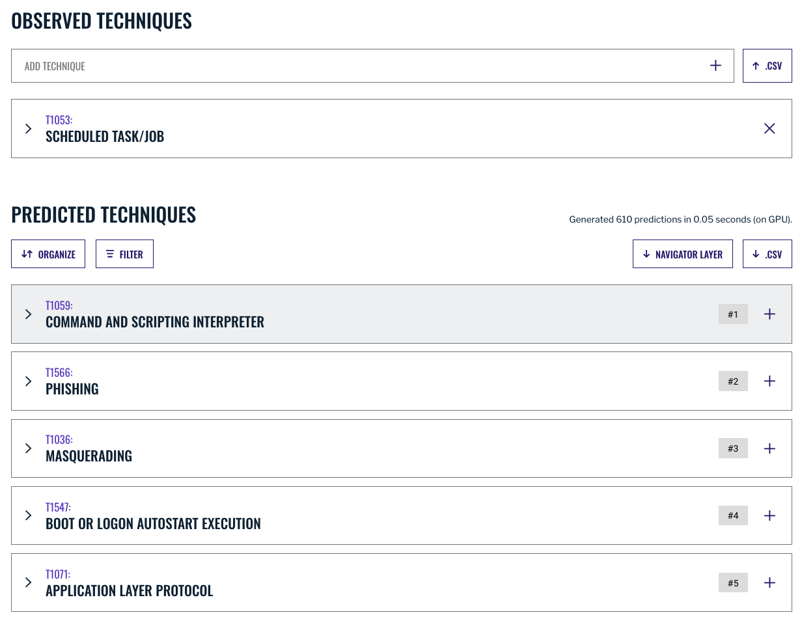

.. _Build Robust Detection:

How to Build a Robust Detection 
===============================

Summiting the Pyramid’s goal is to build :ref:`robust detection<Robust Detection>` analytics that are :ref:`accurate and difficult for adversaries to evade<Components>`. The following guide Pyramid provides defenders with the resources to build robust detections that account for underlying behavior and minimize false positives.

**NOTE: These results might look different in your environment.** While the guide below gives specific examples of how to increase accuracy within your environment, results may vary based on policies and varying environmental baselines. Be sure to test results in your environment while implementing best practices.

Identify All "Spanning Sets" of Observables for Malicious Behavior 
------------------------------------------------------------------

As Jared Atkinson writes in his blog on the Funnel of Fidelity, [#f1]_  defenders should first ensure they are collecting sufficient data and writing broad enough analytics to observe all malicious behavior. Doing so will achieve a low false negative rate. Then, we can focus on filtering out the false positives to improve accuracy overall.

   The Funnel of Fidelity, by SpecterOps. [#f1]_

Malicious activity generates many potential observables, including ephemeral values, tool artifacts, and underlying OS function calls and events. The first step in achieving high accuracy can be accomplished by collecting a “spanning set” of observables across many or all implementations. A spanning set is any set of observables, that when combined, will be triggered no matter how a technique is implemented. This set can also contribute to understanding observables that contribute to resistance to adversary evasion over time, because the observables are core to the underlying behaviors employed by the tools. One way to visualize the observables and which sets might span the implementations is through a :ref:`D3`. 

These D3 visuals will provide insight into event ID and analytic observables that provide good accuracy and resistance to adversary evasion. Selecting an observable that only includes ephemeral or tool-specific elements will be less resistant to adversary evasion and increasing the false negative rate. Below is the D3 visual for Scheduled Tasks.

.. figure:: _static/D3_ScheduledTasks_Basic.png
   :alt: D3 for Scheduled Tasks
   :align: center

   D3 for Scheduled Tasks.

:ref:`Check out the D3 write-up to learn how to build your own for additional techniques!<D3>`

As seen in this diagram, multiple event source observables point to the creation of a Scheduled Task. We can take the observables seen in the diagram and map each one to the Summiting model.

   Event source mapping for scheduled tasks event IDs.

Based on the event sources provided and our capability abstraction, we can begin to identify analytic observables that will be difficult for an adversary to evade.

According to the capability abstraction above, two registry keys span all implementations of creating a scheduled task: the ``HKLM\SOFTWARE\Microsoft\Windows NT\CurrentVersion\Schedule\TaskCache\Tasks\`` key (Tasks key) and the ``HKLM\SOFTWARE\Microsoft\Windows NT\CurrentVersion\Schedule\TaskCache\Tree\`` key (Tree key). These specific files and registry objects are robust; their creation can indicate across multiple implementations that a scheduled task is being created. Therefore, the use of these keys as an analytic would score at a **5K**.

Additionally, the 4698 Event ID is generated whenever a task is scheduled through the Task Scheduler GUI, the PowerShell ``Register-ScheduledTask`` command, or ``schtasks.exe``. While the event does not fire for the creation of scheduled tasks through the creation of registry keys, the generation of this event is a low-variance observable, detecting multiple implementations of the scheduled task behavior. Since this detection covers most of the implementations of scheduled tasks, this would score at a **4A**.

At the end of this step, we have three different analytic options that provide robust detections for scheduled tasks.

   Placement of scheduled task observables in Levels 4 and 5 of scoring model.

These options from the spanning set provide us good accuracy and resistance to adversary evasion over time. 

.. _Spanning Sets:

Select Spanning Set(s) Most Specific to the Malicious Behavior 
--------------------------------------------------------------

*Select the set that has the highest robustness as well as ability to distinguish malicious behavior versus benign behavior for the selected environment.* 

Observables that score higher on the Summiting model are difficult for an adversary to evade; that means it can be difficult for normal users to evade detection as well, causing noise for the analyst and increasing the false positive rate. A tool or technique that is used by an adversary can also be used by normal users. For example, system administrators might schedule tasks to perform daily operations. When it comes to selecting observables and events for detecting tools and behaviors, it is important for the detection engineer to select sets that are most likely to alert on suspicious or malicious behavior.

When it comes to picking observables, a defender must consider the fields and values that can contribute to accuracy and resistance to adversary evasion over time. While a low false negative focuses on observables that detect on malicious implementations, a low false positive rate ensures a detection’s performance regardless of benign implementation. An analytic must have observables that contribute to all components of accuracy.

Taking a look at the few examples we currently have for scheduled tasks, we have multiple options that are already highly robust detections. Now, we can dive into each of them a bit more and choose which analytic will result in accurate detections.

**Registry Key Creation and File Create**

The most robust detections discovered while building our D3 visual detect on the creation of the Tree and Tasks registry keys. While these detections are extremely difficult for the adversary to evade, the detections will cause a lot of noise and burden for the defender if alerting solely on this registry key creation. Not only will it be difficult for the defender to distinguish malicious versus benign task creation, but the detections will fire for the creation of any registry key under that sub-path. The trade-off for a low false negative rate in this context could result in a higher false positive rate.

   Detection of scheduled task files has a low false negative rate, but a high false positive rate.

Another option discovered was the use of the Windows EID 4698. This fires upon the creation of a scheduled task from the Task Scheduler GUI, ``schtasks.exe``, or through the PowerShell ``cmdlet``. It is important to note that this will not capture all scheduled task activities, most notably scheduling tasks to the registry. However, the 4698 Windows Event ID still captures most implementations of the technique. While there is still the chance of false positives from system administrators and potential tools scheduling tasks, it will not fire upon all new registry key creations under the Tree and Tasks keys.

Windows EID 4698 provides an accurate detection for scheduled tasks, while also providing some resistance to adversary evasion over time.

.. figure:: _static/D3_ScheduledTasks_4698.png
   :alt: D3 for Scheduled Tasks Event ID 4698
   :align: center

   Detection of scheduled task is accurate, and highly resistant to adversary evasion.

Add Exclusions for False Positive Reduction
-------------------------------------------

Now that we have a detection that has a low false negative rate and is resistance to adversary evasion over time, we can use filters to continue to increase **accuracy and the ability of an analytic to retain a low false positive rate despite variations in benign implementations.** Adding filters, or exclusions, will allow defenders to increase the accuracy of an analytic by excluding known false positives, and maintain the false negative rate of the original detection analytic.

It is important to consider the “size” of an exclusion to not create hiding spaces for the adversary. We want to ensure our exclusion values are specific, creating a small shadow, but are also difficult for the adversary to manipulate. We would accomplish this by using fields that are robust, making it difficult for the adversary to manipulate and control them. Additionally, defenders would utilize specific values that are known to be benign implementations of the specific analytic, such as filenames or specific tool names, compared to excluding whole file paths.

**Seek observables that are difficult for an adversary to modify.**

**This next step is important because we have to assume that the adversary knows our detection analytics.** Nowadays, a lot of analytics are open source through repositories such as Sigma, Elastic, and Splunk. The only items that are not open source (and should not be) are the exclusions that are put in place by an organization. 

This step looks to understand the fields that are present in the event source and what level they score at in the Summiting scoring model. This will ensure that adversaries cannot easily control the fields when trying to instigate their attack and hide in the exclusion.

Let’s first look at the Windows EID 4698 and determine robust fields that can improve accuracy.

   Windows EID 4698.

Diving into some of the fields present, there are a few that will not be as easy for an adversary to evade or help in detecting the behavior, such as an account name or logon ID. However, one we can investigate more is the Task Content. The ``Task Content`` holds the information concerning the new task in Extensible Markup Language (XML) format. Within the XML there are a few fields that can help in distinguishing the behavior that is actually occurring.

Some of these fields can be scored as more resistant to adversary evasion over time, while others are considered more brittle. We can investigate these fields further to see if some scheduled task activities can be filtered out.

**What fields or values do events contain to help distinguish malicious from benign implementations?**

The next step is to understand the benign implementations of the activity within your environment and use values that are specific and unique to the activity. These values can help filter out known, benign activity to raise the accuracy rate of the detection.

To avoid casting a large exclusion in your analytic for an adversary to potentially “hide in,” it is important to identify unique, benign activity. Ensuring that exclusionary values are unique will avoid catching numerous false positives.

Here are some questions to ask when looking to distinguish benign from unique suspicious or malicious activity.

* Are general buckets of benign activity observed when the analytic does not have a filter?
* Have these activities been investigated before?
    * Do they come from the running of a tool?
    * Do they come from the activities of a user?
    * Do they come from the activities of a specific user’s role?
* If a filter were to be put on each activity, how would the accuracy rate change?
* If a filter were to be put on each activity, how could the adversary hide in the filter?
    * Are there mitigations that can be implemented to mitigate the blind spot?

The answers to these questions will help determine which activities to apply a filter to in an analytic. Each environment will have different activities the defender will filter out, and a balance will look different for each defender.

Once you have identified this activity, pick out the observables that could potentially be used in detecting this behavior.

In a scheduled task, there are two primary types of Action in the XML that can be specified to execute:

* `Exec Action <https://learn.microsoft.com/en-us/windows/win32/taskschd/execaction>`_: Specifies the `command <https://learn.microsoft.com/en-us/windows/win32/taskschd/taskschedulerschema-command-exectype-element>`_ to run when the schedule conditions are met.
* `ComHandler Action <https://learn.microsoft.com/en-us/windows/win32/taskschd/comhandleraction>`_: Specifies a `COM Handler ClassId and input Data <https://learn.microsoft.com/en-us/windows/win32/taskschd/taskschedulerschema-comhandler-actiongroup-element#child-elements>`_ to execute when schedule conditions are met.

The Command value of an Exec action and the COM Handler ClassID and Data cannot be easily masqueraded since they must map to the execution of a specific program, therefore, making them excellent values to use for detection.

Based on the fields identified in the previous step and the nature of scheduled tasks, we can look to filter out benign activity in two ways:

* **Approach 1**: Filter out scheduled tasks based on approved Task Names.
* **Approach 2**: Filter out scheduled tasks if they are known and approved Exec ->Command or ComHandler->ClassId.

Both approaches have the virtue of excluding many commonly seen scheduled tasks in your environment. Both also have the downside of requiring the maintenance of a (possibly long and frequently changing) allow-list. Additionally, the use of the Exec-Command field is only available in Event ID 4698, compared to just the task name in Sysmon Event IDs 11, 12, 13, or 14. Given their equality in those respects, we can focus on the crucial difference between them.

**Approach 1** relies on a value that is not used by the Task Scheduler when executing the task, and can therefore be arbitrarily set to any value, including values that might appear benign or be included in the allow-list. **Approach 2** uses values that are used by the Task Scheduler, and cannot be arbitrarily set for the purpose of masquerading and evading the filter. In other words, Task Name is Ephemeral (Level 1), whereas Command and ClassId are Core to Some Implementations of a (Sub-)Technique (Level 4). Hence, we have our first example of a robust detection that has high accuracy, and is resistant to adversary evasion over time. 

Now that we have the field used to build the exclusion, we next identify the unique values to add to the exclusion based on the defender’s environmental baseline. For detection engineering, having an environmental baseline helps defenders understand a network at regular intervals for identifying potential network problems and identifying observables that can help contribute to accurate detections.[#f2]_ 

* What users or applications are creating scheduled tasks? (Look at the activity within your Security Information and Event Management [SIEM] system.)
* Which activities have been investigated and deemed benign?
* Is there already an allow-list with approved scheduled task activities?
* Which one of these actions could most likely be used by an adversary?

When looking at the actions, it is important to keep in mind how an adversary could potentially evade detection by choosing a value that is well-known and easy to obfuscate. Therefore, while in the last step we chose a field that is robust and difficult for an adversary to manipulate, we now want to choose a value that is specific and pointed to known, benign user behavior, so an adversary has less chances of finding a place to hide.

After answering the questions above, the defender can make an allow-list of command-line operations that have been approved by the security operations center (SOC) or detection analytics team. These approved activities will minimize the number of false positives a defender will receive, while also not preventing unique activities from getting caught in the filter—all contributing to a robust detection.

For example, when building the scheduled task analytic, these are some of the tools which utilize scheduled tasks that could be potentially worked into our allow-list:

* Microsoft Office Feature Updates
* Microsoft Office Performance Monitor 
* Microsoft Office ClickToRun Service Monitor 
* Launch Adobe CCXProcess

To start our exclusionary list small, we’ll pick Launch Adobe CCXProcess. This is a known benign activity, in a folder that the adversary cannot modify without elevated permissions, and is specific enough that it would be difficult for them to guess where to hide.

   D3 visual to exclude benign instances of Scheduled Task activity.

Our final analytics maps out to a 4A.

   Our final Scheduled Task analytic maps to a 4A Summiting score.

.. important::

    **Keep in mind the blind spots that the use of this filter could create.** The defender should have a general awareness of the shadow that is cast from the filter and identify a way to mitigate potential blind spots created.

**Observe changes to your detection rate and adjust.**

Once you have completed the filter, observe what happens to the detection's accuracy, and make necessary adjustments to fit your environment.

* How many false positives occur over a period of one hour? How does that rate change over one day? A week? A month?
* Are there benign instances that you did not expect?
* Are there known suspicious or emulated instances of malicious activity that were not captured in the analytic?

Run the analytic on a representative set of data. As an example, find the fields that have more than 1 but less than 12 distinct values for them. Find the intersect of those observables and the other previous steps. Exclude the ones in which an analyst has the most confidence are benign. 

It is important to note that this process is not a “one and done” deal. Just as detections should be reviewed and observed on a recurring basis, filters must also be reviewed to account for new and old users, new tools, or new adversary TTPs. Find a cadence that is right for your team, such as every six months, to ensure that filters are not abused by adversaries or malicious actors.

Incorporate into Fused Analytic Frameworks
------------------------------------------

Finally, an additional step that can be taken to increase the accuracy of detections is to incorporate multiple analytics together through fused analytic frameworks. Sometimes, certain TTPs, tools, or other activities are best detected through the campaign that malware or an adversary will take. Attempting to distinguish malicious activity based only on the detection of one detection might be too difficult and can decrease the accuracy and the potential robustness of a detection. Below are various methods of increasing accuracy and resistance to adversary evasion over time through multiple analytic detections.

* Risk-Based Alerting (RBA) [#f3]_:  A framework for alerting on combinations of observables from a user or system that a defender finds important. 
* Graph analysis or statistical analysis: Understand the relationships of interconnected data and form chaining detection analytics based on patterns within one’s network environment. Attack Flow can help defenders understand the patterns seen between various ATT&CK techniques. [#f4]_
* `Technique Inference Engine (TIE) <https://center-for-threat-informed-defense.github.io/technique-inference-engine/#/>`_:  Suggests techniques an adversary is likely to have used based on a set of observed techniques. Defenders can build chaining analytics based on the adversary’s inferred techniques to highlight lateral movement and persistent behaviors.

   TIE highlights the top 5 TTPs that are associated with scheduled tasks.

Overall, it is important that we create detections that are difficult for adversaries to evade. However, this is only one piece of the puzzle. By following these steps, a defender can build a robust detection, including accuracyand resistance to adversary evasion over time.

Want to see some more examples? Check out our :ref:`analytics repository<analytics>` and :ref:`D3 write-up<D3>`.

.. rubric:: References

.. [#f1] https://posts.specterops.io/introducing-the-funnel-of-fidelity-b1bb59b04036
.. [#f2] https://www.cisco.com/c/en/us/support/docs/availability/high-availability/15112-HAS-baseline.html
.. [#f3] https://www.splunk.com/en_us/form/the-essential-guide-to-risk-based-alerting.html?utm_campaign=google_amer_en_search_generic_security&utm_source=google&utm_medium=cpc&utm_content=EssGuidetoRBA_WP&utm_term=risk%20based%20alerting&device=c&_bt=648326773140&_bm=p&_bn=g&gad_source=1&gclid=EAIaIQobChMIie6fgM_MiAMV-mZHAR0xFz3xEAAYASAAEgI8L_D_BwE
.. [#f4] https://center-for-threat-informed-defense.github.io/attack-flow/

