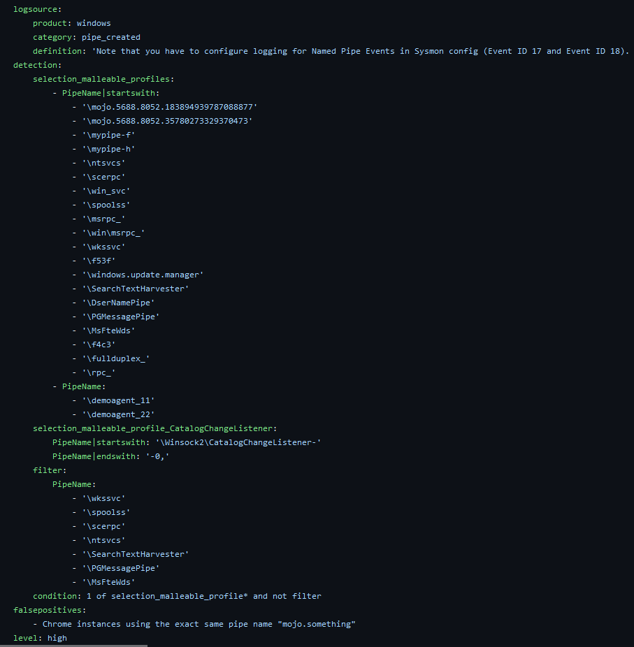
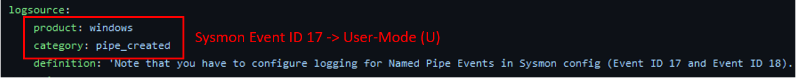
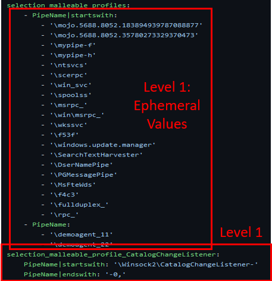
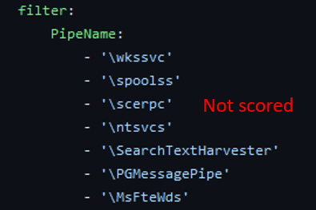
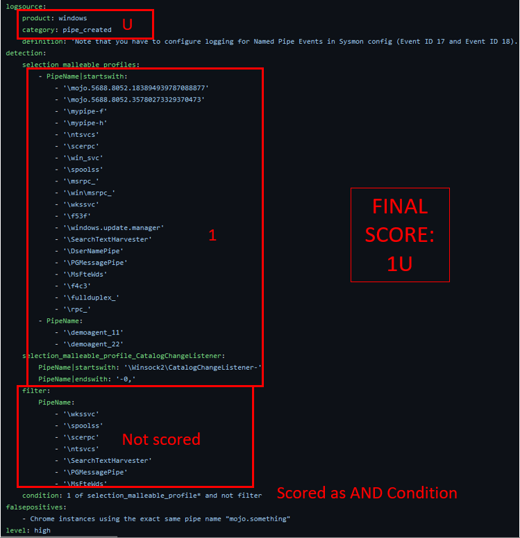
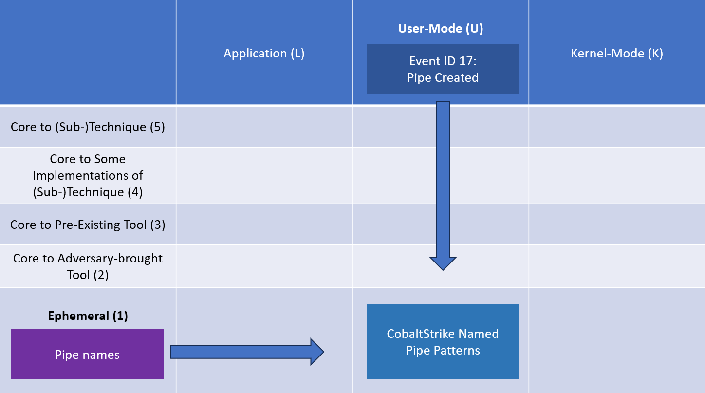

How to Score an Analytic
========================

These are the steps that should be taken to score an analytic with the Summiting the Pyramid methodology. If you identify an observable or value that is not part of the current methodology or would like to submit your own scored analytic, please create an issue in our `GitHub here <https://github.com/center-for-threat-informed-defense/summiting-the-pyramid/issues>`_ and the team will integrate feedback.

This walkthrough will highlight scoring `suspicious pipe creation from CobaltStrike <https://github.com/SigmaHQ/sigma/blob/37bba95e4a7353a8d90ed43c0403fefec38152b8/rules/windows/pipe_created/pipe_created_susp_cobaltstrike_pipe_patterns.yml>`_, authored by Florian Roth (Nextron Systems) and Christian Burkard (Nextron Systems).

   Suspicious Pipe Creation from Cobalt Strike [#f1]_

Step 1: Scoring the analytic's sensor data
------------------------------------------
Just as not all analytics are created equal, not all sensors are created equal. Our sensor robustness categories identify the different layers within the OS in which observables can be collected. Each of the different sensors within each column provide different insight into the OS.

In the pipe creation example, the sensor data identified is Windows, and the category is ``pipe_created``. Based on the types of Event IDs Windows provides and a list of field names which belong to Event IDs, we know that the analytic is made for Sysmon logs. Based on past research, emulation, and Microsoft documentation, we understand that Event ID 17 is fired after ImpersonateNamedPipeClient is called. [#f2]_ Our current research so far can only justify a user-mode rating. However, further research into underlying syscalls could indicate a raised data sensor score to kernel-mode. Because of this, the data sensor placement of this analytic will be in :ref:`User-Mode`.

   The sensor data highlights that Sysmon events are detected [#f1]_

.. important:: Some analytics might be vendor tool agnostic.
    If the field names can be applied to various different tools, be sure to score it in the sensor that you will be using in your environment. Keep this consistent as you look at each of the individual analytics.

Step 2: Break down each of the observables
------------------------------------------
Each of the observables, or the individual components of an analytic, will have its own score. Scoring each individually will help us define a composite score for the whole analytic. Some observable scores will be more strongly determined by the fields searched, while others will be more influenced by the values specified. 

Next, the ``selection_malleable_profiles`` and ``selection_malleable_profile_CatalogChangeListener`` selections look for a pipe name used by CobaltStrike or certain Windows tools. Since the pipe names specified look to be used by CobaltStrike, this initially seems like a level 2 dependency, being at the :ref:`Adversary Brought Tool` level, since it can be changed by the adversary. However, upon closer inspection, these are actually not the names utilized by CobaltStrike tooling. For example, the pipe name ``ntsvcs`` is meant to be mistaken for the ``ntsvc`` used by Windows Task Manager. In addition to somewhat similar pipe names, these pipe names can be easily changed by the adversary, requiring little effort on their part without reconfiguring the tool. Due to this fact, the group of analytics is scored at a :ref:`Ephemeral Values`.

   The pipes created are scored at level 1, the Operational and Environmental Variables Level [#f1]_

The last component of the analytic is a filter. This is used to improve the precision of the analytic, lowering the amount of false positives which are generated. As of right now, the scoring of the analytic using the Summiting the Pyramid methodology is focused solely on the robustness of an analytic, not precision or recall. Because of this, filter sections will not be scored. 

   The filters used in the analytic are not scored [#f1]_

.. important:: The Summiting team is looking into how precision can affect the robustness score of an analytic. This is slated for future research.

Step 3: Analyze the selection or condition of the analytic
----------------------------------------------------------

Before scoring the analytic, the final step is to consider how the separate components of an analytic are related. Understanding the logic of an analytic will help determine how robust it is.

In Sigma specifically, there are two steps which need to be looked at to understand the robustness of the full analytic, with all components combined as specified. It will say if each of the selections need to be considered as an AND statement or an OR statement. There can also be a condition at the bottom of an analytic which might identify a filter that needs to be applied to the analytic.

   The condition of the analytic determines how we score the overall analytic [#f1]_

For our example, the condition states that this analytic will fire if any one of the ``selection_malleable_profile*`` conditions is met, unless the filter condition is also true. There are four sections in ``selection_malleable_profile``: ``PipeName | startswith``, ``PipeName``,  ``selection_malleable_profile_CatalogChangeListener``, and ``PipeName | endswith``. The observables within each of the selections are connected using an AND. The condition states that at least 1 of the ``selection_malleable_profile*`` will be selected, making each of the selections connected by an OR. So, the final analytic would look like this:

``(selection_malleable_profiles: Pipename | startswith AND Pipename) OR (selection_malleable_profile_CatalogChangeListener: Pipename | startswith AND Pipename | endswith) = 1 AND 1 = 1``

The “not filter” indicates that anything that is not in the filter will be detected. Based on the Summiting the Pyramid methodology, analytic components that are AND’ed together, will fall to the score of the lowest observable. 

.. important:: To read more about AND and OR condition scoring 
    check out the release on :ref:`Robustness and Boolean Logic`

Step 4: Give the analytic a final score
---------------------------------------

Now that we understand the individual components of this analytic, we can now score the overall analytic with the :ref:`robustness level<Robustness and Boolean Logic>`. 

The sensor data was scored at the user-mode level, placing the score of the final analytic in :ref:`User-Mode`. The individual observables were all scored as ephemeral values, placing them at :ref:`Ephemeral Values`. The filter used to increase precision of the analytic has not been scored. The condition logic of the analytic indicates the relationships between the observables will be scored as an AND condition. The AND condition makes the individual observables dependent on the lowest level observable being fulfilled, putting the observables at Level 1. Therefore, the robustness score of this analytic is **1U**.

   The final score of the suspicious pipes analytic is 1U [#f1]_

This is how you can place the score using the 2D model diagram.

And that’s it! You have officially scored an analytic based on the Summiting the Pyramid methodology. Knowing the steps to score an analytic, you can apply this to your environment, see where your analytics fall, and determine if there’s any ways your analytics can be improved.

Remember, not all analytics will be able to be scored utilizing this methodology. For example, some analytics might be tuned specifically for your environment or for collecting contextual data rather than detection. We are documenting different use cases where some analytics would not be scored, and will continue to update the Summiting methodology to reflect this.

**Do you have analytics that should be documented in the analytic repository? Do you have new fields or observables which can be added to the analytics observables table?** `Fill out our analytic submission form, and the team will make updates <https://github.com/center-for-threat-informed-defense/summiting-the-pyramid/issues/new?assignees=marvel90120&labels=analytic%2Cissue&projects=&template=analytic_submission.yml&title=%5BAnalytic-Submission%5D%3A+>`_!

.. rubric:: References

.. [#f1] https://github.com/SigmaHQ/sigma/blob/37bba95e4a7353a8d90ed43c0403fefec38152b8/rules/windows/pipe_created/pipe_created_susp_cobaltstrike_pipe_patterns.yml
.. [#f2] https://learn.microsoft.com/en-us/windows/win32/api/namedpipeapi/nf-namedpipeapi-impersonatenamedpipeclient