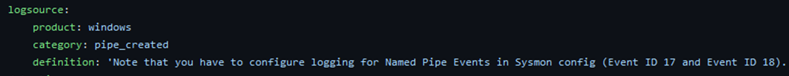
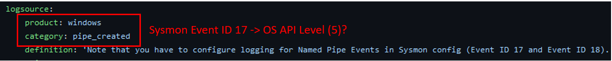
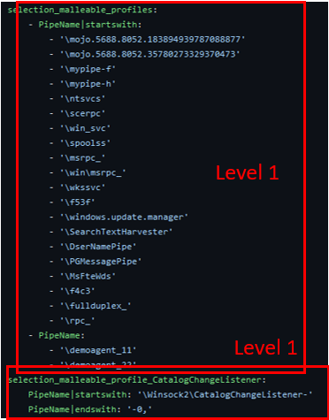
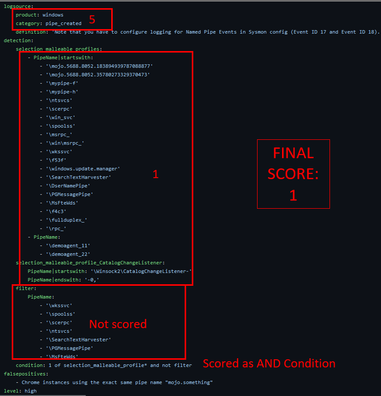

How to Score an Analytic
========================

These are the steps that should be taken to score an analytic against the Summiting the Pyramid methodology and the Analytics Observable Table. If you identify an observable or value that is not part of the current methodology, please create an issue in our `GitHub here <https://github.com/center-for-threat-informed-defense/summiting-the-pyramid/issues>`_ and the team will integrate feedback.

For this walk through, we will highlight our scoring of `suspicious pipe creation from CobaltStrike <https://github.com/SigmaHQ/sigma/blob/37bba95e4a7353a8d90ed43c0403fefec38152b8/rules/windows/pipe_created/pipe_created_susp_cobaltstrike_pipe_patterns.yml>`_.

.. figure:: _static/pipes_analytic.png
   :alt: Suspicious Pipe Creation Analytic
   :align: center

   Suspicious Pipe Creation from Cobalt Strike [#f1]_

Step 1: Identify the log source of the analytic
-----------------------------------------------
Just as not all analytics are created equal, not all log sources are created equal. For example, some data sources are associated with kernel functions, while others might be triggered by, and provide insight into, specific applications. It is important to remember that we score the data source at the highest level it’s monitoring within the OS or platform. The fields that are included in the event text may or may not reflect that highest potential score. This includes log sources such as Windows Event IDs, Sysmon, MITRE’s Cyber Analytics Repository (CAR), and other vendor-specific tools. Keep this in mind as you score your analytic.

In the pipe creation example, the log source identified is Windows, and the category is ‘pipe_created.’ Based on the types of event IDs Windows provides and the description, we know that the analytic is made for Sysmon logs. We will keep this in mind as we continue to score our analytic.

   The logsource highlights that Windows Event IDs are detected [#f1]_

.. important:: Some analytics might be vendor tool agnostic, such as analytics on GitHub.
    If the field names can be applied to various different tools, be sure to score it in the log source that you will be using in your environment. Keep this consistent as you look at each of the individual analytics.

Step 2: Break down each of the observables
------------------------------------------
Each of the observables, or the individual parts of an analytic, will have its own score. Scoring each individually will help us define a composite score for the whole analytic. Some observable scores will be more strongly determined by the fields searched, while others will be more influenced by the values specified. 

For our example, let’s consider each component individually. First, we know that Sigma utilizes the log source product and category fields for identifying Event IDs that are used within data sources. As mentioned above, we know that the analytic is looking specifically at the Sysmon pipe creation, identified as ID 17. Based on the StP methodology, event IDs can span multiple levels. It depends on how the Event ID is fired. Based on past research, emulation, and Microsoft documentation, we understand that Event ID 17 is fired after ImpersonateNamedPipeClient is called. [#f2]_ This may track down to a lower-level syscall, but this would require a deeper dive into syscalls for Event ID 17. For now, we will consider it **level 5** :ref:`OS API Level` level, understanding that it can at least be fired from Windows OS API calls.

   The logsource highlighting pipe creation is scored at level 5, the OS API level [#f1]_

Next, the selection_malleable_profiles and selection_malleable_profile_CatalogChangeListener selections look for a pipe name used by CobaltStrike or certain Windows tools. Since the pipe names specified are used by CobaltStrike, this initially seems like a level 2 dependency, being at the tools within adversary control level, since it can be changed by the adversary. However, quite a few of the pipe names specified are not specific to CobaltStrike and belong to the operating system, such as ntsvcs. These pipe names can be easily changed by the adversary, requiring little effort on their part. Due to this fact, the group of analytics is scored at a **level 1**, :ref:`Operational Environmental Variables`.

   The pipes created are scored at level 1, the Operational and Environmental Variables Level [#f1]_

The last section of the analytic is a filter. This is used to improve the precision of the analytic, lowering the amount of false positives which can be generated. As of right now, the scoring of the analytic is focused solely on the robustness of an analytic, not the precision or recall. Because of this, filter sections will not be scored. 

.. figure:: _static/pipes_filter.png
   :alt: Suspicious Pipe Creation filter
   :align: center

   The filters used in the analytic are not scored [#f1]_

.. important:: The Summiting team is looking into how precision can affect the robustness score of an analytic. This is slated for future research.

Step 3: Analyze the selection or condition of the analytic
----------------------------------------------------------

Before scoring the analytic, the final step to take is to consider how the separate parts of an analytic are implemented. Understanding the logic of an analytic will help determine how evadable it is.

In Sigma specifically, there are two steps which need to be looked at to understand how the analytic publisher intended the analytic to be run. It will say if each of the selections need to be considered as an AND statement or an OR statement. There can also be a condition at the bottom of an analytic which might identify a filter that needs to be applied to the analytic.

.. figure:: _static/pipes_condition.png
   :alt: Suspicious Pipe Creation condition
   :align: center

   The condition of the analytic determines how we score the overall analytic [#f1]_

For our example, the condition states that this analytic will fire if any one of the selection_malleable_profile* conditions is met, unless the filter condition is also true. There are four sections in selection_malleable_profile: PipeName | startswith, PipeName,  selection_malleable_profile_CatalogChangeListener, and PipeName | endswith. The observables within each of the selections are connected using an AND. The condition states that at least 1 of the selection_malleable_profile* will be selected, making each of the selections connected by an OR. So, the final analytic would look like this:

**(Pipename | startswith AND Pipename) OR (Pipename | startswith AND Pipename | endswith)**

The “not filter” indicates that anything that is not in the filter will be detected. Based on the Summiting the Pyramid methodology, analytic components that are AND’ed together, will fall to the score of the lowest observable. 

.. important:: To read more about AND and OR condition scoring 
    check out the release on :ref:`Evadability and Boolean Logic`

Step 4: Give the analytic a final score
---------------------------------------

Now that we understand the individual components of this analytic, we can now score the overall analytic. 

The individual observables, the Event ID 17 and the names of pipes created by CobaltStrike, have been scored at levels 5 and 1 respectively. The filter used to increase precision of the analytic has not been scored.  The condition logic of the analytic indicates the relationships between the observables will be scored as an AND condition. Since the AND condition makes the observables dependent on the lowest level observable being fulfilled, the overall score of the analytic will be a **level 1**, falling to the :ref:`Operational Environmental Variables` level.

   The final score of the suspicious pipes analytic is a 1 [#f1]_

And that’s it! You have officially scored an analytic based on the Summiting the Pyramid methodology. Knowing the steps to score an analytic, you can apply this to your environment, see where your analytics fall, and determine if there’s any ways your analytics can be improved.

Remember, not all analytics will be able to be scored utilizing this methodology. For example, some analytics might be specifically for environment tuning or for collection information rather than detection. We are documenting different use cases where some analytics would not be scored, and will continue to update the Summiting methodology to reflect this.

Do you have analytics that should be documented in the analytic repository? Do you have new fields or observables which can be added to the analytics observables table? `Create an issue or pull request with the 'analytic scoring' label, and the team will make updates <https://github.com/center-for-threat-informed-defense/summiting-the-pyramid/labels/analytic%20scoring>`_!

.. rubric:: References

.. [#f1] https://github.com/SigmaHQ/sigma/blob/37bba95e4a7353a8d90ed43c0403fefec38152b8/rules/windows/pipe_created/pipe_created_susp_cobaltstrike_pipe_patterns.yml
.. [#f2] https://learn.microsoft.com/en-us/windows/win32/api/namedpipeapi/nf-namedpipeapi-impersonatenamedpipeclient