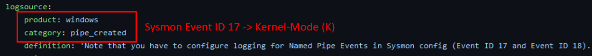

.. _scoring analytic:

How to Score Resistance to Adversary Evasion Over Time
======================================================

These are the steps that should be taken to score an analytic with the Summiting the
Pyramid methodology. This walkthrough is based on the analytic for `suspicious pipe
creation from CobaltStrike
<https://github.com/SigmaHQ/sigma/blob/37bba95e4a7353a8d90ed43c0403fefec38152b8/rules/windows/pipe_created/pipe_created_susp_cobaltstrike_pipe_patterns.yml>`_,
authored by Florian Roth (Nextron Systems) and Christian Burkard (Nextron Systems).

.. code:: yaml

   title: CobaltStrike Named Pipe Patterns
   id: 85adeb13-4fc9-4e68-8a4a-c7cb2c336eb7
   status: test
   description: Detects the creation of a named pipe with a pattern found in CobaltStrike malleable C2 profiles
   references:
      - https://svch0st.medium.com/guide-to-named-pipes-and-hunting-for-cobalt-strike-pipes-dc46b2c5f575
      - https://gist.github.com/MHaggis/6c600e524045a6d49c35291a21e10752
   author: Florian Roth (Nextron Systems), Christian Burkard (Nextron Systems)
   date: 2021/07/30
   modified: 2022/10/09
   tags:
      - attack.defense_evasion
      - attack.privilege_escalation
      - attack.t1055
   logsource:
      product: windows
      category: pipe_created
      definition: 'Note that you have to configure logging for Named Pipe Events in Sysmon config (Event ID 17 and Event ID 18). The basic configuration is in popular sysmon configuration (https://github.com/SwiftOnSecurity/sysmon-config), but it is worth verifying. You can also use other repo, e.g. https://github.com/Neo23x0/sysmon-config, https://github.com/olafhartong/sysmon-modular You can also use other repo, e.g. https://github.com/Neo23x0/sysmon-config, https://github.com/olafhartong/sysmon-modular. How to test detection? You can always use Cobalt Strike, but also you can check powershell script from this site https://svch0st.medium.com/guide-to-named-pipes-and-hunting-for-cobalt-strike-pipes-dc46b2c5f575'
   detection:
      selection_malleable_profiles:
         - PipeName|startswith:
               - '\mojo.5688.8052.183894939787088877'
               - '\mojo.5688.8052.35780273329370473'
               - '\mypipe-f'
               - '\mypipe-h'
               - '\ntsvcs'
               - '\scerpc'
               - '\win_svc'
               - '\spoolss'
               - '\msrpc_'
               - '\win\msrpc_'
               - '\wkssvc'
               - '\f53f'
               - '\windows.update.manager'
               - '\SearchTextHarvester'
               - '\DserNamePipe'
               - '\PGMessagePipe'
               - '\MsFteWds'
               - '\f4c3'
               - '\fullduplex_'
               - '\rpc_'
         - PipeName:
               - '\demoagent_11'
               - '\demoagent_22'
      selection_malleable_profile_CatalogChangeListener:
         PipeName|startswith: '\Winsock2\CatalogChangeListener-'
         PipeName|endswith: '-0,'
      filter:
         PipeName:
               - '\wkssvc'
               - '\spoolss'
               - '\scerpc'
               - '\ntsvcs'
               - '\SearchTextHarvester'
               - '\PGMessagePipe'
               - '\MsFteWds'
      condition: 1 of selection_malleable_profile* and not filter
   falsepositives:
      - Chrome instances using the exact same pipe name "mojo.something"
   level: high

Step 1: Scoring the Analytic's Sensor Data
------------------------------------------

Just as not all analytics are created equal, not all sensors are created equal. Our
event robustness categories identify the different layers within the OS in which
observables can be collected. Each of the different events within each column provide
different insights into the OS.

In the pipe creation example, the sensor data identified is Windows, and the category is
``pipe_created``. Based on the types of Event IDs Windows provides and a list of field
names which belong to Event IDs, we know that the analytic is made for Sysmon logs.
Based on past research, emulation, and Microsoft documentation, we understand that Event
ID 17 is fired after ImpersonateNamedPipeClient is called, which is a :ref:`User-Mode`
function. [#f2]_ However, after some additional research, it was found that certain
Sysmon events are triggered with a minifilter. [#f3]_ Minifilters are executed by the
Filter manager, operating in kernel-mode. [#f4]_ Because of this, the data sensor
placement of this analytic will be in :ref:`Kernel-Mode`.

   The sensor data highlights that Sysmon events are detected. [#f1]_

.. important::

    **Some analytics might be vendor tool agnostic.** If the field names can be applied
    to various different tools, be sure to score it in the sensor that you will be using
    in your environment. Keep this consistent as you look at each of the individual
    analytics.

Step 2: Break Down Each of the Observables
------------------------------------------

Each of the observables, or the individual components of an analytic, will have its own score. Scoring each observable individually will help us define a composite score for the whole analytic. Some observable scores will be more strongly determined by the fields searched, while others will be more influenced by the values specified.

Next, the ``selection_malleable_profiles`` and
``selection_malleable_profile_CatalogChangeListener`` selections by CobaltStrike or certain Windows tools. Since the pipe names specified look to be used by CobaltStrike, this initially seems like a Level 2 dependency, being at the :ref:`Adversary Brought Tool` level, since the pipe names can be changed by the adversary. However, upon closer inspection, these are actually not the names utilized by CobaltStrike tooling. For example, the pipe name ``ntsvcs`` is meant to be mistaken for a protocol used by Windows Task Manager.  In addition to somewhat similar pipe names, these pipe names can be easily changed by the adversary, requiring little effort on their part without reconfiguring the tool. Additionally, this observable is looking only for the beginning of the pipe name. Due to this fact, the group of detections is scored at a :ref:`Ephemeral Values`.

   The pipes created are scored at level 1, the Operational and Environmental Variables Level [#f1]_

The last component of the analytic is the filter. This is used to improve the accuracy of the analytic, lowering the number of false positives that are generated. We can score the filter in terms of the ability for an adversary to manipulate the values within it based on their level of control within the victim environment. In this example, specific known pipe names are used to filter out Windows processes. These pipe names are specific and are inherent to the functioning of Windows processes, including the Windows Search protocol, [#f5]_ the Windows RPC protocol, [#f6]_  and other potential pre-existing software. [#f7]_ While pipe names can be considered ephemeral, the specificity for these pipe names and the configuration and permissions required to edit the tools raise the effort needed by an adversary. Because of this, the filter itself scores as a :ref:`Pre-Existing Tools`. 

   The filters are scored using the same Summiting scoring model.

Step 3: Analyze the Selection or Condition of the Analytic
----------------------------------------------------------

Before scoring the analytic, the final step is to consider how the separate components of an analytic are related. Understanding the logic of an analytic will help determine how robust it is.

In Sigma specifically, two steps need to be looked at to understand the robustness of the full analytic, with all components combined as specified. The condition will say if each of the selections needs to be considered as an AND statement or an OR statement. [#f8]_ There can also be a condition at the bottom of an analytic that might identify a filter that needs to be applied to the analytic.

.. figure:: _static/pipes_condition.png
   :alt: Suspicious Pipe Creation condition
   :align: center

   The condition of the analytic determines how we score the overall analytic. [#f1]_

For our example, the condition states that this analytic will fire if any one of the ``selection_malleable_profile*`` conditions is met, unless the filter condition is also true. There are four sections in ``selection_malleable_profile``: ``PipeName | startswith``, ``PipeName``, ``selection_malleable_profile_CatalogChangeListener``, and ``PipeName | endswith``. The observables within each of the selections are connected using an AND. The condition states that at least one of the ``selection_malleable_profile*`` will be selected, making each of the selections connected by an OR. So, the final analytic would look like this:

``((selection_malleable_profiles: Pipename | startswith AND Pipename) OR (selection_malleable_profile_CatalogChangeListener: Pipename | startswith AND Pipename | endswith)) AND (NOT filter) = (1 AND 1) AND 3  = 1``

Based on the Summiting the Pyramid methodology, analytic components that are ANDed together will fall to the score of the lowest observable.

.. important:: To read more about AND and OR condition scoring
    check out the release on :ref:`Robustness and Boolean Logic`

Step 4: Give the Analytic a Final Score
---------------------------------------

Now that we understand the individual components of this analytic, we can score the overall detection.

The sensor data was placed at the kernel-mode level, placing the score of the final analytic in :ref:`Kernel-Mode`. The individual observables were all scored as ephemeral values, placing them at :ref:`Ephemeral Values`. The filter values placed are specific and robust, making it both difficult for the adversary to evade and produce a low false positive rate, placing the filter at :ref:`Pre-Existing Tools`. The condition logic of the analytic indicates the relationships between the observables will be scored as an AND condition. The AND condition makes the individual observables dependent on the lowest level observable being fulfilled, putting the observables at Level 1. Therefore, the score of this analytic is **1K**.

   The final score of the suspicious pipes analytic is 1K. [#f1]_

And that’s it! You have officially scored an analytic based on the Summiting the Pyramid methodology. You can apply these steps to your own environment, see where your analytics fall, and determine if there are any ways your analytics can be improved.

Remember, not all analytics can be scored utilizing this methodology. For example, some analytics might be tuned specifically for your environment or for collecting contextual data rather than detection. We are documenting different use cases where some analytics would not be scored, and will continue to update the Summiting methodology to reflect this.

.. rubric:: References

.. [#f1] https://github.com/SigmaHQ/sigma/blob/37bba95e4a7353a8d90ed43c0403fefec38152b8/rules/windows/pipe_created/pipe_created_susp_cobaltstrike_pipe_patterns.yml
.. [#f2] https://learn.microsoft.com/en-us/windows/win32/api/namedpipeapi/nf-namedpipeapi-impersonatenamedpipeclient
.. [#f3] https://github.com/trustedsec/SysmonCommunityGuide/blob/master/chapters/named-pipes.md
.. [#f4] https://learn.microsoft.com/en-us/windows-hardware/drivers/ifs/filter-manager-concepts
.. [#f5] https://learn.microsoft.com/en-us/openspecs/windows_protocols/ms-wsp/bffd9e13-108e-4580-a859-6f6586c50bbc
.. [#f6] https://detect.fyi/threat-hunting-suspicious-named-pipes-a4206e8a4bc8
.. [#f7] https://www.lrqa.com/en/cyber-labs/cve-2017-16245-cve-2017-16246-avecto-defendpoint-multiple-vulnerabilities/ 
.. [#f8] :ref:`Robustness and Boolean Logic`
